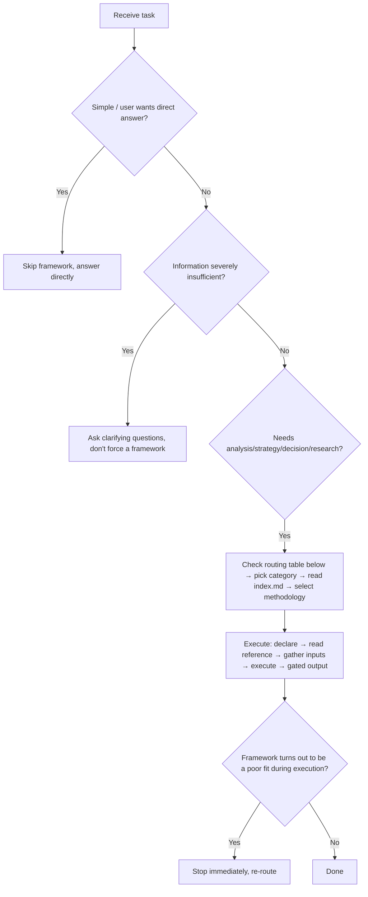

# Methodology Compass

Every agent task requires methodology support. This skill is a methodology index map that guides agents to **choose the right framework, then use it correctly**.

## TL;DR — 30-Second Quick Reference



**Capability overview**: 19 categories × 142 methodologies. Each category's methodology list, best-use scenarios, and minimum information requirements are in its `index.md`.

## Core Principles

1. **Choose the framework first, then do the work** — When receiving a task, first determine which methodology applies; framework selection should take < 30 seconds
2. **Frameworks are tools, not goals** — Combine flexibly based on context; don't force-fit
3. **Make usage explicit** — Tell the user which methodology is being used and why, making the analysis process traceable
4. **Structured and verifiable output** — Output should include actionable recommendations + verification criteria
5. **Framework fitness self-check** — After selecting a framework, verify in one sentence: "Can [framework name] directly answer [the user's core question]?" If not, re-select

---

## Category Overview (19 categories × 142 methodologies)

| # | Category | Count | Index path |
| --- | --- | --- | --- |
| 1 | Problem Diagnosis | 7 | `references/problem-diagnosis/index.md` |
| 2 | Strategic Analysis | 24 | `references/strategy/index.md` |
| 3 | Product & Growth | 8 | `references/product-growth/index.md` |
| 4 | Decision Making | 12 | `references/decision-making/index.md` |
| 5 | User Research | 5 | `references/user-research/index.md` |
| 6 | Structured Thinking | 9 | `references/structured-thinking/index.md` |
| 7 | Product Discovery | 8 | `references/product-discovery/index.md` |
| 8 | Go-to-Market | 7 | `references/go-to-market/index.md` |
| 9 | Market Research | 7 | `references/market-research/index.md` |
| 10 | Data Analysis | 5 | `references/data-analysis/index.md` |
| 11 | AI Delivery | 2 | `references/ai-delivery/index.md` |
| 12 | Execution | 4 | `references/execution/index.md` |
| 13 | Engineering | 21 | `references/engineering/index.md` |
| 14 | Product Philosophy | 4 | `references/product-philosophy/index.md` |
| 15 | Leadership | 3 | `references/leadership/index.md` |
| 16 | Financial Analysis | 5 | `references/financial-analysis/index.md` |
| 17 | Research Methodology | 2 | `references/research-methodology/index.md` |
| 18 | Industry Analysis | 2 | `references/industry-analysis/index.md` |
| 19 | Quantitative Investment | 7 | `references/quantitative-investment/index.md` |

---

## User Intent → Category Quick Routing

Category-level mapping only (one line per category). The full intent→methodology routing, trigger signals, and alternatives are in each `index.md` "Routing Trigger Signals" — read it before declaring a framework.

**Problem Diagnosis** — root cause→5 Whys; disruptive thinking→First Principles; 80/20→Pareto; multi-factor→Fishbone
**Strategic Analysis** — situation assessment→SWOT; competitive landscape→Porter's Five Forces; business model/pricing/moat/portfolio/evolution (24 methodologies)→`strategy/index.md`
**Product & Growth** — user needs→JTBD; growth bottleneck→AARRR; metrics→North Star
**Decision Making** — prioritization→RICE; goal setting→OKR; risk rehearsal→Pre-mortem
**User Research** — user journey→Customer Journey Map; empathy→Empathy Map; needs hierarchy→Maslow
**Structured Thinking** — structured expression→MECE + Pyramid Principle; multi-perspective→Six Thinking Hats; problem nature→Cynefin
**Product Discovery** — continuous discovery→Opportunity Solution Tree; interviews→The Mom Test; experiments→Experiment Design Library
**Go-to-Market** — beachhead→Beachhead Segment; ideal customer→ICP; positioning→Positioning Strategy
**Market Research** — market sizing→Market Sizing; segmentation→Segmentation; personas→User Personas
**Data Analysis** — retention→Cohort Analysis; A/B testing→A/B Test Analysis; user value→RFM
**AI Delivery** — shipping standards→Shipping Artifacts; doc-code drift→Intended vs Implemented
**Execution** — outcome roadmap→Outcome Roadmap; strategy red team→Strategy Red Team; requirements→User Stories
**Engineering** — TDD; code review; architecture→Clean Architecture/DDD; CI/CD; observability; security/API/DB design; incident response (21 methodologies)→`engineering/index.md`
**Product Philosophy** — radical focus→Focus as No; vertical integration→Whole Widget; invisible perfection→Invisible Perfection
**Leadership** — vision→Reality Distortion Field; hiring→A-Player Density; org change→Change Management
**Financial Analysis** — ROE decomposition→DuPont; valuation→DCF; comparables→Comparable Company; value creation→EVA
**Research Methodology** — systematic research→Systematic Research Process
**Industry Analysis** — value chain→Industry Value Chain; technology maturity→Gartner Hype Cycle
**Quantitative Investment** — factor investing→Factor Investing; portfolio optimization→Portfolio Optimization; backtesting→Backtesting Framework

---

## Calling Protocol

```
0. Pre-check, in strict order — information first, fitness second: a) Confirm the task type matches a routing-table row and information sufficiency ≥ Level 1; below that, run the Degradation Path before any framework choice. b) Decide depth: quick scan or full analysis (it trims step 5). c) Framework check in three tiers — exactly one realistic candidate → apply the 5 principles as a one-sentence check (can it directly answer the core question? inputs available? effort proportional? — `references/structured-thinking/framework-selection.md`) and say the short-circuit path was taken; ≥ 2 candidates or a habitual pick → full fitness-gate scorecard; no candidate clears the bar → NONE: answer directly without a framework. d) If two frameworks both fit, pick primary + backup and explain why primary is primary
1. Declare framework and depth: "I will use [methodology name] for this analysis. Depth: [quick scan | full analysis]. Reason: [routing correspondence]; Required inputs: [list]; Expected output: [format]"
2. Read reference: Open references/<category>/<methodology>.md to extract execution steps and output template
3. Gather inputs: Confirm each item as required by the framework; handle missing items via the degradation path
4. Execute framework: Output step by step per the reference, tagging each piece of information as fact/inference/assumption
5. Output conclusion (quality gate — six checks, hard cap; do not add more):
   ✓ Directly answers the user's original question
   ✓ Includes at least one immediately actionable recommendation
   ✓ Labels confidence (High/Medium/Low), key uncertainties, and a stop_reason — `completed | degraded(L2) | rerouted | none_direct` — so an information-limited output is never structurally indistinguishable from a finished one
   ✓ Depth trim: quick scan → conclusion + the primary framework's key output only (no full template walkthrough); full analysis → complete steps + output template
   ✓ Failure boundary & disagreements: one line stating the input or boundary under which this conclusion would mislead (generate it at execution time if the reference lacks such a section); in a multi-framework combination, list where the conclusions disagree instead of silently picking a winner
   ✓ Reassess When: 2-3 triggers that should reopen framework selection (e.g. sample regime change, stage shift, data availability change)
   ✗ If the conclusion merely restates the framework without incremental insight, refine further
```

### When NOT to use a framework

- The task is simple and clear; a framework would add unnecessary complexity
- The user explicitly asks for a direct answer
- Information required by the framework is severely missing (see Degradation Path Level 3+)
- **NONE default**: no candidate framework clears the fitness gate (task alignment ≥ 4 and weighted total ≥ 3.5 — `references/structured-thinking/framework-selection.md`); answer directly and name why each candidate fell short. A marginal framework is not "run with caveats", it is a wrong framework
- **Red Flags — do not enter analysis at all** (checked before the Degradation Path; these are out-of-scope situations, not information gaps):
  - Suspected fraud, legal liability, or personal crisis → no framework; refer to the appropriate professional and say why you are not analyzing
  - No baseline data at all → route to instrumentation/measurement first (see `references/engineering/observability.md`), not diagnosis on empty data
  - Burning emergency (cash runway in weeks, incident in progress) → skip the analysis, output a minimal action list now; analyze after stabilization

### Combination rules

Some tasks require a methodology combination. Where present, common combinations are listed in each `index.md` under "Common Combinations". **Combination cap**: at most 3 methodologies per task, and only as an exception — a single well-fitting framework beats a stack. Every member must bring a complementary role (e.g. framing → evaluation → sequencing); near-synonym or same-domain stacks are redundancy, not combinations. Run members sequentially by default, and check the constraint table below before combining. After each framework completes, before moving to the next, confirm: ① Is the core conclusion from the previous framework clear? ② Does the next framework need the previous one's output as input? ③ Does the user have any objections to the previous framework's conclusion? Multi-step combinations follow the playbook format where an index's Common Combinations prescribes one (per-step output, conditional branches, final deliverable); a multi-framework output must end in a synthesized conclusion section, never a side-by-side pile.

### Methodology mutual exclusion and ordering constraints

Some methodologies have mutual exclusion or ordering dependencies. When combining, these must be observed:

| Constraint pair | Rule | Reason |
| --- | --- | --- |
| Lean Canvas ↔ Startup Canvas | **Pick one**, don't use both simultaneously | Output overlaps heavily; both are BMC adaptations for early-stage startups |
| RICE ↔ ICE | **ICE for rough screening → RICE for fine ranking**, don't use in parallel | ICE is a simplified version of RICE; parallel use produces redundant output |
| PESTLE → SWOT | **PESTLE before SWOT** | PESTLE expands the O/T dimensions of SWOT; doing it first avoids external analysis omissions |
| SWOT vs Porter's Five Forces | **Choose by analysis target**: comprehensive single-enterprise assessment→SWOT; industry competitive structure→Porter's | Different dimensions; if using both, clarify input boundaries for each |
| JTBD vs User Personas | **Choose by goal**: uncover jobs→JTBD; describe user archetype→Personas | Input data may overlap but output purposes differ |
| Death Filter vs Reversibility Grading | **Choose by question**: values-level "should we do this at all"→Death Filter; execution-level "how much process does this deserve"→Reversibility Grading | Different layers of the same decision; Death Filter runs first — a choice it rejects never reaches reversibility grading |
| OODA Loop vs Incident Response & Postmortem | **Choose by phase**: incident still in flight→OODA Loop; stabilized→Incident Response & Postmortem | Same trigger words route differently by time; OODA cycles on live signals, postmortem requires the event to be over |
| Issue Tree vs MECE + Pyramid Principle | **Choose by structure type**: decomposing an unsolved problem to drive evidence gathering→Issue Tree; communicating an already-formed answer→MECE + Pyramid Principle | Both are tree-shaped; one structures the analysis, the other structures the expression |

---

## Insufficient Information Degradation Path

| Level | State | Action |
| --- | --- | --- |
| L1 | Information mostly sufficient | Execute framework normally |
| L2 | Partial information missing | Clearly label which dimensions are assumptions vs facts; use `[data needed]` placeholders; list to-collect items after output |
| L3 | Core information missing (cannot produce valid conclusion) | Stop execution; ask the user 1-3 most critical questions; explain what information is missing and why it affects output quality |
| L4 | Information severely insufficient (cannot even determine framework selection) | Use Cynefin or Framework Selection first to determine problem nature and applicable framework; if still uncertain, fall back to "direct best judgment" without a framework; state confidence level and dependent assumptions |

See each `index.md` "Minimum Information Requirements per Methodology" section for each framework's minimum information needs.

**Three input modes when information is missing** — announce which one you are in: **Guided** (ask the L3 questions one at a time, with progress labels like "input Q2/4"); **Context dump** (the user pastes everything once — you extract it yourself and never re-ask what was already given); **Best guess** (zero input — proceed on typical-case assumptions, flag every assumption in the output, invite correction). At any step the user may say "skip the rest": deliver the result from what you have and discount confidence accordingly. Degradation is a whole-protocol exit, not an entry-only gate.

---

## Framework Correction Mechanism

If during execution you find the framework is a poor fit, don't force completion. Abandonment signals: key dimensions cannot be filled and it's not an information issue; the analysis conclusion drifts from the user's question; the user says "wrong direction"; you are forcing inputs into slots just to keep the framework alive; it steers attention away from factors you know matter; or no incremental insight after honest effort (~15 minutes for a quick scan):

1. Stop executing the current framework immediately
2. Explain: what has been completed + why this framework is judged unsuitable
3. Re-select from the quick routing table, explaining the switch reason — at most one re-route per task, and the replacement must clear the fitness gate
4. If the replacement hits the same signals too, or no candidate clears the gate: return NONE — answer directly from what execution has yielded, stating why no framework was used
5. If any completed portion has value, retain it as input
6. Record the correction reason (inaccurate trigger signal / information mismatch / scenario inapplicable) to optimize the routing table

---

## Automation Script Tools

`scripts/main.py` provides automated computation for 19 computation-heavy methodologies:

| Module | File | Subcommands |
| --- | --- | --- |
| Utilities | `scripts/utils.py` | — |
| Decision & Prioritization | `scripts/decision.py` | `rice`, `dmatrix`, `ice` |
| Risk Assessment | `scripts/risk.py` | `risk`, `fmea`, `pareto` |
| Financial Analysis | `scripts/financial.py` | `dupont`, `dcf`, `eva` |
| Data Analysis | `scripts/data.py` | `abtest`, `rfm`, `cohort` |
| Strategy Matrices | `scripts/strategy.py` | `oppscore`, `bcg`, `gemckinsey` |
| Quantitative Investment | `scripts/quant.py` | `factor`, `momentum`, `riskparity`, `perf` |
| CLI Entry | `scripts/main.py` | All 19 subcommands |

### Usage

```bash
python scripts/main.py <subcommand> -i <input.csv> [--json]
```

Every subcommand has `--help` with the exact CSV columns, options, and a worked example; `-i -` reads stdin; `-o` writes a file (default stdout). Output is a Markdown report by default, JSON with `--json`. Extras: `dcf --rate --growth --shares` (per-share value); `factor`/`momentum`/`riskparity`/`perf --periods-per-year` (annualization, default 252).

---

## Maintenance Notes

Entry skeleton & admission rules, count regeneration, add-must-trim budget, evaluation-asset conventions: [docs/MAINTENANCE.md](docs/MAINTENANCE.md).
