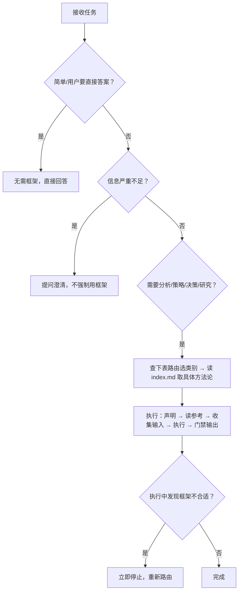

# 方法论导航地图

Agent 的工作必须由方法论支撑。本技能是一张方法论索引地图，引导 Agent **先选对框架，再正确使用**。详细方法论清单在各 `references/<category>/index.md` 中。

## TL;DR · 30 秒速查



**能力概览**：18 类 × 104 个方法论。每个类别的方法论清单、最佳适用场景、最低信息要求都在该类别的 `index.md` 中。

## 核心原则

1. **先选框架再动手** — 接到任务时，先判断适用哪个方法论；框架选择应在 30 秒内完成
2. **框架是工具而非目的** — 结合语境灵活组合，不生搬硬套
3. **显式使用** — 告诉用户正在用哪个方法论以及为什么，让分析过程可追溯
4. **结构化且可验证的输出** — 输出应包含可执行建议 + 验证标准
5. **框架适配自检** — 选定框架后用一句话验证："[框架名] 能否直接回答 [用户的核心问题]？" 若不能，重新选择

---

## 类别总览（18 类 × 104 个方法论）

| #   | 类别             | 适用任务类型                                                                                                                 | 数量 | 索引路径                                 |
| --- | -------------------- | ------------------------------------------------------------------------------------------------------------------------------------- | ----- | ------------------------------------------ |
| 1   | 问题诊断    | 根因查找、颠覆性思考、80/20 聚焦                                                                                  | 4     | `references/problem-diagnosis/index.md`    |
| 2   | 战略分析   | 态势评估、竞争格局、商业模式、定价、护城河、价值链、对标、资源能力评估 | 23    | `references/strategy/index.md`             |
| 3   | 产品与增长     | 用户需求、增长瓶颈、产品创新、指标                                                                           | 8     | `references/product-growth/index.md`       |
| 4   | 决策制定      | 优先级、目标设定、风险预演、技术选型、生死决策                                             | 8     | `references/decision-making/index.md`      |
| 5   | 用户研究        | 客户旅程、共情地图、决策旅程、需求层级                                                                  | 4     | `references/user-research/index.md`        |
| 6   | 结构化思考  | MECE 表达、多视角评估、假设澄清、框架选择、连点成线                         | 8     | `references/structured-thinking/index.md`  |
| 7   | 产品发现    | 持续发现、假设验证、用户访谈、实验设计                                                       | 8     | `references/product-discovery/index.md`    |
| 8   | 上市         | 滩头阵地、ICP、GTM、增长飞轮、定位                                                                             | 7     | `references/go-to-market/index.md`         |
| 9   | 市场研究      | 市场规模、细分、用户画像、STP、感知图、技术采纳                                              | 7     | `references/market-research/index.md`      |
| 10  | 数据分析        | 同期群分析、A/B 测试、指标、RFM                                                                                            | 4     | `references/data-analysis/index.md`        |
| 11  | AI 交付          | 交付标准、文档代码漂移                                                                                          | 2     | `references/ai-delivery/index.md`          |
| 12  | 执行            | 结果导向路线图、战略红队、敏捷需求                                                                      | 4     | `references/execution/index.md`            |
| 13  | 工程实践            | TDD、小步规划、服务契约、Agent DX                                                                                 | 4     | `references/engineering/index.md`          |
| 14  | 产品哲学   | 极致减法、垂直整合、科技人文、无形之善                                                      | 4     | `references/product-philosophy/index.md`   |
| 15  | 领导力           | 现实扭曲力场、A 级人才密度                                                                                            | 2     | `references/leadership/index.md`           |
| 16  | 财务分析   | 杜邦、DCF、可比公司、EVA                                                                                                | 4     | `references/financial-analysis/index.md`   |
| 17  | 研究方法 | 系统化研究流程                                                                                                           | 1     | `references/research-methodology/index.md` |
| 18  | 行业分析    | 行业价值链、技术成熟度曲线                                                                                       | 2     | `references/industry-analysis/index.md`    |

---

## 用户意图 → 类别快速路由

按类别分组，列出每个类别的核心用户意图 → 首选方法论。完整备选方法论在各 `index.md` 的"路由触发信号"章节。

**问题诊断** — 根因→5 Whys；颠覆性思考→第一性原理；80/20 聚焦→帕累托；多因素归因→鱼骨图
**战略分析** — 态势评估→SWOT；竞争格局→波特五力；外部环境→PESTLE；商业模式→商业模式画布；多利益相关方对齐→利益相关方地图；增长方向→Ansoff；价值创新→蓝海战略；组织诊断→麦肯锡 7S；产品组合→BCG 矩阵；战略可视化→产品战略画布；早期创业验证→精益画布；战略与利润分离→创业画布；价值主张文案→JDB 价值主张；变现模型→变现战略；定价→定价战略；护城河→Can't-Won't 防御性；资源能力评估→VRIO；国家竞争优势→波特钻石模型；业务组合管理→GE-麦肯锡矩阵；战略群组→战略群组图；价值链→价值链分析；最佳实践→对标；产品生命周期→产品生命周期
**产品与增长** — 真实用户需求→JTBD；增长瓶颈→AARRR；0→1→设计思维；迭代验证→精益 BML；契合度验证→价值主张画布；系统化创意→SCAMPER；需求性质分类→Kano；指标→北极星
**决策制定** — 优先级→RICE；任务管理→艾森豪威尔矩阵；目标设定→OKR；风险预演→Pre-mortem；多准则选择→决策矩阵；需求裁剪→MoSCoW；失效风险→FMEA；生死决策→死亡过滤器
**用户研究** — 客户旅程→客户旅程地图；共情映射→共情地图；消费者决策旅程→消费者决策旅程；需求层级→马斯洛需求层级
**结构化思考** — 结构化表达→MECE+金字塔；多视角评估→六顶思考帽；假设澄清→苏格拉底式提问；问题域判断→Cynefin；二阶效应→二阶思考；框架选择→框架选择；连点成线→连点成线；重构升华→重构升华
**产品发现** — 持续发现→机会解决方案树；用户访谈→The Mom Test；创意筛选→ICE；未被满足的需求→机会得分；实验选择→实验设计库；假设识别→假设映射；最小可行原型→Pretotypes；产品团队协作→产品铁三角
**上市** — 滩头阵地→滩头阵地细分；理想客户→ICP；GTM 动作→GTM Motions；发布计划→GTM 战略；增长飞轮→增长循环；竞争响应→竞争战卡；定位→定位战略
**市场研究** — 市场规模→市场规模测算；市场细分→市场细分；用户细分→用户细分；用户画像→用户画像；STP 分析→STP 分析；品牌感知→感知图；技术采纳→技术采纳生命周期
**数据分析** — 留存分析→同期群分析；A/B 测试→A/B 测试分析；指标选择→精益分析指标；用户价值分层→RFM 模型
**AI 交付** — 交付标准→交付物；漂移检测→预期 vs 实现
**执行** — 结果导向路线图→结果路线图；战略红队→战略红队；敏捷需求→用户故事；情境化需求→Job Stories
**工程实践** — 测试驱动→TDD；小步规划→小步计划；服务契约→类型化服务契约；Agent 友好→Agent DX/CLI 规模
**产品哲学** — 极致减法→Focus as No；垂直整合→Whole Widget；科技人文→科技遇见人文；无形之善→无形之善
**领导力** — 现实扭曲力场→现实扭曲力场；A 级人才密度→A 级人才密度
**财务分析** — ROE 拆解→杜邦；企业估值→DCF；可比公司→可比公司；价值创造→EVA
**研究方法** — 系统化研究→系统化研究流程
**行业分析** — 行业价值链→行业价值链；技术成熟度→Gartner 炒作周期

---

## 调用协议

```
0. 预检：确认任务类型匹配上表中某一行；确认信息充分度 ≥ L1；若两个框架都合适，选首选 + 备选并说明首选理由
1. 声明框架："我将使用 [方法论名称] 进行分析。选择理由：[路由对应关系]；所需输入：[清单]；预期输出：[格式]"
2. 读参考：打开 references/<category>/<methodology>.md，提取执行步骤与输出模板
3. 收集输入：按框架要求逐项确认；缺失项走降级路径处理
4. 执行框架：按参考步骤逐步输出，每步标注信息来源（事实/推断/假设）
5. 输出结论（质量门禁）：
   ✓ 直接回答用户原始问题
   ✓ 含至少一条可立即执行的动作建议
   ✓ 标注信心水平（高/中/低）及主要不确定因素
   ✗ 若结论只是复述框架内容而无增量洞察，继续细化
```

### 何时不用框架

- 任务简单清晰；用框架反而增加不必要的复杂度
- 用户明确要求直接回答
- 信息严重缺失（见降级路径 L3+）

### 组合规则

部分任务需要方法论组合。常见组合在各 `index.md` 的"常见组合"章节。每完成一个框架、进入下一个前确认：① 上一个框架的核心结论是否清晰？② 下一个框架是否需要上一个框架的输出作为输入？③ 用户对上一个框架的结论是否有异议？

---

## 信息不足降级路径

| 等级 | 状态                                                                         | 动作                                                                                                                                          |
| ----- | ----------------------------------------------------------------------------- | ----------------------------------------------------------------------------------------------------------------------------------------------- |
| L1    | 信息基本充足                                              | 正常执行框架                                                                                                                      |
| L2    | 部分信息缺失                                                 | 明确标注哪些维度是假设而非事实；用 `[待收集数据]` 占位，输出后列出待收集项 |
| L3    | 核心信息缺失（无法产出有效结论）                   | 停止执行，向用户提 1-3 个最关键问题；说明缺什么信息、为何影响输出质量                     |
| L4    | 信息严重不足（连框架选择都无法确定） | 降级为"直接最佳判断"，不用框架；说明当前判断的信心水平与依赖假设                          |

各框架的最低信息要求详见各 `index.md` 的"各方法论最低信息要求"章节。

---

## 选错框架时的纠偏

执行中若发现框架不合适（关键维度无法填充且非信息问题、分析结论与用户问题脱节、用户反馈"方向错了"），不要硬撑完成：

1. 立即停止当前框架执行
2. 说明：已完成部分 + 为何判断此框架不合适
3. 从快速路由表重新选择，说明切换理由
4. 已完成部分若有价值，可作为输入保留

---

## 维护说明

- 新增方法论：放入对应 `references/<category>/` 目录，更新该类别 `index.md` 的表格、最低信息要求与路由触发信号
- 新增类别：在 SKILL.md 类别总览表追加一行，创建 `references/<category>/index.md`
- 路由表调整：修改 SKILL.md "用户意图 → 类别快速路由"章节
- **读取原则**：按需读取对应参考文件，不要预加载全部文件
