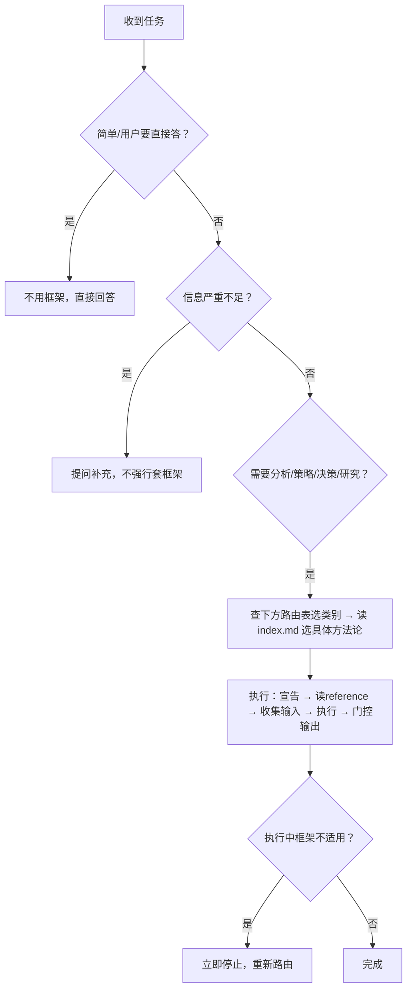

# Methodology Compass · 方法论指南针

Agent 的工作必须有方法论支撑。本 skill 是方法论索引地图，指导 agent **选择正确的框架、正确地使用框架**。详细方法论列表在各 `references/<category>/index.md`。

## TL;DR · 30秒速查



**能力概览**：18 个类别 × 104 个方法论。每个类别的方法论清单、最佳场景、最低信息需求均在该类别的 `index.md` 中。

## 核心原则

1. **先选框架，后展开工作** — 拿到任务先判断适用哪种方法论；选框架耗时应 < 30秒
2. **框架是工具，不是目的** — 根据情境灵活组合，不生搬硬套
3. **显性化使用** — 告知用户正在使用哪种方法论及原因，让分析过程可追溯
4. **输出结构化且可验证** — 输出应包含可操作建议 + 验证标准
5. **框架适配度自检** — 选框架后一句话验证：「[框架名] 能直接回答 [用户的核心问题] 吗？」不能则重新选择

---

## 类别总览（18 类 × 104 个方法论）

| # | 类别 | 适用任务类型 | 数量 | 索引路径 |
| --- | --- | --- | --- | --- |
| 1 | 问题诊断 | 找根因、颠覆性思考、80/20 聚焦 | 4 | `references/problem-diagnosis/index.md` |
| 2 | 战略分析 | 现状评估、竞争格局、商业模式、定价护城河、价值链、标杆、资源能力评估 | 23 | `references/strategy/index.md` |
| 3 | 产品与增长 | 用户需求、增长瓶颈、产品创新、指标体系 | 8 | `references/product-growth/index.md` |
| 4 | 决策制定 | 优先级排序、目标制定、风险预演、选型、存在主义决策 | 8 | `references/decision-making/index.md` |
| 5 | 用户研究 | 用户旅程、同理心画像、决策旅程、需求层次 | 4 | `references/user-research/index.md` |
| 6 | 结构化思维 | MECE 表达、多视角评估、假设澄清、框架选择、连点思维 | 8 | `references/structured-thinking/index.md` |
| 7 | 产品发现 | 持续发现、假设验证、用户访谈、实验设计 | 8 | `references/product-discovery/index.md` |
| 8 | 上市策略 | 滩头堡、ICP、GTM、增长飞轮、定位 | 7 | `references/go-to-market/index.md` |
| 9 | 市场研究 | 市场规模、细分、用户画像、STP、感知图、技术采用 | 7 | `references/market-research/index.md` |
| 10 | 数据分析 | 同期群、A/B 测试、指标体系、RFM | 4 | `references/data-analysis/index.md` |
| 11 | AI 交付 | 交付物标准、文档代码 drift | 2 | `references/ai-delivery/index.md` |
| 12 | 执行 | 结果导向路线图、战略红队、敏捷需求 | 4 | `references/execution/index.md` |
| 13 | 编程与架构 | TDD、小步计划、服务契约、Agent DX | 4 | `references/engineering/index.md` |
| 14 | 产品哲学 | 激进减法、垂直整合、科技人文、隐形完美 | 4 | `references/product-philosophy/index.md` |
| 15 | 领导力 | 现实扭曲力场、A 级人才密度 | 2 | `references/leadership/index.md` |
| 16 | 财务分析 | 杜邦、DCF、可比公司、EVA | 4 | `references/financial-analysis/index.md` |
| 17 | 研究方法论 | 系统化研究流程 | 1 | `references/research-methodology/index.md` |
| 18 | 行业分析 | 行业价值链、技术成熟度曲线 | 2 | `references/industry-analysis/index.md` |

---

## 用户意图 → 类别快速路由

按类别分组，列出该类别覆盖的核心用户意图 → 主方法论。完整备选方法论见各 `index.md` 的"路由触发信号"章节。

**问题诊断** — 找根因→5 Whys；颠覆性思考→First Principles；80/20 聚焦→Pareto；多因素成因→Fishbone
**战略分析** — 现状评估→SWOT；竞争格局→Porter's Five Forces；外部环境→PESTLE；商业模式→Business Model Canvas；多方对齐→Stakeholder Mapping；增长方向→Ansoff；价值创新→Blue Ocean；组织诊断→McKinsey 7S；产品组合→BCG Matrix；战略显性化→Product Strategy Canvas；早期创业验证→Lean Canvas；战略与盈利分离→Startup Canvas；价值主张文案→JDB Value Proposition；变现模型→Monetization Strategy；定价→Pricing Strategy；护城河→Can't-Won't Defensibility；资源能力评估→VRIO；国家竞争优势→Porter Diamond Model；业务组合管理→GE 麦肯锡矩阵；战略群组→Strategic Group Mapping；价值链→Value Chain Analysis；最佳实践→Benchmarking；产品生命周期→Product Life Cycle
**产品与增长** — 用户真实需求→JTBD；增长瓶颈→AARRR；从0到1→Design Thinking；迭代验证→Lean BML；契合度验证→Value Proposition Canvas；系统化创意→SCAMPER；需求性质分类→Kano；指标体系→North Star
**决策制定** — 优先级排序→RICE；任务管理→Eisenhower；目标制定→OKR；风险预演→Pre-mortem；多标准选型→Decision Matrix；需求裁剪→MoSCoW；失效风险→FMEA；存在主义决策→Death Filter
**用户研究** — 用户旅程→Customer Journey Map；同理心画像→Empathy Map；消费者决策旅程→Consumer Decision Journey；需求层次→Maslow Hierarchy
**结构化思维** — 结构化表达→MECE+Pyramid；多视角评估→Six Thinking Hats；澄清假设→Socratic Questioning；问题域判断→Cynefin；二阶效应→Second-Order Thinking；框架选择→Framework Selection；连点思维→Connecting Dots；重构升维→Reframe and Elevate
**产品发现** — 持续发现→Opportunity Solution Tree；用户访谈→The Mom Test；想法初筛→ICE；未满足需求→Opportunity Score；实验选型→Experiment Design Library；假设识别→Assumption Mapping；最小可行原型→Pretotypes；产品团队协作→Product Trio
**上市策略** — 滩头堡→Beachhead Segment；理想客户→ICP；GTM动作→GTM Motions；发布计划→GTM Strategy；增长飞轮→Growth Loops；竞品应战→Competitive Battlecard；定位→Positioning Strategy
**市场研究** — 市场规模→Market Sizing；市场细分→Market Segmentation；用户细分→User Segmentation；用户画像→User Personas；STP 分析→STP Analysis；品牌感知→Perceptual Mapping；技术采用→Technology Adoption Lifecycle
**数据分析** — 留存分析→Cohort Analysis；A/B测试→A/B Test Analysis；指标选型→Lean Analytics Metrics；用户价值分层→RFM Model
**AI 交付** — 交付物标准→Shipping Artifacts；drift检测→Intended vs Implemented
**执行** — 结果导向路线图→Outcome Roadmap；战略红队→Strategy Red Team；敏捷需求→User Stories；情境化需求→Job Stories
**编程与架构** — 测试驱动→TDD；小步计划→Bite-Sized Plan；服务契约→Typed Service Contracts；Agent友好度→Agent DX/CLI Scale
**产品哲学** — 激进减法→Focus as No；垂直整合→Whole Widget；科技人文→Technology Meets Humanities；隐形完美→Invisible Perfection
**领导力** — 现实扭曲力场→Reality Distortion Field；A 级人才密度→A-Player Density
**财务分析** — ROE 拆解→DuPont；企业估值→DCF；可比公司→Comparable Company；价值创造→EVA
**研究方法论** — 系统化研究→Systematic Research Process
**行业分析** — 行业价值链→Industry Value Chain；技术成熟度→Gartner Hype Cycle

---

## 调用协议

```
0. 前置检查：确认任务类型匹配上表某一行；确认信息充分度 ≥ Level 1；两个框架都适合则选主+备并说明选主理由
1. 宣告框架："我将使用 [方法论名] 分析。选择原因：[路由对应]；所需输入：[列出]；预期输出：[格式]"
2. 读 reference：打开 references/<category>/<methodology>.md 提取执行步骤和输出模板
3. 收集输入：按框架所需逐项确认；缺失项按降级路径处理
4. 执行框架：按 reference 步骤逐一输出，每步标注信息来源（事实/推断/假设）
5. 输出结论（质量门控）：
   ✓ 直接回答用户原始问题
   ✓ 包含至少一条可立即执行的行动建议
   ✓ 标注置信度（高/中/低）及主要不确定因素
   ✗ 如结论只是重复框架内容而无增量洞察，重新提炼
```

### 何时不使用框架

- 任务简单明确，框架会增加不必要复杂性
- 用户明确要求直接回答
- 框架所需信息严重缺失（见降级路径 Level 3+）

### 组合使用规则

部分任务需要方法论组合。常见组合在各 `index.md` 的"常见组合"章节。每个框架执行完毕后，进入下一框架前确认：①上一框架核心结论是否已明确？②下一框架是否需要上一框架输出作为输入？③用户对上一框架结论有无异议？

---

## 信息不足降级路径

| Level | 状态 | 动作 |
| --- | --- | --- |
| L1 | 信息基本充分 | 正常执行框架 |
| L2 | 信息部分缺失 | 明确标注哪些维度是假设而非事实；用 `[需补充数据]` 占位，输出后列出待收集项 |
| L3 | 核心信息缺失（无法产出有效结论） | 停止执行，向用户提出 1-3 个最关键问题；说明缺少什么信息、为何影响输出质量 |
| L4 | 信息严重不足（连框架选择都无法判断） | 退化为「直接最佳判断」，不套框架；说明当前判断的置信度和依赖假设 |

各框架最低信息需求详见各 `index.md` 的"各方法论最低信息需求"章节。

---

## 框架选错时的纠偏

执行中若发现框架不适用（关键维度无法填充且非信息问题、分析结论与用户问题脱节、用户反馈"方向不对"），不要强行完成：

1. 立即停止当前框架执行
2. 说明：已完成部分 + 为何判断此框架不适合
3. 从快速路由表重新选择，说明切换理由
4. 已完成部分如有价值可保留作为输入

---

## 维护说明

- 新增方法论：放入对应 `references/<category>/` 目录，并更新该类别 `index.md` 的表格、最低信息需求、路由触发信号
- 新增类别：在 SKILL.md 类别总览表追加一行，创建 `references/<category>/index.md`
- 路由表调整：修改 SKILL.md "用户意图 → 类别快速路由" 章节
- **读取原则**：仅在需要时读取对应的 reference 文件，不要预加载全部文件
