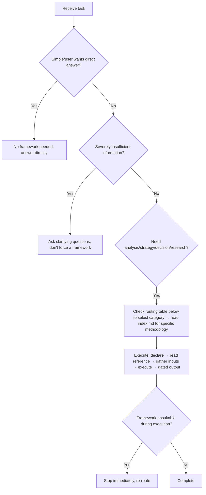

# Methodology Compass · Methodology Compass

Agent work must be supported by methodologies. This skill is a methodology index map that guides agents to **choose the right framework first, then use it correctly**. Detailed methodology lists are in each `references/<category>/index.md`.

## TL;DR · 30-second Quick Reference



**Capability overview**: 18 categories × 104 methodologies. Each category's methodology list, best scenarios, and minimum information requirements are in that category's `index.md`.

## Core Principles

1. **Choose framework first, then proceed** — When receiving a task, first determine which methodology applies; framework selection should take < 30 seconds
2. **Framework is a tool, not a goal** — Combine flexibly based on context, don't rigidly apply
3. **Explicit usage** — Tell users which methodology is being used and why, making the analysis process traceable
4. **Structured and verifiable output** — Output should include actionable advice + verification criteria
5. **Framework fitness self-check** — After choosing a framework, verify in one sentence: "Can [framework name] directly answer [user's core question]?" If not, re-select

---

## Category Overview (18 categories × 104 methodologies)

| # | Category | Applicable Task Types | Count | Index Path |
| --- | --- | --- | --- | --- |
| 1 | Problem Diagnosis | Root cause finding, disruptive thinking, 80/20 focus | 4 | `references/problem-diagnosis/index.md` |
| 2 | Strategic Analysis | Situation assessment, competitive landscape, business model, pricing, moat, value chain, benchmarking, resource capability assessment | 23 | `references/strategy/index.md` |
| 3 | Product & Growth | User needs, growth bottlenecks, product innovation, metrics | 8 | `references/product-growth/index.md` |
| 4 | Decision Making | Prioritization, goal setting, risk rehearsal, technology selection, existential decisions | 8 | `references/decision-making/index.md` |
| 5 | User Research | Customer journey, empathy mapping, decision journey, needs hierarchy | 4 | `references/user-research/index.md` |
| 6 | Structured Thinking | MECE expression, multi-perspective evaluation, assumption clarification, framework selection, connecting dots | 8 | `references/structured-thinking/index.md` |
| 7 | Product Discovery | Continuous discovery, hypothesis validation, user interviews, experiment design | 8 | `references/product-discovery/index.md` |
| 8 | Go-to-Market | Beachhead segment, ICP, GTM, growth flywheel, positioning | 7 | `references/go-to-market/index.md` |
| 9 | Market Research | Market sizing, segmentation, user personas, STP, perceptual mapping, technology adoption | 7 | `references/market-research/index.md` |
| 10 | Data Analysis | Cohort analysis, A/B testing, metrics, RFM | 4 | `references/data-analysis/index.md` |
| 11 | AI Delivery | Delivery standards, documentation code drift | 2 | `references/ai-delivery/index.md` |
| 12 | Execution | Outcome-oriented roadmap, strategic red team, agile requirements | 4 | `references/execution/index.md` |
| 13 | Engineering | TDD, bite-sized planning, service contracts, Agent DX | 4 | `references/engineering/index.md` |
| 14 | Product Philosophy | Radical subtraction, vertical integration, tech-humanities, invisible perfection | 4 | `references/product-philosophy/index.md` |
| 15 | Leadership | Reality distortion field, A-player density | 2 | `references/leadership/index.md` |
| 16 | Financial Analysis | DuPont, DCF, comparable companies, EVA | 4 | `references/financial-analysis/index.md` |
| 17 | Research Methodology | Systematic research process | 1 | `references/research-methodology/index.md` |
| 18 | Industry Analysis | Industry value chain, technology maturity curve | 2 | `references/industry-analysis/index.md` |

---

## User Intent → Category Quick Routing

Grouped by category, listing core user intent → primary methodology for each category. Complete backup methodologies are in each `index.md`'s "Routing Trigger Signals" section.

**Problem Diagnosis** — Root cause→5 Whys; Disruptive thinking→First Principles; 80/20 focus→Pareto; Multi-factor causes→Fishbone
**Strategic Analysis** — Situation assessment→SWOT; Competitive landscape→Porter's Five Forces; External environment→PESTLE; Business model→Business Model Canvas; Multi-stakeholder alignment→Stakeholder Mapping; Growth direction→Ansoff; Value innovation→Blue Ocean; Organizational diagnosis→McKinsey 7S; Product portfolio→BCG Matrix; Strategy visualization→Product Strategy Canvas; Early startup validation→Lean Canvas; Strategy-profit separation→Startup Canvas; Value proposition copy→JDB Value Proposition; Monetization model→Monetization Strategy; Pricing→Pricing Strategy; Moat→Can't-Won't Defensibility; Resource capability assessment→VRIO; National competitive advantage→Porter Diamond Model; Business portfolio management→GE McKinsey Matrix; Strategic groups→Strategic Group Mapping; Value chain→Value Chain Analysis; Best practices→Benchmarking; Product lifecycle→Product Life Cycle
**Product & Growth** — True user needs→JTBD; Growth bottleneck→AARRR; 0→1→Design Thinking; Iterative validation→Lean BML; Fit validation→Value Proposition Canvas; Systematic creativity→SCAMPER; Need nature classification→Kano; Metrics→North Star
**Decision Making** — Prioritization→RICE; Task management→Eisenhower; Goal setting→OKR; Risk rehearsal→Pre-mortem; Multi-criteria selection→Decision Matrix; Requirement trimming→MoSCoW; Failure risk→FMEA; Existential decisions→Death Filter
**User Research** — Customer journey→Customer Journey Map; Empathy mapping→Empathy Map; Consumer decision journey→Consumer Decision Journey; Needs hierarchy→Maslow Hierarchy
**Structured Thinking** — Structured expression→MECE+Pyramid; Multi-perspective evaluation→Six Thinking Hats; Assumption clarification→Socratic Questioning; Problem domain judgment→Cynefin; Second-order effects→Second-Order Thinking; Framework selection→Framework Selection; Connecting dots→Connecting Dots; Reframing and elevating→Reframe and Elevate
**Product Discovery** — Continuous discovery→Opportunity Solution Tree; User interviews→The Mom Test; Idea screening→ICE; Unmet needs→Opportunity Score; Experiment selection→Experiment Design Library; Hypothesis identification→Assumption Mapping; Minimum viable prototype→Pretotypes; Product team collaboration→Product Trio
**Go-to-Market** — Beachhead segment→Beachhead Segment; Ideal customer→ICP; GTM actions→GTM Motions; Launch plan→GTM Strategy; Growth flywheel→Growth Loops; Competitive response→Competitive Battlecard; Positioning→Positioning Strategy
**Market Research** — Market sizing→Market Sizing; Market segmentation→Market Segmentation; User segmentation→User Segmentation; User personas→User Personas; STP analysis→STP Analysis; Brand perception→Perceptual Mapping; Technology adoption→Technology Adoption Lifecycle
**Data Analysis** — Retention analysis→Cohort Analysis; A/B testing→A/B Test Analysis; Metrics selection→Lean Analytics Metrics; User value segmentation→RFM Model
**AI Delivery** — Delivery standards→Shipping Artifacts; Drift detection→Intended vs Implemented
**Execution** — Outcome-oriented roadmap→Outcome Roadmap; Strategic red team→Strategy Red Team; Agile requirements→User Stories; Contextual requirements→Job Stories
**Engineering** — Test-driven→TDD; Bite-sized planning→Bite-Sized Plan; Service contracts→Typed Service Contracts; Agent friendliness→Agent DX/CLI Scale
**Product Philosophy** — Radical subtraction→Focus as No; Vertical integration→Whole Widget; Tech-humanities→Technology Meets Humanities; Invisible perfection→Invisible Perfection
**Leadership** — Reality distortion field→Reality Distortion Field; A-player density→A-Player Density
**Financial Analysis** — ROE decomposition→DuPont; Enterprise valuation→DCF; Comparable companies→Comparable Company; Value creation→EVA
**Research Methodology** — Systematic research→Systematic Research Process
**Industry Analysis** — Industry value chain→Industry Value Chain; Technology maturity→Gartner Hype Cycle

---

## Calling Protocol

```
0. Pre-check: Confirm task type matches a row in the table above; confirm information sufficiency ≥ Level 1; if both frameworks are suitable, select primary + backup and explain primary selection reason
1. Declare framework: "I will use [methodology name] for analysis. Reason for selection: [routing correspondence]; required inputs: [list]; expected output: [format]"
2. Read reference: Open references/<category>/<methodology>.md to extract execution steps and output template
3. Gather inputs: Confirm each item as required by the framework; handle missing items via degradation path
4. Execute framework: Output step by step per reference steps, tagging information source for each step (fact/inference/assumption)
5. Output conclusion (quality gate):
   ✓ Directly answers user's original question
   ✓ Contains at least one immediately executable action suggestion
   ✓ Labels confidence level (high/medium/low) and main uncertainty factors
   ✗ If conclusion merely repeats framework content without incremental insights, refine further
```

### When Not to Use Frameworks

- Task is simple and clear; framework would add unnecessary complexity
- User explicitly asks for direct answer
- Information is severely missing (see degradation path Level 3+)

### Combination Rules

Some tasks require methodology combinations. Common combinations are in each `index.md`'s "Common Combinations" section. After completing each framework and before proceeding to the next, confirm: ① Are the core conclusions from the previous framework clear? ② Does the next framework need the previous framework's output as input? ③ Does the user have any objections to the previous framework's conclusions?

---

## Information Insufficiency Degradation Path

| Level | State | Action |
| --- | --- | --- |
| L1 | Information basically sufficient | Execute framework normally |
| L2 | Information partially missing | Clearly label which dimensions are assumptions rather than facts; use `[data to be collected]` placeholders, list items to collect after output |
| L3 | Core information missing (cannot produce valid conclusions) | Stop execution, ask user 1-3 most critical questions; explain what information is missing and why it affects output quality |
| L4 | Information severely insufficient (cannot even determine framework selection) | Degrade to "direct best judgment", no framework; explain current judgment's confidence level and dependent assumptions |

Minimum information requirements for each framework are detailed in each `index.md`'s "Minimum Information Requirements for Each Methodology" section.

---

## Correction When Wrong Framework Is Chosen

If during execution you find the framework is unsuitable (key dimension cannot be filled and it's not an information issue, analysis conclusions are disconnected from user's question, user feedback says "wrong direction"), don't force completion:

1. Stop current framework execution immediately
2. Explain: completed parts + why you judge this framework unsuitable
3. Re-select from quick routing table, explaining switch reason
4. Completed parts, if valuable, can be retained as input

---

## Maintenance Notes

- Adding methodology: Place in corresponding `references/<category>/` directory, update that category's `index.md` table, minimum information requirements, and routing trigger signals
- Adding category: Append row to SKILL.md category overview table, create `references/<category>/index.md`
- Routing table adjustment: Modify SKILL.md "User Intent → Category Quick Routing" section
- **Reading principle**: Only read corresponding reference files when needed, don't preload all files
