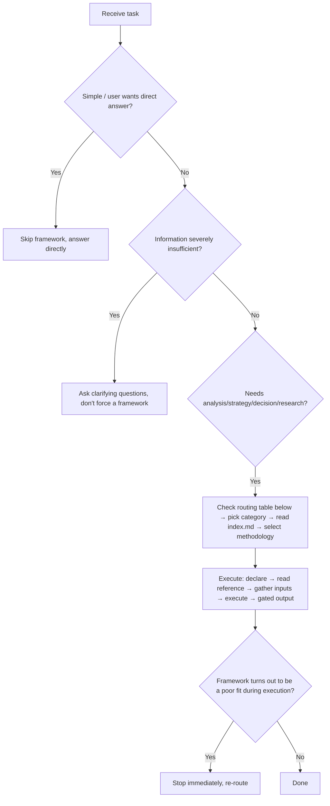

# Methodology Compass

Every agent task requires methodology support. This skill is a methodology index map that guides agents to **choose the right framework, then use it correctly**. The detailed methodology list for each category is in the respective `references/<category>/index.md`.

## TL;DR — 30-Second Quick Reference



**Capability overview**: 19 categories × 116 methodologies. Each category's methodology list, best-use scenarios, and minimum information requirements are in that category's `index.md`.

## Core Principles

1. **Choose the framework first, then do the work** — When receiving a task, first determine which methodology applies; framework selection should take < 30 seconds
2. **Frameworks are tools, not goals** — Combine flexibly based on context; don't force-fit
3. **Make usage explicit** — Tell the user which methodology is being used and why, making the analysis process traceable
4. **Structured and verifiable output** — Output should include actionable recommendations + verification criteria
5. **Framework fitness self-check** — After selecting a framework, verify in one sentence: "Can [framework name] directly answer [the user's core question]?" If not, re-select

---

## Category Overview (19 categories × 116 methodologies)

| # | Category | Task types | Count | Index path |
| --- | --- | --- | --- | --- |
| 1 | Problem Diagnosis | Root cause analysis, disruptive thinking, 80/20 focus | 4 | `references/problem-diagnosis/index.md` |
| 2 | Strategic Analysis | Situation assessment, competitive landscape, business model, pricing moat, value chain, benchmarking, resource/capability assessment, strategic evolution | 23 | `references/strategy/index.md` |
| 3 | Product & Growth | User needs, growth bottleneck, product innovation, metrics | 8 | `references/product-growth/index.md` |
| 4 | Decision Making | Prioritization, goal setting, risk rehearsal, technology selection, existential decision, risk assessment | 9 | `references/decision-making/index.md` |
| 5 | User Research | User journey, empathy mapping, decision journey, needs hierarchy | 4 | `references/user-research/index.md` |
| 6 | Structured Thinking | MECE expression, multi-perspective assessment, assumption clarification, framework selection, connecting dots, systems thinking | 9 | `references/structured-thinking/index.md` |
| 7 | Product Discovery | Continuous discovery, hypothesis validation, user interviews, experiment design | 8 | `references/product-discovery/index.md` |
| 8 | Go-to-Market | Beachhead, ICP, GTM, growth loops, positioning | 7 | `references/go-to-market/index.md` |
| 9 | Market Research | Market sizing, segmentation, user personas, STP, perceptual mapping, technology adoption | 7 | `references/market-research/index.md` |
| 10 | Data Analysis | Cohort, A/B testing, metrics, RFM | 4 | `references/data-analysis/index.md` |
| 11 | AI Delivery | Shipping artifacts standards, doc-code drift | 2 | `references/ai-delivery/index.md` |
| 12 | Execution | Outcome roadmap, strategy red team, agile requirements | 4 | `references/execution/index.md` |
| 13 | Engineering | TDD, bite-sized plan, service contracts, Agent DX, code review, refactoring, architecture design, CI/CD, observability, DDD, performance optimization, security design, API design, database design, incident response, Git workflow, dependency management, microservices | 18 | `references/engineering/index.md` |
| 14 | Product Philosophy | Radical focus, vertical integration, tech meets humanities, invisible perfection | 4 | `references/product-philosophy/index.md` |
| 15 | Leadership | Reality distortion field, A-player density, change management | 3 | `references/leadership/index.md` |
| 16 | Financial Analysis | DuPont, DCF, comparable company, EVA | 4 | `references/financial-analysis/index.md` |
| 17 | Research Methodology | Systematic research process | 1 | `references/research-methodology/index.md` |
| 18 | Industry Analysis | Industry value chain, Gartner Hype Cycle | 2 | `references/industry-analysis/index.md` |
| 19 | Quantitative Investment | Factor investing, portfolio optimization, risk parity, momentum strategy, statistical arbitrage, backtesting, ML stock selection | 7 | `references/quantitative-investment/index.md` |

---

## User Intent → Category Quick Routing

Grouped by category, listing the core user intents covered → primary methodology. See each `index.md` "Routing Trigger Signals" section for the full list of alternative methodologies.

**Problem Diagnosis** — Find root cause→5 Whys; Disruptive thinking→First Principles; 80/20 focus→Pareto; Multi-factor causation→Fishbone
**Strategic Analysis** — Situation assessment→SWOT; Competitive landscape→Porter's Five Forces; External environment→PESTLE; Business model→Business Model Canvas; Multi-stakeholder alignment→Stakeholder Mapping; Growth direction→Ansoff; Value innovation→Blue Ocean; Org diagnosis→McKinsey 7S; Product portfolio→BCG Matrix; Strategy visualization→Product Strategy Canvas; Early-stage startup validation→Lean Canvas; Strategy & monetization separation→Startup Canvas; Value proposition copy→JDB Value Proposition; Monetization model→Monetization Strategy; Pricing→Pricing Strategy; Moat→Can't-Won't Defensibility; Resource/capability assessment→VRIO; National competitive advantage→Porter Diamond Model; Business portfolio management→GE-McKinsey Matrix; Strategic groups→Strategic Group Mapping; Value chain→Value Chain Analysis; Best practices→Benchmarking; Product life cycle→Product Life Cycle; Strategic evolution awareness→Wardley Mapping
**Product & Growth** — Core job users want done→JTBD; Growth bottleneck→AARRR; Zero-to-one→Design Thinking; Iterative validation→Lean BML; Fit validation→Value Proposition Canvas; Systematic creativity→SCAMPER; Need type classification→Kano; Metrics→North Star
**Decision Making** — Prioritization→RICE; Task management→Eisenhower; Goal setting→OKR; Risk rehearsal→Pre-mortem; Multi-criteria selection→Decision Matrix; Scope trimming→MoSCoW; Failure risk→FMEA; Existential decision→Death Filter; Quick risk assessment→Risk Matrix
**User Research** — User journey→Customer Journey Map; Empathy mapping→Empathy Map; Consumer decision journey→Consumer Decision Journey; Needs hierarchy→Maslow Hierarchy
**Structured Thinking** — Structured expression→MECE+Pyramid; Multi-perspective assessment→Six Thinking Hats; Clarify assumptions→Socratic Questioning; Problem domain identification→Cynefin; Second-order effects→Second-Order Thinking; Framework selection→Framework Selection; Connecting dots→Connecting Dots; Reframe & elevate→Reframe and Elevate; Systems thinking→Systems Thinking
**Product Discovery** — Continuous discovery→Opportunity Solution Tree; User interviews→The Mom Test; Idea screening→ICE; Unmet needs→Opportunity Score; Experiment selection→Experiment Design Library; Assumption identification→Assumption Mapping; Minimum viable prototype→Pretotypes; Product team collaboration→Product Trio
**Go-to-Market** — Beachhead→Beachhead Segment; Ideal customer→ICP; GTM actions→GTM Motions; Launch plan→GTM Strategy; Growth flywheel→Growth Loops; Competitive response→Competitive Battlecard; Positioning→Positioning Strategy
**Market Research** — Market sizing→Market Sizing; Market segmentation→Market Segmentation; User segmentation→User Segmentation; User personas→User Personas; STP analysis→STP Analysis; Brand perception→Perceptual Mapping; Technology adoption→Technology Adoption Lifecycle
**Data Analysis** — Retention analysis→Cohort Analysis; A/B testing→A/B Test Analysis; Metrics selection→Lean Analytics Metrics; User value segmentation→RFM Model
**AI Delivery** — Shipping artifacts standards→Shipping Artifacts; Drift detection→Intended vs Implemented
**Execution** — Outcome roadmap→Outcome Roadmap; Strategy red team→Strategy Red Team; Agile requirements→User Stories; Contextualized requirements→Job Stories
**Engineering** — Test-driven→TDD; Bite-sized plan→Bite-Sized Plan; Service contracts→Typed Service Contracts; Agent friendliness→Agent DX/CLI Scale; Code review→Code Review Checklist; Refactoring→Refactoring Patterns; Architecture design→Clean Architecture; Domain modeling→DDD; Microservices→Microservices Patterns; API design→API Design; Database design→Database Schema Design; CI/CD→CI/CD Pipeline Design; Security design→Security by Design; Observability→Observability; Performance optimization→Performance Optimization; Incident response→Incident Response & Postmortem; Git workflow→Git Workflow Strategies; Dependency management→Dependency Management
**Product Philosophy** — Radical focus→Focus as No; Vertical integration→Whole Widget; Tech meets humanities→Technology Meets Humanities; Invisible perfection→Invisible Perfection
**Leadership** — Reality distortion field→Reality Distortion Field; A-player density→A-Player Density; Org change→Change Management
**Financial Analysis** — ROE decomposition→DuPont; Enterprise valuation→DCF; Comparable company→Comparable Company; Value creation→EVA
**Research Methodology** — Systematic research→Systematic Research Process
**Industry Analysis** — Industry value chain→Industry Value Chain; Technology maturity→Gartner Hype Cycle
**Quantitative Investment** — Factor investing→Factor Investing; Portfolio optimization→Portfolio Optimization; Risk budgeting→Risk Parity; Trend following→Momentum Strategy; Pairs trading→Statistical Arbitrage; Strategy backtesting→Backtesting Framework; AI stock selection→ML Stock Selection

---

## Calling Protocol

```
0. Pre-check: Confirm the task type matches a row in the table above; confirm information sufficiency ≥ Level 1; if two frameworks both fit, pick primary + backup and explain why primary is primary
1. Declare framework: "I will use [methodology name] for this analysis. Reason: [routing correspondence]; Required inputs: [list]; Expected output: [format]"
2. Read reference: Open references/<category>/<methodology>.md to extract execution steps and output template
3. Gather inputs: Confirm each item as required by the framework; handle missing items via the degradation path
4. Execute framework: Output step by step per the reference, tagging each piece of information as fact/inference/assumption
5. Output conclusion (quality gate):
   ✓ Directly answers the user's original question
   ✓ Includes at least one immediately actionable recommendation
   ✓ Labels confidence (High/Medium/Low) and key uncertainties
   ✗ If the conclusion merely restates the framework without incremental insight, refine further
```

### When NOT to use a framework

- The task is simple and clear; a framework would add unnecessary complexity
- The user explicitly asks for a direct answer
- Information required by the framework is severely missing (see Degradation Path Level 3+)

### Combination rules

Some tasks require a methodology combination. Common combinations are listed in each `index.md` under "Common Combinations". After each framework completes, before moving to the next, confirm: ① Is the core conclusion from the previous framework clear? ② Does the next framework need the previous one's output as input? ③ Does the user have any objections to the previous framework's conclusion?

### Methodology mutual exclusion and ordering constraints

Some methodologies have mutual exclusion or ordering dependencies. When combining, these must be observed:

| Constraint pair | Rule | Reason |
| --- | --- | --- |
| Lean Canvas ↔ Startup Canvas | **Pick one**, don't use both simultaneously | Output overlaps heavily; both are BMC adaptations for early-stage startups |
| RICE ↔ ICE | **ICE for rough screening → RICE for fine ranking**, don't use in parallel | ICE is a simplified version of RICE; parallel use produces redundant output |
| PESTLE → SWOT | **PESTLE before SWOT** | PESTLE expands the O/T dimensions of SWOT; doing it first avoids external analysis omissions |
| SWOT vs Porter's Five Forces | **Choose by analysis target**: comprehensive single-enterprise assessment→SWOT; industry competitive structure→Porter's | Different dimensions; if using both, clarify input boundaries for each |
| JTBD vs User Personas | **Choose by goal**: uncover jobs→JTBD; describe user archetype→Personas | Input data may overlap but output purposes differ |

---

## Insufficient Information Degradation Path

| Level | State | Action |
| --- | --- | --- |
| L1 | Information mostly sufficient | Execute framework normally |
| L2 | Partial information missing | Clearly label which dimensions are assumptions vs facts; use `[data needed]` placeholders; list to-collect items after output |
| L3 | Core information missing (cannot produce valid conclusion) | Stop execution; ask the user 1-3 most critical questions; explain what information is missing and why it affects output quality |
| L4 | Information severely insufficient (cannot even determine framework selection) | Use Cynefin or Framework Selection first to determine problem nature and applicable framework; if still uncertain, fall back to "direct best judgment" without a framework; state confidence level and dependent assumptions |

See each `index.md` "Minimum Information Requirements per Methodology" section for each framework's minimum information needs.

---

## Framework Correction Mechanism

If during execution you find the framework is a poor fit (key dimensions cannot be filled and it's not an information issue, the analysis conclusion drifts from the user's question, the user says "wrong direction"), don't force completion:

1. Stop executing the current framework immediately
2. Explain: what has been completed + why this framework is judged unsuitable
3. Re-select from the quick routing table, explaining the switch reason
4. If any completed portion has value, retain it as input
5. Record the correction reason (inaccurate trigger signal / information mismatch / scenario inapplicable) to optimize the routing table

---

## Automation Script Tools

`scripts/main.py` provides automated computation for 19 computation-heavy methodologies:

| Module | File | Subcommands |
| --- | --- | --- |
| Utilities | `scripts/utils.py` | — |
| Decision & Prioritization | `scripts/decision.py` | `rice`, `dmatrix`, `ice` |
| Risk Assessment | `scripts/risk.py` | `risk`, `fmea`, `pareto` |
| Financial Analysis | `scripts/financial.py` | `dupont`, `dcf`, `eva` |
| Data Analysis | `scripts/data.py` | `abtest`, `rfm`, `cohort` |
| Strategy Matrices | `scripts/strategy.py` | `oppscore`, `bcg`, `gemckinsey` |
| Quantitative Investment | `scripts/quant.py` | `factor`, `momentum`, `riskparity`, `perf` |
| CLI Entry | `scripts/main.py` | All 19 subcommands |

### Subcommand Reference

| Subcommand | Methodology | Function | CSV Input |
| --- | --- | --- | --- |
| `rice` | RICE Scoring | Priority scoring + ranking + tiered recommendations | name,reach,impact,confidence,effort |
| `dmatrix` | Decision Matrix | Multi-option weighted scoring + sensitivity analysis | option,criterion,weight,score |
| `risk` | Risk Matrix | Probability×Impact assessment + 4-zone classification | name,probability,impact[,category] |
| `dupont` | DuPont Analysis | 3-factor decomposition + chain substitution | period,revenue,net_income,total_assets,equity |
| `pareto` | Pareto Analysis | Ranking + cumulative percentage + vital few identification | name,value |
| `fmea` | FMEA | RPN=S×O×D + risk level classification | name,severity,occurrence,detection[,category] |
| `ice` | ICE Framework | Impact×Confidence×Ease scoring | name,impact,confidence,ease |
| `oppscore` | Opportunity Score | Importance×(1-Satisfaction) opportunity identification | name,importance,satisfaction |
| `dcf` | DCF | NPV + terminal value + sensitivity analysis | year,fcf + --rate --growth [--shares] |
| `eva` | EVA | NOPAT-WACC×IC + value creation diagnostics | period,ebit,tax_rate,invested_capital,wacc |
| `abtest` | A/B Test Analysis | z-test + SRM detection + decision matrix | variant,users,conversions |
| `rfm` | RFM Model | R/F/M quantile scoring → 8-segment user classification | customer_id,recency,frequency,monetary |
| `cohort` | Cohort Analysis | Cohort retention matrix + PMF signals | cohort,period,active,initial |
| `bcg` | BCG Matrix | Growth rate×share → 4-quadrant strategic recommendations | product,market_growth,relative_share[,revenue] |
| `gemckinsey` | GE-McKinsey | Attractiveness×strength → 9-cell classification | business,attractiveness,strength[,revenue] |
| `factor` | Factor Investing | IC/IC_IR + 5-group returns + monotonicity test | date,asset,factor_value,forward_return |
| `momentum` | Momentum Strategy | Multi-period returns + cross-sectional ranking + group returns + rolling momentum | date,asset1,asset2,... |
| `riskparity` | Risk Parity | Iterative risk parity weight solving + risk decomposition | period,asset1,asset2,... |
| `perf` | Backtesting Framework | Sharpe/Sortino/Calmar/drawdown/VaR/win rate/distribution | date,return[,benchmark] |

```bash
# Usage
python scripts/main.py <subcommand> -i <input.csv> [-o report.md] [--json]

# Examples
python scripts/main.py fmea     -i failures.csv
python scripts/main.py dcf      -i cashflows.csv --rate 0.10 --growth 0.03 --shares 1000000
python scripts/main.py abtest   -i experiment.csv
python scripts/main.py rfm      -i customers.csv
python scripts/main.py bcg      -i products.csv
python scripts/main.py cohort   -i retention.csv
python scripts/main.py factor   -i factor-data.csv
python scripts/main.py momentum -i prices.csv
python scripts/main.py riskparity -i asset-returns.csv
python scripts/main.py perf     -i strategy-returns.csv
```

Supports Markdown report output (default) and JSON format (`--json`).

---

## Maintenance Notes

- Adding a methodology: update the category's `index.md` table, minimum information requirements, and routing trigger signals
- Adding a category: add a row to the category overview table and create the corresponding `index.md`
- **Reading principle**: only read the corresponding reference file when needed; do not preload all files
