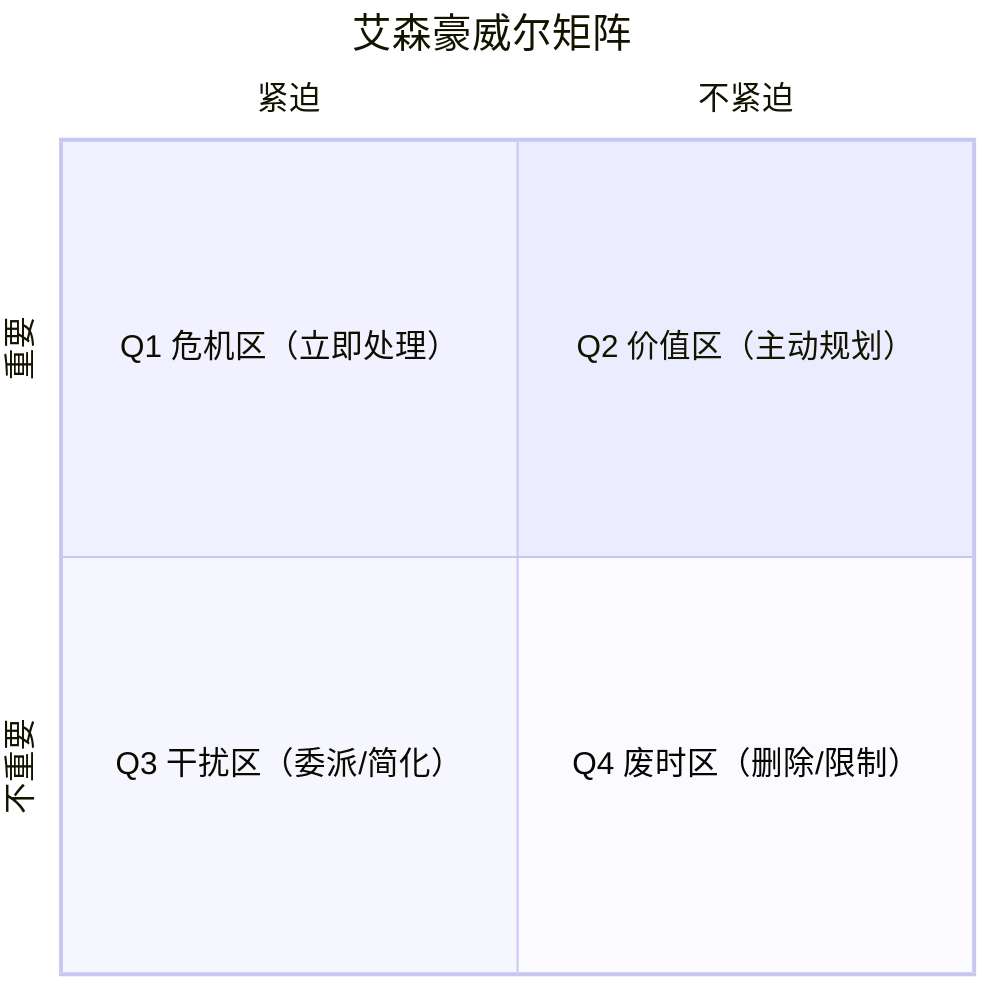

# Eisenhower Matrix · 艾森豪威尔矩阵

## 核心理念

以**重要性**和**紧迫性**两个维度划分任务，帮助区分"真正重要的工作"与"感觉忙但没有价值的工作"。



> 艾森豪威尔曾说："紧急的事情很少是重要的，重要的事情很少是紧急的。"
> **高效人士的特征：大量时间在 Q2，而非在 Q1 救火。**

---

## 适用场景

✅ **最适合**
- 个人每日/每周任务规划
- 团队任务分配和优先级对齐
- 时间管理混乱时的快速梳理
- 识别哪些事项可以委派或删除

⚠️ **慎用**
- 跨项目、多功能的产品优先级排序（用 RICE 更精准）
- 需要量化权衡的复杂决策

---

## 四象限详解

### Q1 · 重要且紧急（Do First）

**特征**：deadline 临近、紧急故障、客户投诉升级
**处理原则**：立即处理，全力投入
**注意**：长期在 Q1 工作 = 没有做好 Q2 的主动规划，是压力来源

常见事项：
- 线上故障/事故响应
- 即将到期的重要交付物
- 关键决策的临时紧急处理

---

### Q2 · 重要但不紧急（Schedule）

**特征**：没有 deadline 压力，但对长期目标至关重要
**处理原则**：主动规划时间，保护不被 Q1/Q3 挤占
**这是精力投入的最高价值区域**

常见事项：
- 战略规划、季度目标设定（OKR）
- 技术债偿还、架构升级
- 用户研究、产品调研
- 个人/团队能力建设
- 预防性维护（避免 Q1 危机）

**提升策略**：
- 在日历中 block 固定的 Q2 时间（通勤、早晨第一小时）
- 将 Q2 任务分解为可操作的小步骤
- 对 Q3 说不，保护 Q2 时间

---

### Q3 · 紧急但不重要（Delegate）

**特征**：感觉急，但实际上对核心目标贡献低
**处理原则**：委派给他人，或建立自动化流程减少人工介入
**陷阱**：这类任务制造"忙碌感"，但消耗 Q2 的时间

常见事项：
- 他人发起的非关键会议
- 部分来自他人的"紧急"请求（对他们紧急，对你未必重要）
- 可以由他人处理的日常沟通

---

### Q4 · 不重要也不紧急（Eliminate）

**特征**：纯粹消耗时间，几乎没有价值产出
**处理原则**：识别并删除/限制
**注意**：适度的 Q4 活动可以是休息（如休闲娱乐），但要有意识地选择

常见事项：
- 无目的的社交媒体刷新
- 冗长的低价值会议
- 不必要的过度准备/完美主义

---

## 执行步骤

### Step 1：任务清单倾倒

把当前所有待办事项写出来（大脑倾倒），不做评判。

### Step 2：四象限分类

对每个任务，快速判断：
- **重要性**：这个任务是否直接贡献于我的核心目标/OKR？
- **紧迫性**：如果今天不做，会有什么实质性后果？

分入对应象限。

**注意**：区分"别人认为紧急"（别人的 Q1）和"我的真正重要任务"（我的 Q2）。

### Step 3：制定行动计划

- Q1：今天或明天内处理
- Q2：在日历中安排具体时间
- Q3：明确委派给谁，何时
- Q4：直接删除或限制接触频率

### Step 4：每周复盘

- Q1 任务是否可以通过更好的 Q2 规划来预防？
- Q3 任务占比是否过高？是否需要边界设置？
- Q2 时间是否被保护？

---

## 输出模板

```
日期/周次：[...]
处理对象：[个人 / 团队名称]

任务清单：

Q1（立即处理）：
  1. [任务] — 截止时间：[...] — 预计耗时：[...]
  2. [...]

Q2（计划安排）：
  1. [任务] — 安排时间：[...] — 战略价值：[...]
  2. [...]

Q3（委派/简化）：
  1. [任务] — 委派给：[...] — 或自动化方案：[...]
  2. [...]

Q4（删除/限制）：
  1. [任务] — 处理方式：删除 / 限制频率至 [...]
  2. [...]

本周 Q2 时间 Block：
  [周一 9:00-11:00] → [Q2 任务名]
  [...]

反思：
  Q1 中哪些是可以通过 Q2 预防的？[...]
  Q3 占比是否需要设置边界？[...]
```

---

## 与其他方法论的关系

- **配合 OKR**：OKR 定义重要目标，用矩阵判断每日任务是否真正服务于 OKR（Q2）
- **补充 RICE**：RICE 用于多项目/功能排序，矩阵用于个人和团队日常任务管理
- **前置 GTD（Getting Things Done）**：矩阵是 GTD 的决策树核心之一
