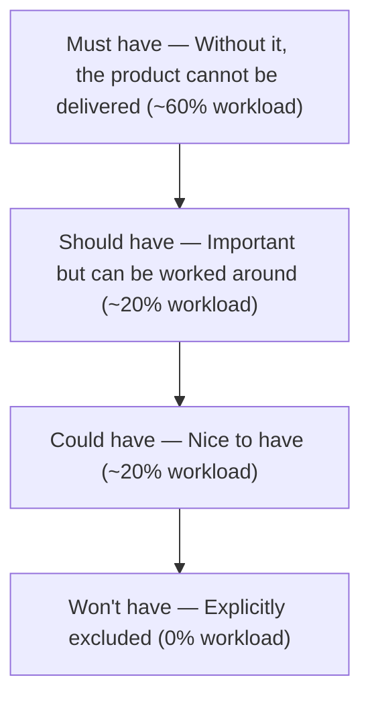

# MoSCoW Method

## Core Concept

Proposed by Dai Clegg in the DSDM method, this classifies requirements into four priority levels based on **necessity**: Must have, Should have, Could have, Won't have. The name comes from the initials M-S-C-W. Core insight: **Explicitly stating "what not to do" is more valuable than "doing everything."**



| Priority | Meaning | Judgment criteria | Workload share |
|--------|------|---------|-----------|
| **Must have** | Must have | Without it = project failure / product unusable | ~60% |
| **Should have** | Should have | Important but has alternatives, delay not fatal | ~20% |
| **Could have** | Could have | Enhances experience, absence doesn't affect core value | ~20% |
| **Won't have** | Won't have | Not included this time, explicitly excluded | 0% |

> **Key distinction**: MoSCoW classifies **requirement necessity**, not urgency. Eisenhower Matrix classifies **task urgency × importance**.

---

## Applicable Scenarios

✅ **Best suited for**
- Project/release scope management (what goes into V1.0, what doesn't)
- Requirement screening in Sprint planning
- Stakeholder expectation alignment (Won't have manages expectations)
- MVP scope definition (Must have = MVP)

⚠️ **Use with caution**
- When quantified scoring is needed (RICE is more precise)
- When ordering tasks/activities (use Eisenhower Matrix)
- When the team lacks consensus on "Must" criteria (all requirements become Must)

---

## Execution Steps

### Step 1: Collect Requirement List

List all requirements/features to be classified, ensuring each description is clear and understandable. Sources may include: user feedback, business goal decomposition, competitive benchmarking, technical debt.

### Step 2: Classify Item by Item

Classify each requirement into M/S/C/W.

**Classification tips**:
- First mark Must have (use strict criteria), then mark Won't have (explicitly exclude), then distinguish S and C for the rest
- Hesitating between M and S → default to S
- Hesitating between C and W → default to W

**Must have verification questions**:
- "If this feature is missing, can the product still launch?"
- "If missing, can users complete core tasks?"
- "Is this a legal/compliance/safety hard requirement?"

> If any of the above answers is "yes," confirm it as Must have. If all are "no," it should be downgraded to Should have.

### Step 3: Verify Workload Distribution

```
Must have ≈ 60% total workload
Should have ≈ 20%
Could have ≈ 20%

Must > 70% → Classification criteria too loose, review again
Must < 40% → May be missing key requirements
```

### Step 4: Stakeholder Alignment

Confirm item by item with stakeholders, focusing on alignment:
- Whether Must have is truly "can't do without"
- Whether the reason for Won't have is understood and accepted
- The trade-off logic for Should have and Could have

**Alignment technique**: Ask stakeholders to subtract from Must have — "If you could only keep half of the Must have, which would you keep?"

### Step 5: Document Won't have

```
Won't have list:
  W1: [Requirement] — Exclusion reason: [...] — Re-evaluation: [V2.0]
  W2: [Requirement] — Exclusion reason: [...] — Re-evaluation: [When user count reaches X]
```

---

## Output Template

```
Project/Release: [Name]  Classification Date: [Date]

Must have (must have, ~60% workload):
  M1: [Requirement] — Reason: [Without it, product unusable]
  M2: [Requirement] — Reason: [...]

Should have (should have, ~20% workload):
  S1: [Requirement] — Alternative: [...]
  S2: [Requirement] — Alternative: [...]

Could have (could have, ~20% workload):
  C1: [Requirement] — Value explanation: [...]
  C2: [Requirement] — Value explanation: [...]

Won't have (won't have, excluded this time):
  W1: [Requirement] — Exclusion reason: [...] — Re-evaluation: [Time/condition]
  W2: [Requirement] — Exclusion reason: [...] — Re-evaluation: [Time/condition]

Workload verification: Must [%] / Should [%] / Could [%]
Risk notes: If behind schedule, prioritize cutting [C1, C2]; if resources increase, prioritize adding [S1]
```

---

## Common Pitfalls

| Pitfall | How to Avoid |
|------|---------|
| All requirements become Must have | Use "Can the product launch without it?" as strict check, default to S not M |
| Won't have not written down | Won't have is key for managing expectations, not writing = hidden scope creep |
| S and C distinction unclear | S = Delay noticeably affects experience, C = Delay almost imperceptible |
| One-time classification without adjustment | Need dynamic adjustment as project progresses, S may upgrade to M |
| Confusing with Eisenhower Matrix | MoSCoW classifies requirement necessity, Eisenhower classifies task urgency |
| Ignoring dependencies between requirements | If B is Must but depends on C, then C should also be upgraded to Must |
| Won't have not recording re-evaluation conditions | Each Won't have should note when to reconsider, avoiding permanent omission |

---

## Relationship with Other Methodologies

- **Combined with RICE**: MoSCoW does coarse-grained necessity classification, RICE does quantitative ranking within similar requirements
- **Combined with Kano**: Kano must-be → MoSCoW Must have; Kano attractive → MoSCoW Could have
- **Combined with Eisenhower Matrix**: MoSCoW manages requirement scope, Eisenhower manages task execution priority
- **Combined with OKR**: OKR defines goals, MoSCoW defines MVP scope for achieving goals
- **Combined with Lean BML**: MoSCoW's Must have defines MVP, BML loop validates MVP hypotheses