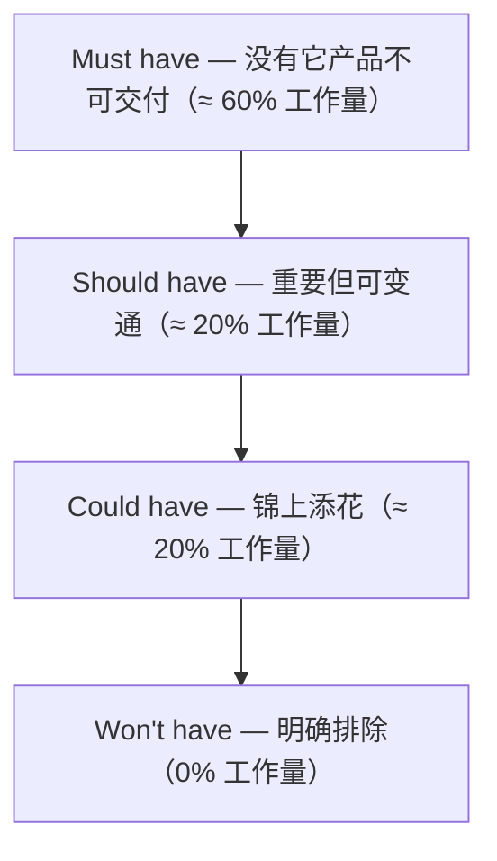

# MoSCoW Method · 莫斯科法

## 核心理念

由 Dai Clegg 在 DSDM 方法中提出，将需求按**必要性程度**分为四个优先级：Must have（必须有）、Should have（应该有）、Could have（可以有）、Won't have（不会有）。名称取自首字母 M-S-C-W。核心洞察：**明确"不做"比"都做"更有价值**。



| 优先级 | 含义 | 判断标准 | 工作量占比 |
|--------|------|---------|-----------|
| **Must have** | 必须有 | 没有它 = 项目失败 / 产品不可用 | ~60% |
| **Should have** | 应该有 | 重要但有替代方案，延迟不致命 | ~20% |
| **Could have** | 可以有 | 提升体验，缺少不影响核心价值 | ~20% |
| **Won't have** | 不会有 | 本次不纳入，明确排除 | 0% |

> **关键区分**：MoSCoW 分类的是**需求的必要性**，不是紧迫性。Eisenhower Matrix 分类的是**任务的紧迫×重要性**。

---

## 适用场景

✅ **最适合**
- 项目/版本范围管理（什么进 V1.0，什么不进）
- Sprint 规划中的需求筛选
- 利益相关者期望对齐（Won't have 管理预期）
- MVP 范围界定（Must have = MVP）

⚠️ **慎用**
- 需要量化评分时（用 RICE 更精准）
- 对任务/活动排序时（用 Eisenhower Matrix）
- 团队对"Must"标准没有共识时（所有需求都变 Must）

---

## 执行步骤

### Step 1：收集需求清单

列出所有待分类的需求/功能，确保每条描述清晰、可理解。来源可包括：用户反馈、业务目标拆解、竞品对标、技术债。

### Step 2：逐条分类

对每条需求归入 M/S/C/W。

**分类技巧**：
- 先标 Must have（用严格标准），再标 Won't have（明确排除），剩余区分 S 和 C
- 犹豫 M 还是 S → 默认归 S
- 犹豫 C 还是 W → 默认归 W

**Must have 验证问题**：
- "如果没有这个功能，产品还能上线吗？"
- "如果没有，用户能完成核心任务吗？"
- "这是法律/合规/安全硬性要求吗？"

> 如果以上任一答案为"是"，则确认是 Must have。如果全部为"否"，应降级为 Should have。

### Step 3：验证工作量分布

```
Must have ≈ 60% 总工作量
Should have ≈ 20%
Could have ≈ 20%

Must > 70% → 分类标准过松，重新审视
Must < 40% → 可能遗漏关键需求
```

### Step 4：利益相关者对齐

与利益相关者逐条确认，重点对齐：
- Must have 是否真的是"没有就不行"
- Won't have 的理由是否被理解和接受
- Should have 和 Could have 的取舍逻辑

**对齐技巧**：让利益相关者对 Must have 做减法——"如果只能保留一半的 Must have，你保留哪些？"

### Step 5：文档化 Won't have

```
Won't have 清单：
  W1: [需求] — 排除理由：[...] — 重新评估：[V2.0]
  W2: [需求] — 排除理由：[...] — 重新评估：[用户量达 X 时]
```

---

## 输出模板

```
项目/版本：[名称]  分类时间：[日期]

Must have（必须有，≈60% 工作量）：
  M1: [需求] — 理由：[没有它产品不可用]
  M2: [需求] — 理由：[...]

Should have（应该有，≈20% 工作量）：
  S1: [需求] — 替代方案：[...]
  S2: [需求] — 替代方案：[...]

Could have（可以有，≈20% 工作量）：
  C1: [需求] — 价值说明：[...]
  C2: [需求] — 价值说明：[...]

Won't have（不会有，本次排除）：
  W1: [需求] — 排除理由：[...] — 重新评估：[时间/条件]
  W2: [需求] — 排除理由：[...] — 重新评估：[时间/条件]

工作量验证：Must [%] / Should [%] / Could [%]
风险备注：进度落后优先砍除 [C1, C2]；资源增加优先补充 [S1]
```

---

## 常见陷阱

| 陷阱 | 避免方式 |
|------|---------|
| 所有需求都变成 Must have | 用"没有它产品能上线吗？"严格检验，默认归 S 而非 M |
| Won't have 不敢写 | Won't have 是管理期望的关键，不写 = 隐性范围蔓延 |
| S 和 C 区分模糊 | S = 延迟会明显影响体验，C = 延迟几乎无感 |
| 一次性分类不再调整 | 随项目推进需动态调整，S 可能升级为 M |
| 与 Eisenhower Matrix 混用 | MoSCoW 分类需求必要性，Eisenhower 分类任务紧迫性 |
| 忽视需求间的依赖 | B 是 Must 但依赖 C，则 C 也应升级为 Must |
| Won't have 不记录重新评估条件 | 每条 Won't have 应注明何时重新考虑，避免永久遗忘 |

---

## 与其他方法论的关系

- **配合 RICE**：MoSCoW 做粗粒度必要性分类，RICE 在同类需求内做量化排序
- **配合 Kano**：Kano 必备型 → MoSCoW Must have；Kano 兴奋型 → MoSCoW Could have
- **配合 Eisenhower Matrix**：MoSCoW 管需求范围，Eisenhower 管任务执行优先级
- **配合 OKR**：OKR 定义目标，MoSCoW 界定实现目标的 MVP 范围
- **配合 Lean BML**：MoSCoW 的 Must have 定义 MVP，BML 循环验证 MVP 假设
