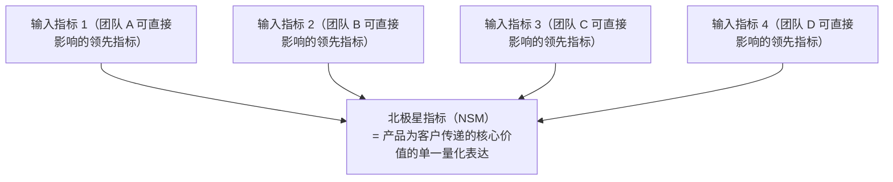
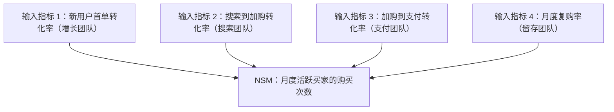

# North Star Framework · 北极星框架

## 核心理念

由 Sean Ellis 提出、Amplitude 团队推广，定义**一个北极星指标（NSM）**代表产品核心价值，配合 **3-5 个输入指标**驱动其增长。核心洞察：**整个公司围绕一个统一指标对齐，避免指标碎片化导致的局部优化**。



NSM 是滞后指标（结果），Input Metrics 是领先指标（驱动因素）。

**NSM 三要素检验**：
1. **反映客户价值**：指标上升 = 客户获得更多价值
2. **代表商业成功**：指标上升 = 收入/长期商业健康改善
3. **衡量进步而非虚荣**：不是虚荣指标，而是真正的价值指标

| 公司 | 北极星指标 | 核心价值 |
|------|----------|---------|
| Spotify | 收听时长 | 让用户发现和享受更多音乐 |
| Airbnb | 预订夜晚数 | 让旅行者找到住宿 |
| WhatsApp | 发送消息数 | 让人们便捷沟通 |

---

## 适用场景

✅ **最适合**
- 公司/产品级指标对齐（所有团队朝同一方向努力）
- 增长策略聚焦（防止各团队优化各自的局部指标）
- 防止指标碎片化
- 产品战略沟通（向全公司传达"什么最重要"）

⚠️ **慎用**
- 需要目标设定时（用 OKR，NSM 是指标不是目标）
- 产品太早期无法定义有意义的指标时（先验证 PMF）
- NSM 被当作 KPI 考核工具（会导致指标操纵）

---

## NSM 与 Input Metrics

### 北极星指标（NSM）

**特征**：唯一性（整个公司只有一个）、结果性（团队行动的结果）、价值性（客户价值 + 商业价值同时提升）

```
好的 NSM：
  ✅ "预订夜晚数" — 反映房东收入 + 房客体验
  ✅ "周活跃用户的核心操作次数" — 反映产品粘性

差的 NSM：
  ❌ "注册用户数" — 虚荣指标，不反映价值
  ❌ "收入" — 短期可操纵，不反映客户价值
  ❌ "DAU" — 可能包含低价值使用
```

### 输入指标（Input Metrics）

**特征**：领先性（团队可直接影响）、可分解性（每个团队至少拥有一个）、因果性（变化驱动 NSM）



---

## 执行步骤

### Step 1：阐述产品核心价值主张

```
对于 [目标用户]，我们帮助 [解决什么问题]，
通过 [核心方式]，使他们 [获得什么价值]。
```

### Step 2：识别候选 NSM

列出 3-5 个候选 NSM，用三要素检验筛选：

```
候选 NSM：[指标名称]
  □ 反映客户价值？ — [是/否] — 理由：[...]
  □ 代表商业成功？ — [是/否] — 理由：[...]
  □ 衡量进步而非虚荣？ — [是/否] — 理由：[...]
```

### Step 3：验证 NSM 可分解性

检验候选 NSM 是否能分解为 3-5 个可操作的输入指标，每个有明确负责团队。

### Step 4：定义输入指标

为每个输入指标设定：当前基线值、目标值和达成时间、衡量频率、负责团队。

### Step 5：建立衡量和复盘节奏

```
日度：输入指标仪表盘（自动更新）
周度：输入指标趋势回顾（团队站会）
月度：NSM + 输入指标全面复盘（管理层）
季度：NSM 有效性评估（是否需要调整？）
```

### Step 6：团队对齐

确保每个团队理解：自己的输入指标如何驱动 NSM，局部优化不能以牺牲 NSM 为代价。

---

## 输出模板

```
产品：[名称]  制定时间：[日期]

核心价值主张：
  对于 [目标用户]，我们帮助 [解决什么问题]，
  通过 [核心方式]，使他们 [获得什么价值]。

北极星指标（NSM）：
  指标名称：[...]  当前值：[...]
  三要素验证：客户价值 [✓] 商业成功 [✓] 进步非虚荣 [✓]

输入指标分解：
  输入指标 1：[名称] — 定义：[...] — 当前值：[...] → 目标值：[...]
    负责团队：[团队名] — 因果逻辑：[...]
  输入指标 2：[名称] — 定义：[...] — 当前值：[...] → 目标值：[...]
    负责团队：[团队名] — 因果逻辑：[...]
  输入指标 3：[名称] — [...]

衡量节奏：日度看板 / 周度回顾 / 月度复盘
NSM 重新评估触发条件：[持续 N 月无变化 / 产品战略调整 / ...]
```

---

## 常见陷阱

| 陷阱 | 避免方式 |
|------|---------|
| 选择虚荣指标作为 NSM | 用三要素严格检验，注册数/下载量几乎都不是好的 NSM |
| NSM 被当作 KPI 考核 | NSM 是对齐工具不是考核工具，挂钩考核会导致指标操纵 |
| 输入指标不可操作 | 每个输入指标必须有明确负责团队，且团队能直接影响 |
| 忽视 NSM 的反指标 | 定义 NSM 时同时定义反指标（NSM 上升但投诉也上升 = 有问题） |
| NSM 长期不调整 | 产品阶段变化时 NSM 可能需要调整（早期 → 成长期 → 成熟期） |
| 多业务线共用一个 NSM | 多业务线需分层 NSM：公司级 + 业务线级 |

---

## 与其他方法论的关系

- **配合 OKR**：NSM 是北极星方向，OKR 是季度里程碑；KR 应驱动 Input Metrics
- **配合 AARRR**：AARRR 定位漏斗瓶颈，NSM 定义整体方向，Input Metrics 可映射到漏斗各层
- **配合 RICE**：NSM 和 Input Metrics 为 RICE 的 Impact 维度提供评估基准
- **配合 Lean BML**：NSM 是"成功指标"，BML 循环验证 Input Metrics 的因果假设
- **配合 Kano**：Kano 分类功能性质，兴奋型功能应驱动 NSM 的突破性增长
- **区别于 OKR**：NSM 是长期稳定的方向指标，OKR 是周期性（季度）的挑战目标

---

## 三种商业游戏分类（NSM 选型前置）

选 NSM 前需先识别产品属于哪种商业游戏——游戏类型决定 NSM 的形态。源自 Lenny Rachitsky / Product Compass 推广的分类法：

| 商业游戏 | 核心机制 | 典型 NSM | 货币化方式 | 例子 |
|---------|---------|---------|-----------|------|
| **Attention Game** | 占据用户时间/注意力 | 时长 / 次数 | 广告 / 增值订阅 | TikTok、Facebook、YouTube |
| **Transaction Game** | 促成买卖双方交易 | 交易次数 / GMV | 抽佣 / 服务费 | Airbnb、Uber、Amazon |
| **Productivity Game** | 帮用户完成任务 | 关键操作完成数 / 活跃工作流数 | 订阅 / 席位 | Notion、Figma、Slack |

**选型逻辑**：
- Attention Game 的 NSM 多为"时长/次"——核心价值是用户投入的时间
- Transaction Game 的 NSM 多为"成功交易数"——核心价值是匹配达成
- Productivity Game 的 NSM 多为"任务完成数"——核心价值是效率提升

混淆游戏类型会导致 NSM 错位：用"时长"衡量 Productivity 产品（如 Notion）会鼓励产品变臃肿而非变高效。

---

## 7 条 NSM 准则

选取 / 验证 NSM 时逐条核对：

1. **表达核心价值**（Express Core Value）：NSM 必须直接量化产品为客户创造的核心价值，而非代理指标
2. **反映客户价值**（Reflect Customer Value）：NSM 上升 = 客户获得更多价值（不是单纯公司获益）
3. **代表商业成功**（Represent Commercial Success）：NSM 上升 = 长期商业健康改善（收入/可持续性）
4. **是领先指标**（Be a Leading Indicator）：NSM 预测未来商业结果，而非只是滞后总结
5. **可测量**（Be Measurable）：能在日/周维度稳定计算，而非季度才出数
6. **可分解**（Be Decomposable）：能拆为 3–5 个团队可影响的输入指标
7. **不可被操纵为 KPI**（Resist Gaming）：挂钩考核时不易被刷量（如"消息数"会被刷，"完成的工作流数"较难）

任意一条不满足都应重新审视 NSM 候选。
