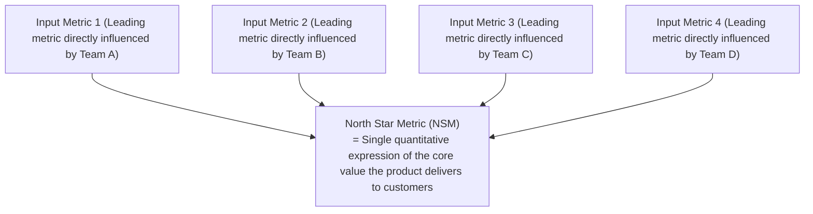
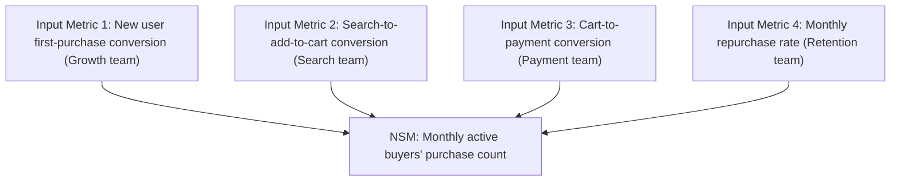

# North Star Framework · 北极星框架

## Core Concept

Proposed by Sean Ellis and promoted by the Amplitude team, it defines **one North Star Metric (NSM)** representing the product's core value, paired with **3-5 input metrics** to drive its growth. Core insight: **the entire company aligns around a single unified metric, avoiding fragmented local optimization caused by metric silos**.



NSM is a lagging metric (outcome); Input Metrics are leading metrics (drivers).

**NSM Three-Element Test**:
1. **Reflects Customer Value**: Metric goes up = customers receive more value
2. **Represents Commercial Success**: Metric goes up = revenue/long-term business health improves
3. **Measures Progress, Not Vanity**: Not a vanity metric, but a true value metric

| Company | North Star Metric | Core Value |
|------|----------|---------|
| Spotify | Listening hours | Help users discover and enjoy more music |
| Airbnb | Nights booked | Help travelers find accommodation |
| WhatsApp | Messages sent | Enable people to communicate conveniently |

---

## Applicable Scenarios

✅ **Best For**
- Company/product-level metric alignment (all teams pulling in the same direction)
- Growth strategy focus (preventing each team from optimizing their own local metric)
- Preventing metric fragmentation
- Product strategy communication (conveying "what matters most" company-wide)

⚠️ **Use with Caution**
- When goal-setting is needed (use OKR; NSM is a metric, not a goal)
- When the product is too early to define a meaningful metric (validate PMF first)
- When NSM is used as a KPI assessment tool (leads to metric manipulation)

---

## NSM vs Input Metrics

### North Star Metric (NSM)

**Characteristics**: Uniqueness (only one across the company), Outcome-based (result of team actions), Value-driven (customer value + commercial value both improve)

```
Good NSM examples:
  ✅ "Nights booked" — reflects host income + guest experience
  ✅ "Core action count per weekly active user" — reflects product stickiness

Bad NSM examples:
  ❌ "Registered users" — vanity metric, doesn't reflect value
  ❌ "Revenue" — easily gamed short-term, doesn't reflect customer value
  ❌ "DAU" — may include low-value usage
```

### Input Metrics

**Characteristics**: Leading (team can directly influence), Decomposable (each team owns at least one), Causal (changes drive the NSM)



---

## Execution Steps

### Step 1: Articulate Product Core Value Proposition

```
For [target users], we help [solve what problem],
through [core method], enabling them to [gain what value].
```

### Step 2: Identify Candidate NSMs

List 3-5 candidate NSMs and filter using the three-element test:

```
Candidate NSM: [Metric name]
  □ Reflects customer value? — [Yes/No] — Rationale: [...]
  □ Represents commercial success? — [Yes/No] — Rationale: [...]
  □ Measures progress, not vanity? — [Yes/No] — Rationale: [...]
```

### Step 3: Validate NSM Decomposability

Test whether the candidate NSM can be decomposed into 3-5 actionable input metrics, each with a clearly responsible team.

### Step 4: Define Input Metrics

For each input metric, set: current baseline value, target value and deadline, measurement frequency, responsible team.

### Step 5: Establish Measurement and Review Cadence

```
Daily: Input metrics dashboard (auto-updated)
Weekly: Input metrics trend review (team standup)
Monthly: NSM + input metrics comprehensive review (management)
Quarterly: NSM effectiveness evaluation (does it need adjustment?)
```

### Step 6: Team Alignment

Ensure every team understands: how their input metrics drive the NSM, and local optimization cannot come at the expense of the NSM.

---

## Output Template

```
Product: [Name]  Date: [Date]

Core Value Proposition:
  For [target users], we help [solve what problem],
  through [core method], enabling them to [gain what value].

North Star Metric (NSM):
  Metric name: [...]  Current value: [...]
  Three-element validation: Customer value [✓] Commercial success [✓] Progress not vanity [✓]

Input Metric Decomposition:
  Input Metric 1: [Name] — Definition: [...] — Current: [...] → Target: [...]
    Responsible team: [Team name] — Causal logic: [...]
  Input Metric 2: [Name] — Definition: [...] — Current: [...] → Target: [...]
    Responsible team: [Team name] — Causal logic: [...]
  Input Metric 3: [Name] — [...]

Measurement cadence: Daily dashboard / Weekly review / Monthly deep-dive
NSM re-evaluation triggers: [No change for N consecutive months / Product strategy shift / ...]
```

---

## Common Pitfalls

| Pitfall | How to Avoid |
|------|---------|
| Choosing a vanity metric as NSM | Apply the three-element test strictly; signups/downloads are almost never good NSMs |
| NSM used as KPI assessment | NSM is an alignment tool, not an assessment tool; tying it to compensation leads to metric manipulation |
| Input metrics not actionable | Every input metric must have a clearly responsible team that can directly influence it |
| Ignoring counter-metrics for NSM | Define counter-metrics alongside NSM (NSM rising but complaints also rising = a problem) |
| NSM never adjusted over time | NSM may need adjustment as product stage changes (early → growth → mature) |
| Multiple business lines sharing one NSM | Multi-business lines need layered NSMs: company-level + business-line-level |

---

## Relationships with Other Methodologies

- **Combined with OKR**: NSM is the North Star direction; OKR is the quarterly milestone; KRs should drive Input Metrics
- **Combined with AARRR**: AARRR locates funnel bottlenecks; NSM defines the overall direction; Input Metrics can map to funnel layers
- **Combined with RICE**: NSM and Input Metrics provide evaluation benchmarks for the Impact dimension in RICE
- **Combined with Lean BML**: NSM is the "success metric"; BML loops validate the causal hypotheses behind Input Metrics
- **Combined with Kano**: Kano classifies feature nature; Attractive features should drive breakthrough NSM growth
- **Distinction from OKR**: NSM is a long-term stable directional metric; OKR is a periodic (quarterly) stretch goal

---

## Three Business Game Classifications (NSM Selection Prerequisite)

Before selecting an NSM, first identify which business game the product belongs to — the game type determines the NSM's form. Originating from the taxonomy promoted by Lenny Rachitsky / Product Compass:

| Business Game | Core Mechanism | Typical NSM | Monetization | Examples |
|---------|---------|---------|-----------|------|
| **Attention Game** | Occupy user time/attention | Duration / Count | Ads / Premium subscription | TikTok, Facebook, YouTube |
| **Transaction Game** | Facilitate buyer-seller transactions | Transaction count / GMV | Commission / Service fee | Airbnb, Uber, Amazon |
| **Productivity Game** | Help users complete tasks | Key action completions / Active workflow count | Subscription / Seat-based | Notion, Figma, Slack |

**Selection Logic**:
- Attention Game NSMs are typically "duration/count" — core value is user time invested
- Transaction Game NSMs are typically "successful transactions" — core value is matching completion
- Productivity Game NSMs are typically "tasks completed" — core value is efficiency gain

Confusing game types leads to NSM misalignment: measuring a Productivity product (e.g., Notion) by "duration" encourages bloat rather than efficiency.

---

## 7 NSM Criteria

Check item by item when selecting / validating an NSM:

1. **Express Core Value**: NSM must directly quantify the core value the product creates for customers, not a proxy metric
2. **Reflect Customer Value**: NSM goes up = customers receive more value (not just the company benefits)
3. **Represent Commercial Success**: NSM goes up = long-term business health improves (revenue/sustainability)
4. **Be a Leading Indicator**: NSM predicts future business outcomes, not just a lagging summary
5. **Be Measurable**: Can be calculated stably on a daily/weekly basis, not just quarterly
6. **Be Decomposable**: Can be broken into 3–5 input metrics that teams can influence
7. **Resist Gaming**: Not easily manipulated when tied to KPIs (e.g., "message count" can be gamed; "completed workflows" is harder)

Re-evaluate the NSM candidate if any single criterion is not met.
