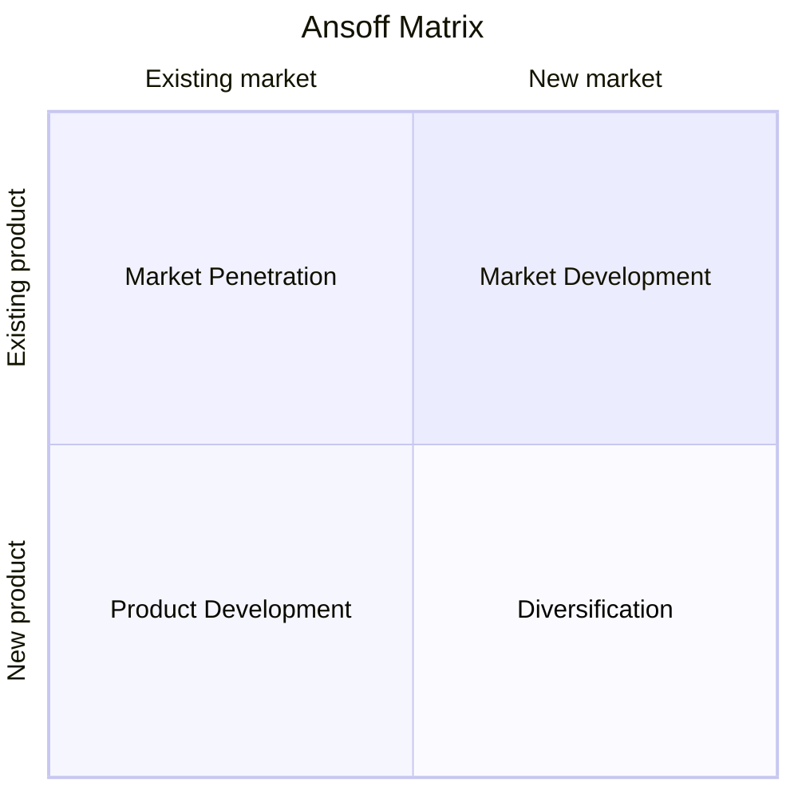

# Ansoff Matrix

## Core Concept

Proposed by Igor Ansoff in 1957, this framework uses the intersection of **product dimension** (existing/new) and **market dimension** (existing/new) to form a 2×2 matrix, providing four clear **growth strategy directions**. Core insight: risk increases from upper-left to lower-right; firms should allocate resources across different risk levels.



| Quadrant | Strategy | Core Logic | Risk |
|------|------|---------|------|
| Existing Product × Existing Market | **Market Penetration** | Sell more to existing customers | ★☆☆☆☆ |
| Existing Product × New Market | **Market Development** | Sell existing products to new customers | ★★☆☆☆ |
| New Product × Existing Market | **Product Development** | Sell new products to existing customers | ★★★☆☆ |
| New Product × New Market | **Diversification** | Sell new products to new customers | ★★★★★ |

---

## Use Cases

✅ **Best for**
- Enterprise/product growth strategy direction selection
- Growth path design in annual/three-year planning
- Risk-reward trade-off assessment of different growth options
- Setting growth priorities when resources are limited

⚠️ **Use with caution**
- When specific execution plans are needed (Ansoff is a directional framework, not tactical)
- When market/product boundaries are blurry ("new market" poorly defined leads to misclassification)
- Single-product startups (only market penetration is an option)
- Rapidly changing industries ("existing" definitions may quickly become outdated)

---

## Execution Steps

### Step 1: Define Current Product and Market Scope

```
Existing product scope: [Core product/service description]
Existing market scope: [Target customer segment + geography + channels]
```

### Step 2: Fill in Four Quadrant Strategic Options

List 2-5 specific growth options for each quadrant:

```
Market Penetration Options (Low risk):
  - Increase market share (promotions, price cuts, expanded channel coverage)
  - Increase usage frequency (membership systems, habit formation)
  - Convert competitor customers

Market Development Options (Medium risk):
  - Geographic expansion (domestic→overseas, tier-1→lower-tier markets)
  - New customer segments (B2C→B2B, young→middle-aged/elderly)
  - New channel development (offline→online, direct→distribution)

Product Development Options (Medium risk):
  - Product line extension (premium line/entry-level line)
  - New features/versions (iterating based on user feedback)
  - Bundling/packaging (combining existing products into new solutions)

Diversification Options (High risk):
  - Concentric diversification (extending based on existing technology/capabilities)
  - Horizontal diversification (new categories for existing customers)
  - Conglomerate diversification (completely new fields unrelated to existing business)
```

### Step 3: Assess Risk and Resource Requirements

```
Assessment dimensions:
  Market risk: Demand uncertainty (High/Medium/Low)
  Technical risk: Implementation feasibility (High/Medium/Low)
  Resource requirements: Investment scale (Large/Medium/Small)
  Time to results: Time horizon (Long/Medium/Short)
  Synergy: Degree of synergy with existing business (High/Medium/Low)
```

### Step 4: Select Primary Growth Strategy

Based on risk appetite and resource capabilities, determine primary and supporting strategies:

```
Strategy portfolio:
  Primary strategy: [Quadrant] — [Specific strategy]
  Supporting strategy 1: [Quadrant] — [Specific strategy]
  Watchlist reserve: [Quadrant] — [Specific strategy]
```

### Step 5: Convert to Execution Plan

Convert growth strategy into OKR/RICE executable roadmap.

---

## Output Template

```
Analysis subject: [Company/Product]  Time horizon: [Annual/Three-year]

Market Penetration (Existing Product × Existing Market):
  Option 1: [Strategy] — Risk: Low — Expected growth: [%]
  Option 2: [Strategy] — Risk: Low — Expected growth: [%]

Market Development (Existing Product × New Market):
  Option 1: [Strategy] — Risk: Medium — Target market: [...]
  Option 2: [Strategy] — Risk: Medium — Target market: [...]

Product Development (New Product × Existing Market):
  Option 1: [Strategy] — Risk: Medium — Target customers: [Existing customers]

Diversification (New Product × New Market):
  Option 1: [Strategy] — Risk: High — Synergy: [...]

Strategic Selection:
  Primary growth strategy: [Quadrant] — [Strategy] — Rationale: [...]
  Supporting strategy: [Quadrant] — [Strategy] — Rationale: [...]

Resource allocation: Penetration [%] / Market Development [%] / Product Development [%] / Diversification [%]
```

---

## Common Pitfalls

| Pitfall | How to Avoid |
|------|---------|
| Selecting primary strategy in all four quadrants | Resources are limited; 1 primary + 1-2 supporting strategies |
| Underestimating diversification risk | Diversification has the highest failure rate; validate with Lean BML at small scale |
| "Existing market" definition too broad | Define clear customer profiles, geography, and channel boundaries |
| Ignoring dynamic evolution across quadrants | Successful market development can transition to market penetration; reassess regularly |
| Only looking at growth, not defense | Ansoff is a growth framework; complement with SWOT's W×T defensive strategies |

---

## Relationship with Other Methodologies

- **Preceded by SWOT**: SWOT identifies strengths and opportunities, providing basis for Ansoff quadrant selection
- **Combined with PESTLE**: PESTLE scans macro environment, assessing external feasibility of "new markets"
- **Combined with Porter's Five Forces**: Five forces assess competitive intensity of target markets
- **Followed by OKR**: Ansoff determines growth direction; OKR breaks it down into quantifiable quarterly targets
- **Followed by Lean BML**: Especially for the diversification quadrant, validate with BML cycles before large-scale investment
- **Combined with RICE**: Multiple options within each quadrant are quantitatively ranked using RICE
