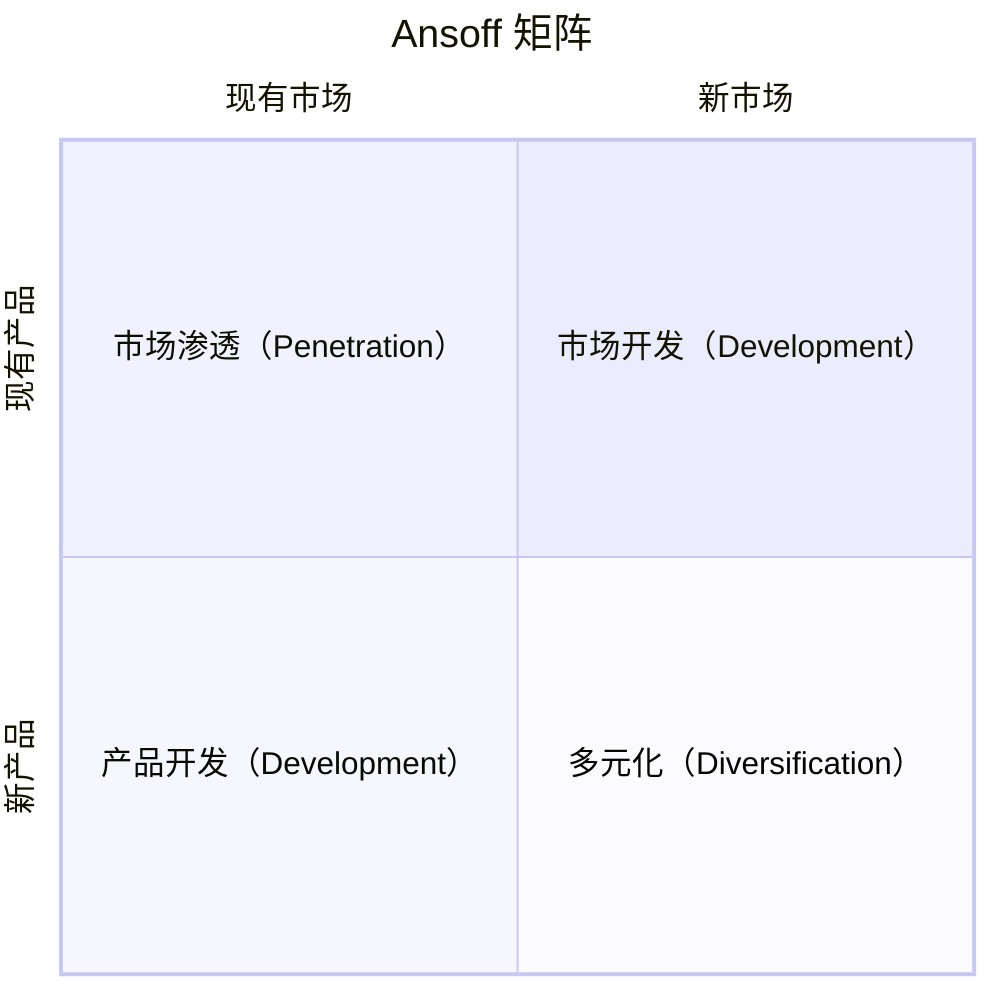

# Ansoff Matrix · 安索夫矩阵

## 核心理念

由伊戈尔·安索夫于 1957 年提出，通过**产品维度**（现有/新）与**市场维度**（现有/新）的交叉，形成 2×2 矩阵，提供四条清晰的**增长战略方向**。核心洞察：风险从左上到右下递增，企业应在不同风险层级上组合配置资源。



| 象限 | 战略 | 核心逻辑 | 风险 |
|------|------|---------|------|
| 现有产品 × 现有市场 | **市场渗透** | 卖更多给现有客户 | ★☆☆☆☆ |
| 现有产品 × 新市场 | **市场开发** | 把现有产品卖给新客户 | ★★☆☆☆ |
| 新产品 × 现有市场 | **产品开发** | 向现有客户卖新产品 | ★★★☆☆ |
| 新产品 × 新市场 | **多元化** | 向新客户卖新产品 | ★★★★★ |

---

## 适用场景

✅ **最适合**
- 企业/产品增长战略方向选择
- 年度/三年规划中的增长路径设计
- 评估不同增长选项的风险-收益权衡
- 资源有限时确定增长优先级

⚠️ **慎用**
- 需要具体执行方案时（安索夫是方向性框架，不提供战术细节）
- 市场/产品边界模糊时（"新市场"界定不清会导致误分类）
- 单一产品初创企业（只有市场渗透一个选项）
- 快速变化的行业（"现有"定义可能迅速过时）

---

## 执行步骤

### Step 1：界定当前产品和市场范围

```
现有产品范围：[核心产品/服务描述]
现有市场范围：[目标客户群 + 地域 + 渠道]
```

### Step 2：填充四象限战略选项

对每个象限列出 2-5 个具体增长选项：

```
市场渗透选项（低风险）：
  - 提升市场份额（促销、降价、增加渠道覆盖）
  - 提高使用频率（会员体系、习惯培养）
  - 竞争对手客户转化

市场开发选项（中风险）：
  - 地理扩张（国内→海外、一线→下沉市场）
  - 新客户细分（B2C→B2B、年轻人→中老年）
  - 新渠道开拓（线下→线上、直营→分销）

产品开发选项（中风险）：
  - 产品线延伸（高端线/入门线）
  - 新功能/新版本（基于用户反馈迭代）
  - 捆绑/打包（组合现有产品形成新方案）

多元化选项（高风险）：
  - 同心多元化（基于现有技术/能力延伸）
  - 水平多元化（面向现有客户的新品类）
  - 综合多元化（与现有业务完全无关的新领域）
```

### Step 3：评估风险与资源需求

```
评估维度：
  市场风险：需求不确定性（高/中/低）
  技术风险：实现可行性（高/中/低）
  资源需求：投入规模（大/中/小）
  见效周期：时间跨度（长/中/短）
  协同效应：与现有业务的协同度（高/中/低）
```

### Step 4：选择主增长战略

基于风险偏好和资源能力，确定主战略和辅助战略：

```
战略组合：
  主战略：[象限] — [具体策略]
  辅助战略 1：[象限] — [具体策略]
  观望储备：[象限] — [具体策略]
```

### Step 5：转化为执行计划

将增长战略转化为 OKR / RICE 可执行的路线图。

---

## 输出模板

```
分析主体：[公司/产品]  时间范围：[年度/三年期]

市场渗透（现有产品 × 现有市场）：
  选项 1：[策略] — 风险：低 — 预期增长：[%]
  选项 2：[策略] — 风险：低 — 预期增长：[%]

市场开发（现有产品 × 新市场）：
  选项 1：[策略] — 风险：中 — 目标市场：[...]
  选项 2：[策略] — 风险：中 — 目标市场：[...]

产品开发（新产品 × 现有市场）：
  选项 1：[策略] — 风险：中 — 目标客户：[现有客户]

多元化（新产品 × 新市场）：
  选项 1：[策略] — 风险：高 — 协同度：[...]

战略选择：
  主增长战略：[象限] — [策略] — 理由：[...]
  辅助战略：[象限] — [策略] — 理由：[...]

资源分配：渗透 [%] / 市场开发 [%] / 产品开发 [%] / 多元化 [%]
```

---

## 常见陷阱

| 陷阱 | 避免方式 |
|------|---------|
| 四个象限都选主战略 | 资源有限，主战略 1 个 + 辅助 1-2 个 |
| 低估多元化风险 | 多元化失败率最高，需用 Lean BML 小规模验证 |
| "现有市场"定义过宽 | 明确客户画像、地域、渠道的边界 |
| 忽视象限间动态演进 | 市场开发成功后可转为市场渗透，需定期重评估 |
| 只看增长不看防御 | 安索夫是增长框架，需配合 SWOT 的 W×T 防御策略 |

---

## 与其他方法论的关系

- **前置 SWOT**：SWOT 识别优势和机遇，为安索夫象限选择提供依据
- **配合 PESTLE**：PESTLE 扫描宏观环境，判断"新市场"的外部可行性
- **配合 Porter's Five Forces**：五力分析评估目标市场的竞争强度
- **后接 OKR**：安索夫确定增长方向，OKR 拆解为可量化的季度目标
- **后接 Lean BML**：特别是多元化象限，用 BML 循环验证后再大规模投入
- **配合 RICE**：每个象限内的多个选项用 RICE 量化排序
