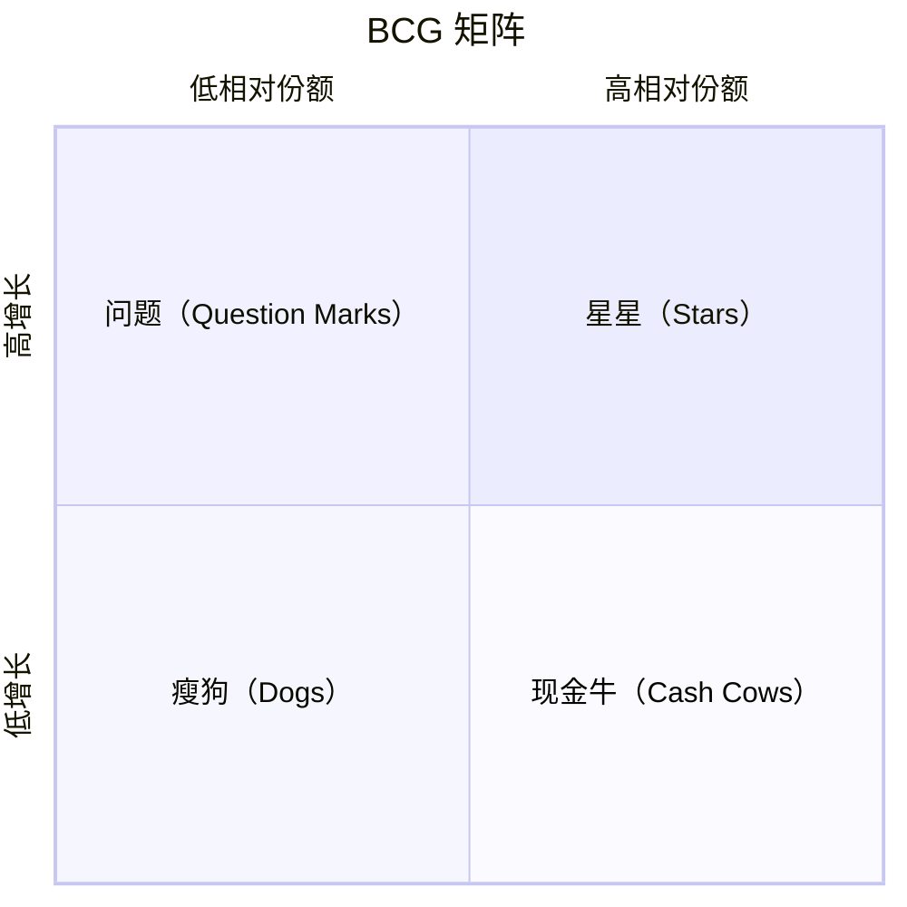

# BCG Matrix · 波士顿矩阵

## 核心理念

用**市场增长率**（高/低）× **相对市场份额**（高/低）构成 2×2 矩阵，将产品/业务单元分为四类：**明星**（Stars）、**现金牛**（Cash Cows）、**问题**（Question Marks）、**瘦狗**（Dogs）。每类隐含不同的投资策略：建设、持有、收割或剥离。

> 健康的业务组合需要现金牛提供资金、明星创造未来、问题中筛选出下一个明星、果断剥离瘦狗。

---

## 适用场景

✅ **最适合**
- 多产品/多业务线的投资组合管理
- 企业级资源分配决策
- 产品生命周期战略规划
- 并购后的业务组合优化

⚠️ **慎用**
- 单一产品公司（矩阵需要多个业务单元才有意义）
- 市场份额和增长率不是关键成功因素时
- 早期创业公司（数据不稳定，分类无意义）
- 需要精细竞争分析时（矩阵只看两个维度，粒度太粗）

---

## 执行步骤

### Step 1：列出所有产品/业务单元

```
产品/业务列表：
  1. [产品A] — 收入：[...] / 市场份额：[...] / 增长率：[...]
  2. [产品B] — 收入：[...] / 市场份额：[...] / 增长率：[...]
  3. [产品C] — 收入：[...] / 市场份额：[...] / 增长率：[...]
  ...
```

### Step 2：确定分界线

为两个维度设定高/低的分界标准：

```
市场增长率分界线：[如 10%] — 高于此为高增长市场
相对市场份额分界线：[如 1.0x] — 相对最大竞争对手的份额比
```

> 相对市场份额 = 自身市场份额 / 最大竞争对手市场份额。1.0x 意味着与最大对手持平。

### Step 3：将每个产品定位到矩阵



每个产品的圆圈大小与收入成正比。

### Step 4：分析组合平衡

检查整体组合的健康度：

```
组合健康度检查：
  □ 是否有足够的明星 → 保证未来收入？
  □ 是否有足够的现金牛 → 为明星和问题提供资金？
  □ 问题产品是否有潜力成为明星 → 值得投资？
  □ 瘦狗是否需要剥离 → 释放资源？
```

**理想组合**：少量现金牛 + 若干明星 + 精选问题 + 极少瘦狗

### Step 5：制定每类产品的策略

```
明星（Stars）— 建设策略（Build）
  行动：持续投资，维持/扩大市场份额
  目标：随市场成熟转化为现金牛

现金牛（Cash Cows）— 持有策略（Hold）
  行动：维持市场份额，不过度投资
  目标：最大化现金流产出，资助明星和问题

问题（Question Marks）— 选择性建设或收割
  有潜力 → 建设策略：加大投资，争取成为明星
  无潜力 → 收割策略：短期最大化现金流，逐步退出

瘦狗（Dogs）— 收割或剥离（Harvest / Divest）
  行动：减少投入，收割残余价值；或直接剥离
  目标：释放资源投向更有价值的业务
```

---

## 输出模板

```
BCG 矩阵分析报告

一、分界标准
  市场增长率分界线：[X%]
  相对市场份额分界线：[X]x

二、矩阵定位
  明星（Stars）：
    - [产品] — 增长率：[X%] — 相对份额：[X]x — 收入：[X]
  现金牛（Cash Cows）：
    - [产品] — 增长率：[X%] — 相对份额：[X]x — 收入：[X]
  问题（Question Marks）：
    - [产品] — 增长率：[X%] — 相对份额：[X]x — 收入：[X]
  瘦狗（Dogs）：
    - [产品] — 增长率：[X%] — 相对份额：[X]x — 收入：[X]

三、组合平衡评估
  整体健康度：健康 / 需调整 / 严重失衡
  核心问题：[如：缺少明星 / 现金牛不足 / 瘦狗过多]

四、战略建议
  [产品A]（明星）：建设 — [具体行动]
  [产品B]（现金牛）：持有 — [具体行动]
  [产品C]（问题）：建设/收割 — [判断依据]
  [产品D]（瘦狗）：剥离 — [时间表]

五、资源再分配
  从 [现金牛/瘦狗] 释放 [X] 资源 → 投入 [明星/问题]
```

---

## 执行示例

**场景**：一家互联网公司的产品组合评估

```
一、分界标准
  市场增长率分界线：15%
  相对市场份额分界线：1.0x

二、矩阵定位
  明星：
    - AI 写作助手 — 增长率：45% — 相对份额：1.8x — 收入：800万
  现金牛：
    - 企业邮箱 — 增长率：5% — 相对份额：2.5x — 收入：5000万
  问题：
    - 协同文档 — 增长率：30% — 相对份额：0.4x — 收入：300万
    - 视频会议 — 增长率：20% — 相对份额：0.3x — 收入：200万
  瘦狗：
    - 传统网盘 — 增长率：-5% — 相对份额：0.6x — 收入：500万

三、组合平衡评估
  整体健康度：需调整
  核心问题：现金牛依赖单一产品（企业邮箱），明星只有1个，问题产品2个但份额都低

四、战略建议
  AI 写作助手（明星）：建设 — 加大研发投入，扩展行业模板
  企业邮箱（现金牛）：持有 — 维护客户关系，控制成本
  协同文档（问题）：建设 — 市场增长快且有技术协同，值得投资
  视频会议（问题）：收割 — 竞争过于激烈（腾讯会议/飞书），不再追加投入
  传统网盘（瘦狗）：剥离 — 6个月内完成用户迁移，团队转岗

五、资源再分配
  从视频会议和传统网盘释放 15 人 → 投入 AI 写作助手和协同文档
```

---

## 常见陷阱

| 陷阱 | 说明 | 避免方式 |
|------|------|---------|
| 只看当前不看趋势 | 今天的问题可能是明天的瘦狗，今天的明星可能即将成熟 | 结合产品生命周期判断未来走向 |
| 瘦狗一刀切 | 有些瘦狗有战略价值（如防御性产品、品牌形象产品） | 评估瘦狗时考虑战略协同价值，不只看财务指标 |
| 忽视市场份额的定义 | 不同市场定义导致份额差异巨大 | 先明确市场边界，再用统一口径计算 |
| 过度依赖两个维度 | 市场份额和增长率不能涵盖所有竞争因素 | BCG 做初筛，复杂决策补充 Porter's 或 SWOT |
| 问题产品犹豫不决 | 不敢决策是建设还是收割，持续消耗资源 | 设定明确的时间窗口和里程碑，到期不达标则收割 |

---

## 与其他方法论的关系

- **搭配 Porter's Five Forces**：BCG 看产品组合，五力分析每个产品的行业竞争格局
- **搭配 SWOT**：BCG 定位产品类别，SWOT 深入分析单个产品的优劣势和机会威胁
- **搭配 Pareto Analysis**：用帕累托验证现金牛是否真的贡献了大部分收入
- **输入 OKR**：明星产品的建设目标、问题产品的里程碑可转化为 OKR
- **搭配 Product Lifecycle**：BCG 的四类对应生命周期不同阶段，结合判断更准确
