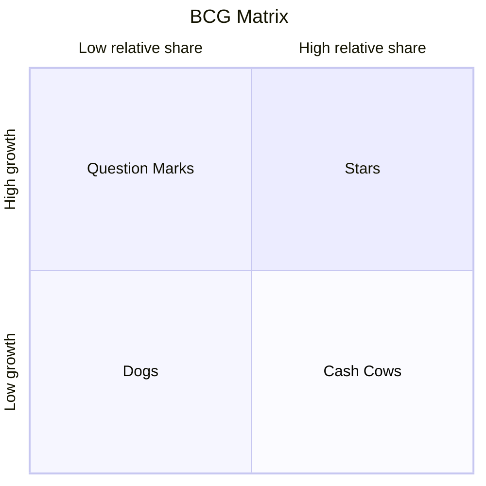

# BCG Matrix

## Core Concept

Uses **Market Growth Rate** (High/Low) × **Relative Market Share** (High/Low) to form a 2×2 matrix, categorizing products/business units into four types: **Stars**, **Cash Cows**, **Question Marks**, and **Dogs**. Each type implies a different investment strategy: Build, Hold, Harvest, or Divest.

> A healthy portfolio needs Cash Cows to provide funding, Stars to create the future, Question Marks filtered to find the next Star, and Dogs decisively divested.

---

## Use Cases

✅ **Best for**
- Multi-product/multi-business-line portfolio management
- Enterprise-level resource allocation decisions
- Product life cycle strategic planning
- Post-M&A business portfolio optimization

⚠️ **Use with caution**
- Single-product companies (matrix needs multiple business units to be meaningful)
- When market share and growth rate are not key success factors
- Early-stage startups (unstable data, categorization meaningless)
- When detailed competitive analysis is needed (matrix only looks at two dimensions, too coarse)

---

## Execution Steps

### Step 1: List All Products/Business Units

```
Product/Business list:
  1. [Product A] — Revenue: [...] / Market share: [...] / Growth rate: [...]
  2. [Product B] — Revenue: [...] / Market share: [...] / Growth rate: [...]
  3. [Product C] — Revenue: [...] / Market share: [...] / Growth rate: [...]
  ...
```

### Step 2: Set Dividing Lines

Define high/low thresholds for both dimensions:

```
Market growth rate dividing line: [e.g., 10%] — Above this is a high-growth market
Relative market share dividing line: [e.g., 1.0x] — Share ratio relative to largest competitor
```

> Relative market share = Own market share / Largest competitor's market share. 1.0x means on par with the largest competitor.

### Step 3: Position Each Product on the Matrix



Each product's circle size is proportional to revenue.

### Step 4: Analyze Portfolio Balance

Check overall portfolio health:

```
Portfolio health check:
  □ Are there enough Stars → Ensuring future revenue?
  □ Are there enough Cash Cows → Funding Stars and Question Marks?
  □ Do Question Marks have potential to become Stars → Worth investing?
  □ Do Dogs need to be divested → Freeing up resources?
```

**Ideal portfolio**: Few Cash Cows + Several Stars + Selected Question Marks + Very few Dogs

### Step 5: Formulate Strategy for Each Category

```
Stars — Build Strategy
  Action: Continuously invest, maintain/expand market share
  Goal: Convert to Cash Cows as market matures

Cash Cows — Hold Strategy
  Action: Maintain market share, don't over-invest
  Goal: Maximize cash flow generation, fund Stars and Question Marks

Question Marks — Selective Build or Harvest
  Potential → Build strategy: Increase investment, aim to become a Star
  No potential → Harvest strategy: Maximize short-term cash flow, gradually exit

Dogs — Harvest or Divest
  Action: Reduce investment, harvest residual value; or divest directly
  Goal: Free up resources for more valuable businesses
```

---

## Output Template

```
BCG Matrix Analysis Report

I. Dividing Standards
  Market growth rate dividing line: [X%]
  Relative market share dividing line: [X]x

II. Matrix Positioning
  Stars:
    - [Product] — Growth rate: [X%] — Relative share: [X]x — Revenue: [X]
  Cash Cows:
    - [Product] — Growth rate: [X%] — Relative share: [X]x — Revenue: [X]
  Question Marks:
    - [Product] — Growth rate: [X%] — Relative share: [X]x — Revenue: [X]
  Dogs:
    - [Product] — Growth rate: [X%] — Relative share: [X]x — Revenue: [X]

III. Portfolio Balance Assessment
  Overall health: Healthy / Needs adjustment / Severely imbalanced
  Core issue: [e.g., Lacking Stars / Insufficient Cash Cows / Too many Dogs]

IV. Strategic Recommendations
  [Product A] (Star): Build — [Specific actions]
  [Product B] (Cash Cow): Hold — [Specific actions]
  [Product C] (Question Mark): Build/Harvest — [Judgment basis]
  [Product D] (Dog): Divest — [Timeline]

V. Resource Reallocation
  Release [X] resources from [Cash Cows/Dogs] → Invest in [Stars/Question Marks]
```

---

## Execution Example

**Scenario**: An internet company's product portfolio assessment

```
I. Dividing Standards
  Market growth rate dividing line: 15%
  Relative market share dividing line: 1.0x

II. Matrix Positioning
  Stars:
    - AI Writing Assistant — Growth rate: 45% — Relative share: 1.8x — Revenue: 8M
  Cash Cows:
    - Enterprise Email — Growth rate: 5% — Relative share: 2.5x — Revenue: 50M
  Question Marks:
    - Collaborative Docs — Growth rate: 30% — Relative share: 0.4x — Revenue: 3M
    - Video Conferencing — Growth rate: 20% — Relative share: 0.3x — Revenue: 2M
  Dogs:
    - Legacy Cloud Storage — Growth rate: -5% — Relative share: 0.6x — Revenue: 5M

III. Portfolio Balance Assessment
  Overall health: Needs adjustment
  Core issue: Cash Cow depends on a single product (Enterprise Email), only 1 Star, 2 Question Marks with low share

IV. Strategic Recommendations
  AI Writing Assistant (Star): Build — Increase R&D investment, expand industry templates
  Enterprise Email (Cash Cow): Hold — Maintain customer relationships, control costs
  Collaborative Docs (Question Mark): Build — Fast market growth with tech synergy, worth investing
  Video Conferencing (Question Mark): Harvest — Too intense competition (Tencent Meeting/Feishu), stop additional investment
  Legacy Cloud Storage (Dog): Divest — Complete user migration within 6 months, reassign team

V. Resource Reallocation
  Release 15 people from Video Conferencing and Legacy Cloud Storage → Invest in AI Writing Assistant and Collaborative Docs
```

---

## Common Pitfalls

| Pitfall | Description | How to Avoid |
|------|------|---------|
| Only looking at current, not trends | Today's Question Mark may be tomorrow's Dog; today's Star may be maturing | Judge future direction using product life cycle |
| Blanket approach to Dogs | Some Dogs have strategic value (defensive products, brand image products) | When assessing Dogs, consider strategic synergy value, not just financial metrics |
| Ignoring market share definition | Different market definitions lead to vastly different share figures | Define market boundaries first, then calculate using consistent methodology |
| Over-relying on two dimensions | Market share and growth rate don't cover all competitive factors | Use BCG for initial screening; supplement with Porter's or SWOT for complex decisions |
| Indecisive about Question Marks | Daring not to decide between build or harvest, continuously draining resources | Set clear time windows and milestones; harvest if targets not met by deadline |

---

## Relationship with Other Methodologies

- **Combined with Porter's Five Forces**: BCG looks at product portfolio; Five Forces analyzes each product's industry competitive landscape
- **Combined with SWOT**: BCG positions product categories; SWOT deeply analyzes individual product strengths/weaknesses/opportunities/threats
- **Combined with Pareto Analysis**: Use Pareto to verify whether Cash Cows truly contribute the majority of revenue
- **Input to OKR**: Star product build goals and Question Mark milestones can be converted to OKRs
- **Combined with Product Lifecycle**: BCG's four categories correspond to different life cycle stages; combining them yields more accurate judgment
