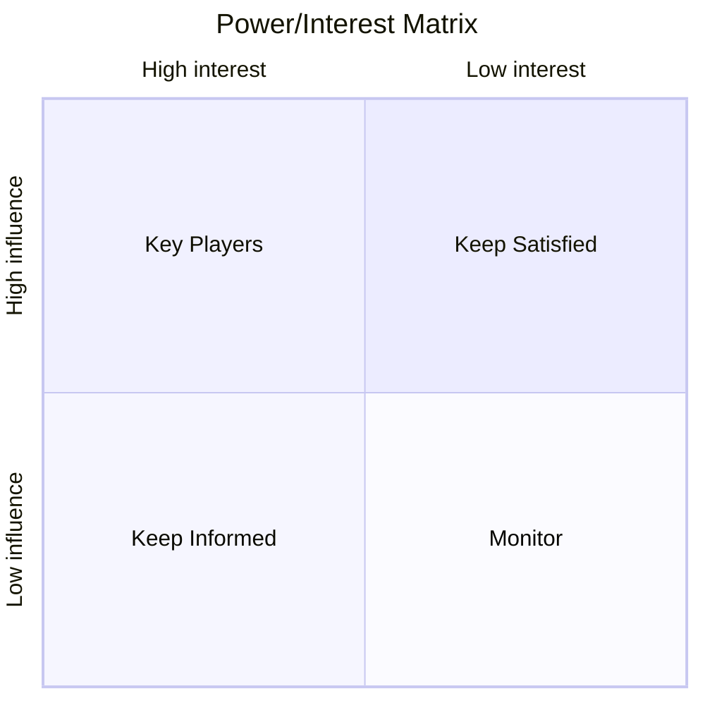

# Stakeholder Mapping

## Core Concept

Identify all people or organizations affected by or able to affect a project/decision, analyze their **influence** and **interest**, and formulate targeted communication and management strategies.

> Porter's Five Forces analyzes the competitive landscape; Stakeholder Mapping analyzes the influence network of people and organizations — the latter is indispensable for driving internal change and cross-organizational collaboration.

**Core Matrix (Power/Interest Matrix):**



---

## Use Cases

✅ **Best for**
- Driving major internal organizational change (product direction adjustment, restructuring)
- Complex projects requiring multi-party alignment (cross-department, cross-company)
- Pre-implementation resistance forecasting for policies/strategies
- Identifying key decision-makers and potential opponents

⚠️ **Use with caution**
- Pure technical issues with no interpersonal/organizational factors (use other frameworks)
- Stakeholders already fully aligned, only execution needed

---

## Execution Steps

### Step 1: Identify All Stakeholders

List all potentially relevant people/organizations without filtering:

```
Internal: [...] (Management, Product, Engineering, Operations, Sales, Finance...)
External: [...] (Users, Customers, Partners, Regulators, Competitors, Media...)
```

**Tip**: Don't filter early; exhaust first, then analyze.

### Step 2: Assess Influence and Interest

Score each stakeholder:

```
Influence (Power): How much impact on project success? (High/Medium/Low)
  Considerations: Decision authority, resource control, public influence, veto power

Interest: How much do they care about project outcomes? (High/Medium/Low)
  Considerations: Direct benefit/harm, attention level, willingness to participate
```

### Step 3: Position on the Matrix

Place each stakeholder in the four quadrants of the power/interest matrix:

```
Zone A (High Power + High Interest) → Key Players: Must be deeply involved, actively managed
Zone B (High Power + Low Interest) → Keep Satisfied: Regular reporting, prevent becoming obstacles
Zone C (Low Power + High Interest) → Keep Informed: Maintain information transparency, leverage their support
Zone D (Low Power + Low Interest) → Monitor: Regular attention, no proactive investment needed
```

### Step 4: Analyze Stance and Motivations

Deep-dive analysis for Zone A and Zone B:

```
Stakeholder: [Name/Role]
Current stance: [Supportive/Neutral/Opposed/Unknown]
Core motivations: [What they truly care about]
Concerns/Resistance sources: [...]
Potential influence methods: [How they can help or hinder the project]
```

### Step 5: Formulate Management Strategies

Develop corresponding strategies for each quadrant:

```
Key Players (Zone A):
  Strategy: Deep involvement, co-decision-making, regular 1-on-1s
  Specific actions: [...]

Keep Satisfied (Zone B):
  Strategy: Regular briefings, address core concerns, advance warnings
  Specific actions: [...]

Keep Informed (Zone C):
  Strategy: Transparent communication, collect feedback, leverage as advocates
  Specific actions: [...]

Monitor (Zone D):
  Strategy: Include in mass notifications, sync at major milestones
  Specific actions: [...]
```

### Step 6: Identify Alliances and Tensions

```
Natural alliances: [Who shares interests and can unite]
Potential conflicts: [Who has opposing interests, needs mediation]
Critical gaps: [Which important stakeholder relationship hasn't been established]
```

---

## Output Template

```
Project/Decision: [...]

Stakeholder list:
  [Name/Role] | Influence: High/Medium/Low | Interest: High/Medium/Low | Quadrant: A/B/C/D | Stance: Supportive/Neutral/Opposed

Key Players (Zone A) deep analysis:
  [Name] — Motivations: [...] — Concerns: [...] — Management strategy: [...]

Alliances: [...]
Major tensions: [...]

Action plan:
  [Specific communication action] — Target: [...] — Timeline: [...] — Method: [...]
```

---

## Execution Example

**Scenario**: Driving product team from waterfall to agile development, requiring internal alignment

```
Stakeholder identification:
  Internal: CTO, VP of Product, Engineering team lead, Design lead, QA lead, VP of Sales, Finance
  External: Key clients (dependent on fixed delivery cycles)

Assessment and matrix:
  CTO              — Influence: High | Interest: High → Zone A (Key Player) — Stance: Supportive
  VP of Sales       — Influence: High | Interest: High → Zone A           — Stance: Opposed (worried about client commitments)
  Engineering lead  — Influence: Medium | Interest: High → Zone C         — Stance: Supportive
  Finance           — Influence: Medium | Interest: Low → Zone D          — Stance: Neutral
  Key clients       — Influence: High | Interest: High → Zone A (External) — Stance: Unknown

Key conflict: VP of Sales opposed — Core concern: Agile iterations can't make fixed commitments to clients
Management strategy:
  → 1-on-1 with VP of Sales, offer "Agile + Fixed Milestones" hybrid approach
  → Pilot agile with a non-core client, let data speak
  → Invite key client representative to product review meetings, increase engagement
```

---

## Common Pitfalls

| Pitfall | Description | How to Avoid |
|------|------|---------|
| Only analyzing internal stakeholders | Ignoring external influencers | Explicitly list external stakeholders |
| Assuming stances without validation | Believing someone is "definitely supportive" without confirming | Confirm stances through direct communication, don't assume |
| Ignoring Zone B (High Power/Low Interest) | "They don't care, no need to manage" | If Zone B feels neglected, they may become unexpected resistance |
| Analyzing without acting | Creating the matrix but having no specific communication plan | Must output specific actions, including timelines and owners |

---

## Relationship with Other Methodologies

- **Combined with OKR**: Key stakeholders' core concerns should be reflected in OKR Key Results design
- **Combined with Pre-mortem**: Stakeholder resistance is an important project failure path; include in risk analysis
- **Precedes Design Thinking**: During user research, confirm which stakeholders need to be interviewed
- **Combined with Socratic questioning**: When analyzing stakeholders, probe their "true motivations" rather than surface stances
