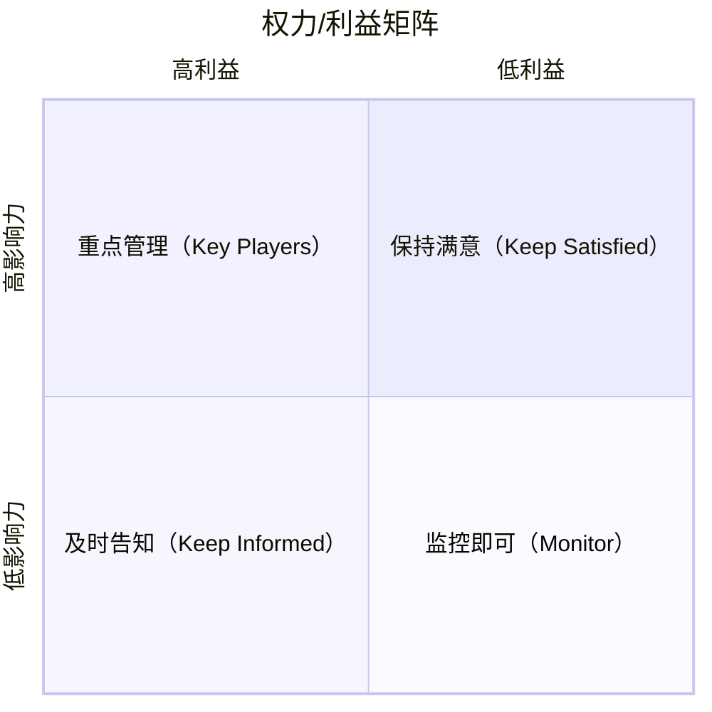

# Stakeholder Mapping · 利益相关者分析

## 核心理念

识别所有受项目/决策影响或能影响项目/决策的人或组织，分析其**影响力**与**利益立场**，制定针对性的沟通与管理策略。

> Porter's Five Forces 分析竞争格局；Stakeholder Mapping 分析人与组织的影响力网络——后者在内部推动变革和跨组织协作中不可或缺。

**核心矩阵（权力/利益矩阵）：**



---

## 适用场景

✅ **最适合**
- 组织内部推动重大变革（产品方向调整、架构重组）
- 需要多方对齐的复杂项目（跨部门、跨公司）
- 政策/战略落地前的阻力预判
- 识别关键决策者和潜在反对者

⚠️ **慎用**
- 纯技术问题，无人际/组织因素（用其他分析框架）
- 利益相关者已经充分对齐，只需执行

---

## 执行步骤

### Step 1：识别所有利益相关者

不加筛选地列出所有可能相关的人/组织：

```
内部：[...]（管理层、产品、技术、运营、销售、财务...）
外部：[...]（用户、客户、合作伙伴、监管方、竞争者、媒体...）
```

**提示**：不要过早筛选，先穷举，后分析。

### Step 2：评估影响力与利益

对每个利益相关者打分：

```
影响力（Power）：对项目成败有多大影响？（高/中/低）
  考量：决策权、资源控制、舆论影响力、否决权

利益程度（Interest）：对项目结果有多在意？（高/中/低）
  考量：直接受益/受损、关注度、参与意愿
```

### Step 3：定位到矩阵

将每个利益相关者放入权力/利益矩阵的四个象限：

```
A区（高权 + 高利）→ 关键玩家：必须深度参与、主动管理
B区（高权 + 低利）→ 保持满意：定期汇报，防止变成阻力
C区（低权 + 高利）→ 及时告知：保持信息透明，利用其支持
D区（低权 + 低利）→ 监控即可：定期关注，无需主动投入
```

### Step 4：分析立场与动机

对 A 区和 B 区重点分析：

```
利益相关者：[名称/角色]
当前立场：[支持/中立/反对/未知]
核心动机：[他们真正在乎的是什么]
顾虑/阻力来源：[...]
潜在影响力方式：[他们能如何帮助或阻碍项目]
```

### Step 5：制定管理策略

针对每个象限制定对应策略：

```
关键玩家（A区）：
  策略：深度参与、共同决策、定期 1-on-1
  具体行动：[...]

保持满意（B区）：
  策略：定期简报、关注其核心诉求、提前预警
  具体行动：[...]

及时告知（C区）：
  策略：透明沟通、收集反馈、利用其作为倡导者
  具体行动：[...]

监控即可（D区）：
  策略：纳入群发通知、重大节点同步
  具体行动：[...]
```

### Step 6：识别联盟与张力

```
天然联盟：[谁和谁利益一致，可以联合]
潜在冲突：[谁和谁利益对立，需要调解]
关键缺口：[哪个重要利益相关者尚未建立关系]
```

---

## 输出模板

```
项目/决策：[...]

利益相关者清单：
  [姓名/角色] | 影响力：高/中/低 | 利益：高/中/低 | 象限：A/B/C/D | 立场：支持/中立/反对

关键玩家（A区）深度分析：
  [姓名] — 动机：[...] — 顾虑：[...] — 管理策略：[...]

联盟关系：[...]
主要张力：[...]

行动计划：
  [具体沟通行动] — 对象：[...] — 时间：[...] — 方式：[...]
```

---

## 执行示例

**场景**：推动产品团队从瀑布开发转向敏捷，需要内部对齐

```
利益相关者识别：
  内部：CTO、产品VP、工程团队负责人、设计负责人、QA负责人、销售VP、财务
  外部：大客户（依赖固定交付周期）

评估与矩阵：
  CTO         — 影响：高 | 利益：高 → A区（关键玩家）— 立场：支持
  销售VP      — 影响：高 | 利益：高 → A区           — 立场：反对（担心影响客户承诺）
  工程团队负责人 — 影响：中 | 利益：高 → C区         — 立场：支持
  财务         — 影响：中 | 利益：低 → D区           — 立场：中立
  大客户       — 影响：高 | 利益：高 → A区（外部）   — 立场：未知

关键矛盾：销售VP反对 — 核心顾虑：敏捷迭代无法给客户做固定承诺
管理策略：
  → 与销售VP 1-on-1，提供「敏捷+固定里程碑」混合方案
  → 选一个非核心客户做敏捷试点，数据说话
  → 把大客户代表拉入产品评审会，增强参与感
```

---

## 常见陷阱

| 陷阱 | 说明 | 避免方式 |
|------|------|---------|
| 只分析内部利益相关者 | 忽略外部影响方 | 显式列出外部利益相关者 |
| 立场假设不验证 | 认为某人「肯定支持」但未确认 | 用直接沟通确认立场，不要假设 |
| 忽视 B 区（高权低利）| 「他不在乎，不用管」 | B 区若感到被忽视，可能成为意外阻力 |
| 分析后不行动 | 做了矩阵但没有具体沟通计划 | 必须输出具体行动，含时间节点和负责人 |

---

## 与其他方法论的关系

- **配合 OKR**：关键利益相关者的核心诉求应体现在 OKR 的 Key Results 设计中
- **配合 Pre-mortem**：利益相关者的阻力是项目失败的重要路径，纳入风险分析
- **前置于 Design Thinking**：在用户研究阶段确认哪些利益相关者需要被访谈
- **配合苏格拉底提问**：分析利益相关者时，追问其「真正动机」而非表面立场
