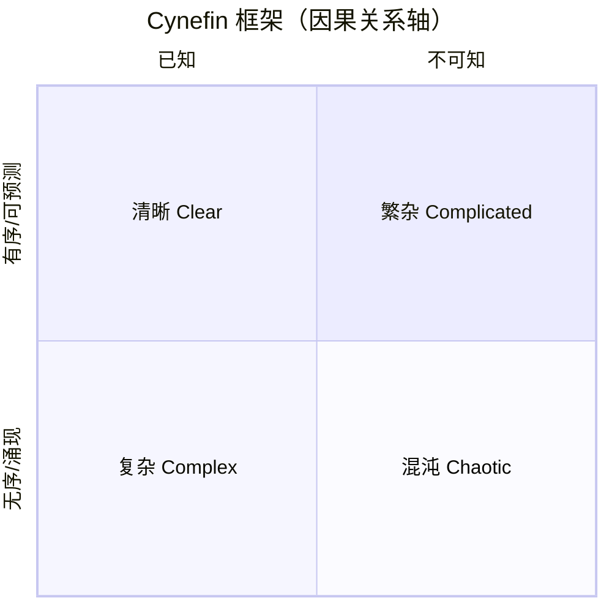

# Cynefin Framework · 肯尼芬框架

## 核心理念

由 Dave Snowden 于 1999 年提出，将问题域分为五种情境，每种需要**截然不同的应对策略**。核心洞察：**在错误的情境中应用错误的方法论，比没有方法论更危险**。Cynefin 是**元框架**——它告诉你应该使用哪种方法，而不是直接给出方法。



困惑 Confused（不知道在哪个域）——位于矩阵之外，需先拆解子问题再分别判断所属域。

| 情境 | 因果关系 | 应对模式 | 实践类型 |
|------|---------|---------|---------|
| **清晰** Clear | 已知且可预测 | 感知 → 分类 → 响应 | 最佳实践 |
| **繁杂** Complicated | 可知但需专业知识 | 感知 → 分析 → 响应 | 良好实践 |
| **复杂** Complex | 只能事后回溯 | 探索 → 感知 → 响应 | 涌现实践 |
| **混沌** Chaotic | 不可感知 | 行动 → 感知 → 响应 | 新颖实践 |
| **困惑** Confused | 不确定在哪个域 | 拆解子问题 → 分别应对 | — |

---

## 适用场景

✅ **最适合**
- 在应用其他方法论**之前**判断应该用哪种方法
- 面对不确定性和复杂性的战略决策
- 团队对"该怎么做"有分歧时（可能对问题域判断不同）
- 避免在复杂域中套用最佳实践

⚠️ **慎用**
- 简单事实性问题（不需要框架辅助）
- 已明确知道该用哪种方法时
- 需要精确量化输出时（Cynefin 是定性判断框架）

---

## 执行步骤

### Step 1：描述问题/情境

清晰描述当前面临的问题，包括背景、约束和目标。

### Step 2：判断所属域

使用诊断问题判断：

```
□ 因果关系是否已知且稳定？→ 是 → 清晰域
□ 因果关系是否可知但需专家分析？→ 是 → 繁杂域
□ 因果关系是否只能事后才能理解？→ 是 → 复杂域
□ 是否完全无法感知因果关系？→ 是 → 混沌域
□ 是否无法确定上述哪个判断成立？→ 是 → 困惑域
```

### Step 3：应用对应的应对模式

```
清晰域 → 感知-分类-响应 → 应用最佳实践
繁杂域 → 感知-分析-响应 → 请专家分析，选良好实践
复杂域 → 探索-感知-响应 → 设计安全失败实验
混沌域 → 行动-感知-响应 → 先止血，再理解
困惑域 → 拆解子问题 → 分别判断各子问题所属域
```

### Step 4：设计具体行动

针对所选模式设计行动方案，复杂域需设计安全失败实验：

```
实验：[具体行动]
安全性：[失败的影响范围和成本]
预期信号：[成功/失败的观察指标]
放大条件：[什么信号下扩大投入]
抑制条件：[什么信号下停止实验]
```

### Step 5：监控域的转换

```
常见转换路径：
  混沌 → 复杂：危机初步控制后
  复杂 → 繁杂：涌现模式被识别和固化后
  繁杂 → 清晰：实践被标准化后
  清晰 → 混沌：环境剧变导致既有实践失效（"悬崖"效应）
```

---

## 输出模板

```
分析时间：[日期]
问题描述：[...]

域判断：
  主要域：[清晰/繁杂/复杂/混沌/困惑]
  判断依据：[因果关系特征]

应对模式：
  选用模式：[感知-分类-响应 / 感知-分析-响应 / 探索-感知-响应 / 行动-感知-响应]

具体行动计划：

  [复杂域] 安全失败实验：
    实验 1：[...] — 安全边界：[...] — 观察指标：[...]
    实验 2：[...] — 安全边界：[...] — 观察指标：[...]

  [混沌域] 紧急行动：
    止血行动：[...] — 降级目标：[从混沌到复杂]

域转换监控：
  当前域 → 可能转换到：[...] — 触发信号：[...]
```

---

## 常见陷阱

| 陷阱 | 避免方式 |
|------|---------|
| 在复杂域套用最佳实践 | 复杂域没有事先的正确答案，必须用实验探索 |
| 将繁杂问题误判为清晰问题 | 繁杂域需要专家分析，不是简单套用 SOP |
| 在混沌域过度分析 | 混沌域先行动止血，再理解原因 |
| 忽视域的动态转换 | 定期重新判断，问题会从一个域转移到另一个域 |
| 团队对域的判断不一致 | 先对齐域的判断，再讨论解决方案 |
| 把"困惑"当作"复杂" | 困惑 = 不知道在哪个域，需先拆解再判断 |

---

## 与其他方法论的关系

- **元框架定位**：Cynefin 在所有方法论之前使用，判断应该用哪种方法论
- **清晰域 → SOP/流程管理**：标准操作流程、检查清单
- **繁杂域 → RICE/Decision Matrix**：专家分析 + 量化评估
- **复杂域 → Lean BML/Design Thinking**：实验驱动、迭代探索
- **混沌域 → Premortem/应急预案**：快速响应、危机管理
- **配合 SWOT**：SWOT 的 Threats 可能属于混沌域，Opportunities 可能属于复杂域
- **配合 OKR**：复杂域的 OKR 应设为探索性目标，而非确定性目标
