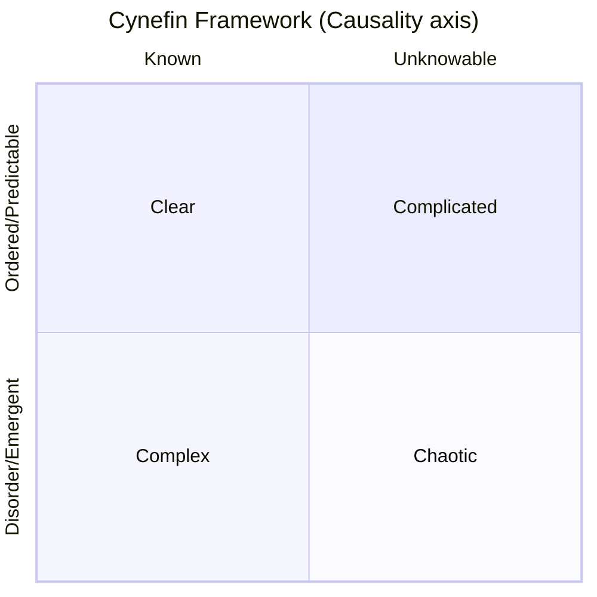

# Cynefin Framework · Cynefin Framework

## Core Idea

Proposed by Dave Snowden in 1999, this framework classifies problem domains into five contexts, each requiring **fundamentally different response strategies**. The core insight: **Applying the wrong methodology in the wrong context is more dangerous than having no methodology at all**. Cynefin is a **meta-framework** — it tells you which methodology to use, rather than providing the methodology directly.



Confused (don't know which domain you're in) — Located outside the matrix; requires decomposing into sub-problems first, then assessing each's domain.

| Context | Causality | Response Mode | Practice Type |
|---------|-----------|--------------|---------------|
| **Clear** | Known and predictable | Sense → Categorize → Respond | Best practice |
| **Complicated** | Knowable but requires expertise | Sense → Analyze → Respond | Good practice |
| **Complex** | Only understood in retrospect | Probe → Sense → Respond | Emergent practice |
| **Chaotic** | Cannot be perceived | Act → Sense → Respond | Novel practice |
| **Confused** | Unsure which domain | Decompose sub-problems → Assess each | — |

---

## Applicable Scenarios

✅ **Best suited for**
- Determining which methodology to use **before** applying any other framework
- Strategic decisions facing uncertainty and complexity
- When the team disagrees on "what to do" (may have different problem domain assessments)
- Preventing application of best practices in complex domains

⚠️ **Use with caution**
- Simple factual problems (no framework needed)
- When it's already clear which method to use
- When precise quantitative output is needed (Cynefin is a qualitative assessment framework)

---

## Execution Steps

### Step 1: Describe the Problem/Context

Clearly describe the problem at hand, including background, constraints, and objectives.

### Step 2: Determine the Domain

Use diagnostic questions:

```
□ Is the causal relationship known and stable? → Yes → Clear domain
□ Is the causal relationship knowable but requires expert analysis? → Yes → Complicated domain
□ Can the causal relationship only be understood in retrospect? → Yes → Complex domain
□ Is the causal relationship completely imperceptible? → Yes → Chaotic domain
□ Can't determine which of the above applies? → Yes → Confused domain
```

### Step 3: Apply the Corresponding Response Mode

```
Clear domain → Sense-Categorize-Respond → Apply best practices
Complicated domain → Sense-Analyze-Respond → Consult experts, choose good practices
Complex domain → Probe-Sense-Respond → Design safe-to-fail experiments
Chaotic domain → Act-Sense-Respond → Stop the bleeding first, then understand
Confused domain → Decompose sub-problems → Assess each sub-problem's domain
```

### Step 4: Design Specific Actions

Design action plans for the chosen mode; complex domains require safe-to-fail experiments:

```
Experiment: [Specific action]
Safety: [Failure impact scope and cost]
Expected signals: [Observation metrics for success/failure]
Amplification conditions: [Under what signals to scale up investment]
Dampening conditions: [Under what signals to stop the experiment]
```

### Step 5: Monitor Domain Transitions

```
Common transition paths:
  Chaotic → Complex: After crisis is initially controlled
  Complex → Complicated: After emergent patterns are identified and codified
  Complicated → Clear: After practices are standardized
  Clear → Chaotic: Environmental upheaval renders existing practices ineffective ("cliff" effect)
```

---

## Output Template

```
Analysis date: [Date]
Problem description: [...]

Domain assessment:
  Primary domain: [Clear / Complicated / Complex / Chaotic / Confused]
  Assessment basis: [Causality characteristics]

Response mode:
  Selected mode: [Sense-Categorize-Respond / Sense-Analyze-Respond / Probe-Sense-Respond / Act-Sense-Respond]

Specific action plan:

  [Complex domain] Safe-to-fail experiments:
    Experiment 1: [...] — Safety boundary: [...] — Observation metric: [...]
    Experiment 2: [...] — Safety boundary: [...] — Observation metric: [...]

  [Chaotic domain] Emergency actions:
    Stop-bleeding action: [...] — De-escalation goal: [From chaotic to complex]

Domain transition monitoring:
  Current domain → May transition to: [...] — Trigger signal: [...]
```

---

## Common Pitfalls

| Pitfall | How to Avoid |
|---------|-------------|
| Applying best practices in complex domain | Complex domain has no pre-existing correct answer; must use experiments to explore |
| Misjudging complicated problems as clear | Complicated domain requires expert analysis, not just applying SOPs |
| Over-analyzing in chaotic domain | Chaotic domain: act first to stop bleeding, then understand the cause |
| Ignoring dynamic domain transitions | Reassess periodically; problems shift from one domain to another |
| Team disagrees on domain assessment | Align on domain assessment first, then discuss solutions |
| Confusing "confused" with "complex" | Confused = don't know which domain; must decompose first, then assess |

---

## Relationship with Other Methodologies

- **Meta-framework positioning**: Cynefin is used before all other methodologies to determine which methodology to apply
- **Clear domain → SOP/process management**: Standard operating procedures, checklists
- **Complicated domain → RICE/Decision Matrix**: Expert analysis + quantitative evaluation
- **Complex domain → Lean BML/Design Thinking**: Experiment-driven, iterative exploration
- **Chaotic domain → Pre-mortem/emergency plans**: Rapid response, crisis management
- **Complements SWOT**: SWOT's Threats may belong to chaotic domain; Opportunities may belong to complex domain
- **Complements OKR**: OKRs in complex domain should be set as exploratory goals, not deterministic goals
