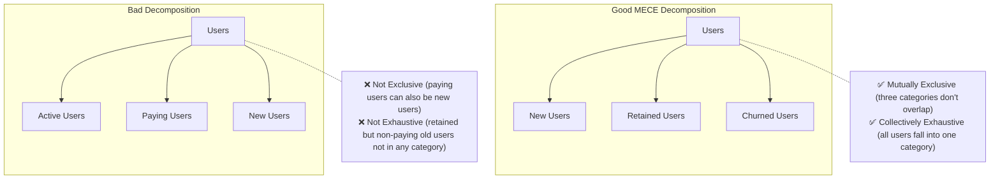
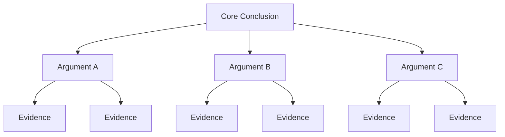
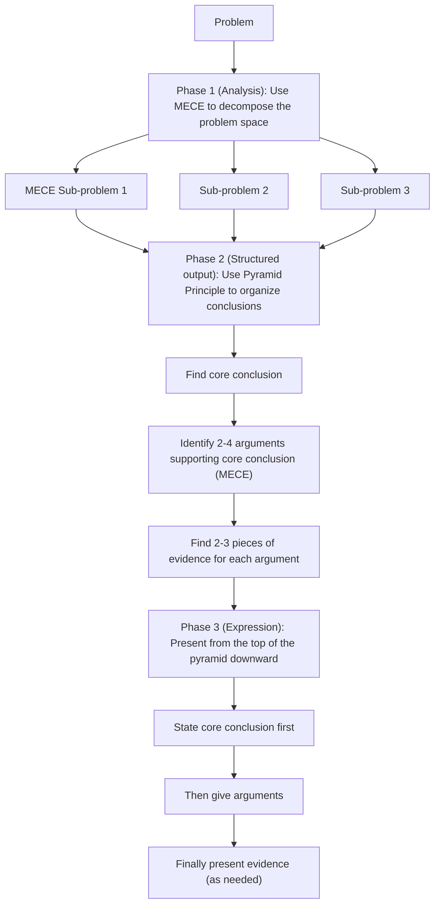

# MECE + Pyramid Principle · The Structured Thinking Power Couple

## Two Tools, One Goal

**MECE** (McKinsey core analysis tool): How to **decompose problems**
**Pyramid Principle** (Barbara Minto, McKinsey consultant): How to **organize and express conclusions**

Together, these two tools address: no gaps in analysis, no chaos in expression.

---

## Part 1 · MECE

### Core Definition

**Mutually Exclusive**: No overlap between parts
**Collectively Exhaustive**: Parts together cover all cases



### Why MECE Matters

- **No gaps**: Prevents blind spots in analysis
- **No overlap**: Avoids double-counting or redundant discussion
- **Clear structure**: Allows the audience to follow the logic without getting lost

### Common MECE Decomposition Frameworks

**Time dimension**: Short-term / Medium-term / Long-term (define clear time boundaries)

**Process dimension**: Decompose by business process stages (Acquisition → Activation → Retention)

**User dimension**: User lifecycle (New users / Active users / Dormant users / Churned users)

**Geographic dimension**: Domestic / Overseas; Tier-1 cities / Tier-2 cities / Other

**Business dimension**: Revenue source breakdown (Subscription revenue + One-time revenue + Service revenue)

**Cause dimension (5C)**: Company internal / Competitors / Customers / Channels / Macro environment

**Impact factors (Product)**: Features / Experience / Performance / Stability / Security

### Two Questions to Test MECE

1. **Exclusivity test**: "Is there overlap between categories? Can a single element belong to two categories?"
2. **Exhaustiveness test**: "Is there any situation/element not covered?"

---

## Part 2 · Pyramid Principle

### Core Idea

**Conclusion first**: Lead with your core point, then provide supporting evidence. This is the opposite of "buildup" storytelling (background → analysis → conclusion at the end).



**Three principles:**
1. **Any point at any level must be a synthesis or inference of the elements below it**
2. **Each group of points must satisfy MECE**
3. **Each group of points must be organized in the same type of logical order**

### Logical Order Types

**Deductive order** (syllogism):
```
Major premise → Minor premise → Conclusion
Example: All B2B SaaS companies need a strong customer success team
    We are a B2B SaaS company
    → We need to build a strong customer success team
```

**Inductive order** (parallel arguments supporting conclusion):
```
Conclusion: Our growth has a problem
Argument 1: Q3 new user registrations dropped 30%
Argument 2: Paid conversion rate fell from 8% to 5%
Argument 3: User NPS dropped from 42 to 31
```

**Chronological order** (steps/process):
```
Conclusion: Recommended three steps to solve this problem
Step 1: ...
Step 2: ...
Step 3: ...
```

---

## Combined Use: Analysis + Expression

### Typical Workflow



---

## Execution Steps (Integrated Use)

### Step 1: Define the Core Problem

Express the problem to solve as a clear question — this is the "North Star" of the entire analysis.

### Step 2: MECE Decompose the Problem Space

Break the core problem into several MECE sub-problems, ensuring:
- No overlap between sub-problems
- Sub-problems combined fully cover the original problem

### Step 3: Analyze Each Sub-problem

For each MECE sub-problem, collect data and form viewpoints.

### Step 4: Synthesize into Core Conclusion

From the sub-problem analysis conclusions, inductively derive the top-level core conclusion.

### Step 5: Organize Output in Pyramid Structure

Organize all content in the order of "Conclusion → Arguments → Evidence."

---

## Output Template

```
Core problem: [One-sentence question]

MECE Decomposition:
  Sub-problem A: [...]  Analysis conclusion: [...]  Evidence: [...]
  Sub-problem B: [...]  Analysis conclusion: [...]  Evidence: [...]
  Sub-problem C: [...]  Analysis conclusion: [...]  Evidence: [...]

[Exclusivity test: Is there overlap between A/B/C?]
[Exhaustiveness test: Are there missed cases?]

---
Pyramid output (expression layer):

Core conclusion: [The most important sentence]

Argument 1: [First argument supporting the conclusion]
  Evidence 1.1: [Data / case / logic]
  Evidence 1.2: [...]

Argument 2: [Second argument supporting the conclusion]
  Evidence 2.1: [...]

Argument 3: [...]
  ...

(The above arguments satisfy MECE: [Verification explanation])
```

---

## Execution Example

**Core problem**: Why has our enterprise customer renewal rate dropped by 15% over the past two quarters?

```
MECE Decomposition (cause dimension):
  Sub-problem A: Is there a product issue?
    → Analysis: Core feature usage dropped 20%; 3 high-frequency features had stability issues in Q2
    → Conclusion: Product stability is the primary cause

  Sub-problem B: Is there a customer success operations issue?
    → Analysis: Customer success team was downsized in Q2; customers per rep increased from 15 to 28
    → Conclusion: Insufficient customer success resources led to reduced proactive intervention

  Sub-problem C: Have external market conditions changed?
    → Analysis: Key competitor launched lower-priced plans in Q2; 3 churned customers explicitly mentioned competitors
    → Conclusion: Competitive pressure is a secondary factor

Pyramid output:

Core conclusion: The decline in enterprise customer renewal rate is primarily caused by two internal factors: product stability issues + insufficient customer success resources; external competitive pressure is an amplifier.

Argument 1: Product stability issues directly erode user trust
  Evidence: 3 core features had stability incidents in Q2; core feature MAU dropped 20%

Argument 2: Customer success resources are severely insufficient, losing proactive intervention opportunities
  Evidence: Customers per rep increased by 87%; proactive outreach frequency dropped from 2/month to 0.5/month

Argument 3: Competitor low-price plans provided an exit reason when customers were dissatisfied
  Evidence: Churn survey: 3/8 churned customers mentioned competitors, but all had existing dissatisfaction
```

---

## Relationship with Other Methodologies

- **Works with 5 Whys / Fishbone**: 5 Whys find root causes; MECE ensures analysis has no gaps
- **Works with all output-oriented work**: Any scenario requiring clear expression of analysis conclusions can use the Pyramid Principle
- **Works with Design Thinking**: Use MECE in the Define phase to ensure complete problem decomposition
- **Works with OKR**: Use MECE to verify that Key Results cover all dimensions of the objective
