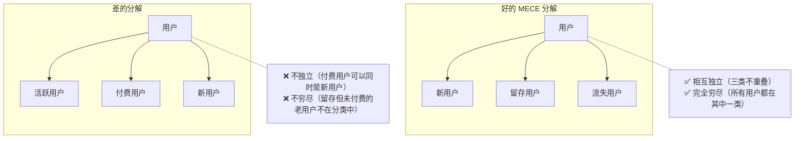
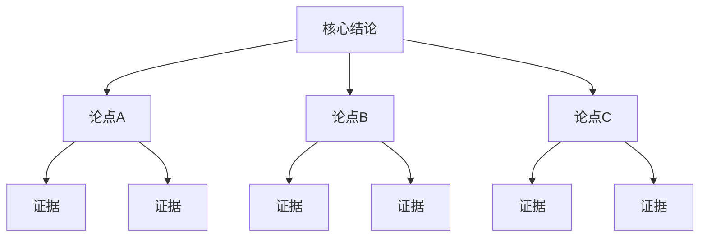
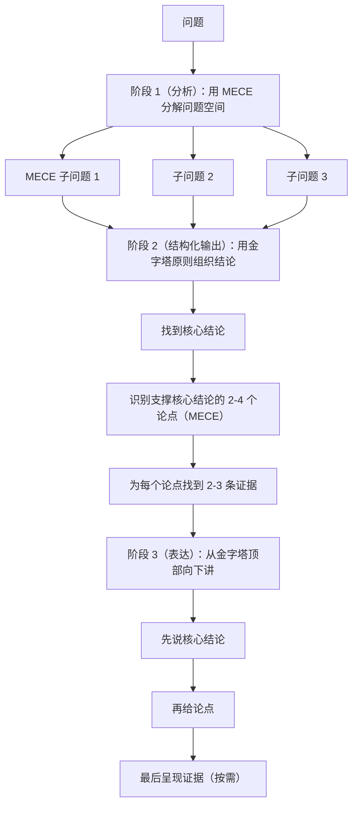

# MECE + Pyramid Principle · 结构化思维双剑客

## 两个工具，一个目标

**MECE**（麦肯锡核心分析工具）：如何**分解问题**
**金字塔原则**（Barbara Minto，麦肯锡顾问）：如何**组织和表达结论**

这两个工具共同解决：分析不遗漏、表达不混乱。

---

## Part 1 · MECE

### 核心定义

**Mutually Exclusive（相互独立）**：各部分之间没有重叠
**Collectively Exhaustive（完全穷尽）**：各部分加在一起覆盖全部情况



### 为什么 MECE 重要

- **不遗漏**：避免分析时盲区
- **不重复**：避免重复计算或重复讨论
- **结构清晰**：让受众可以跟着逻辑走，不会迷失

### 常用 MECE 分解框架

**时间维度**：短期 / 中期 / 长期（注意定义清晰的时间边界）

**流程维度**：按业务流程阶段分解（获客 → 激活 → 留存）

**用户维度**：用户生命周期（新用户 / 活跃用户 / 休眠用户 / 流失用户）

**地理维度**：国内 / 海外；一线城市 / 二线城市 / 其他

**业务维度**：收入来源分解（订阅收入 + 一次性收入 + 服务收入）

**原因维度（5C）**：公司内部 / 竞争对手 / 客户 / 渠道 / 宏观环境

**影响因素（产品）**：功能 / 体验 / 性能 / 稳定性 / 安全性

### 检验 MECE 的两个问题

1. **独立性检验**："各个分类之间有没有重叠？一个元素能同时属于两个分类吗？"
2. **穷尽性检验**："是否有什么情况/元素没有被覆盖？"

---

## Part 2 · 金字塔原则

### 核心理念

**结论先行**：先告诉对方你的核心观点，再支撑论据。对立于"铺垫式"讲述（先讲背景→分析→最后才有结论）。



**三原则：**
1. **任何层级的要点，必须是其下方要素的综合或推论**
2. **每组要点之间，必须满足 MECE**
3. **每组要点，必须以同一类逻辑顺序组织**

### 逻辑顺序类型

**演绎顺序**（三段论）：
```
大前提 → 小前提 → 结论
例：所有做 B2B SaaS 的公司都需要强大的客户成功团队
    我们是 B2B SaaS 公司
    → 我们需要建立强大的客户成功团队
```

**归纳顺序**（并列论据支撑结论）：
```
结论：我们的增长出了问题
论据1：Q3 新用户注册下降 30%
论据2：付费转化率从 8% 降至 5%
论据3：用户 NPS 从 42 降至 31
```

**时间顺序**（步骤/过程）：
```
结论：推荐三步骤解决该问题
步骤1：...
步骤2：...
步骤3：...
```

---

## 联合使用：分析 + 表达

### 典型工作流



---

## 执行步骤（综合运用）

### Step 1：定义核心问题

用一个清晰的问句表达要解决的问题，这是整个分析的"北极星"。

### Step 2：MECE 分解问题空间

将核心问题分解为几个 MECE 的子问题，确保：
- 子问题之间不重叠
- 子问题合并能完整覆盖原问题

### Step 3：逐子问题分析

对每个 MECE 子问题，收集数据、形成观点。

### Step 4：综合形成核心结论

从子问题的分析结论出发，归纳出顶层核心结论。

### Step 5：按金字塔结构组织输出

按"结论 → 论点 → 证据"的顺序组织所有内容。

---

## 输出模板

```
核心问题：[一句话问句]

MECE 分解：
  子问题 A：[...]  分析结论：[...]  证据：[...]
  子问题 B：[...]  分析结论：[...]  证据：[...]
  子问题 C：[...]  分析结论：[...]  证据：[...]

[独立性检验：A/B/C 之间是否重叠？]
[穷尽性检验：是否有遗漏情况？]

---
金字塔输出（表达层）：

核心结论：[最重要的一句话]

论点 1：[支撑结论的第一个论点]
  证据 1.1：[数据/案例/逻辑]
  证据 1.2：[...]

论点 2：[支撑结论的第二个论点]
  证据 2.1：[...]

论点 3：[...]
  ...

（以上论点之间满足 MECE：[验证说明]）
```

---

## 执行示例

**核心问题**：为什么我们的企业客户续费率在过去两个季度下降了 15%？

```
MECE 分解（原因维度）：
  子问题 A：产品层面是否有问题？
    → 分析：核心功能使用率下降 20%，3 个高频用的功能在 Q2 出现稳定性问题
    → 结论：产品稳定性是主因

  子问题 B：客户成功运营是否有问题？
    → 分析：客户成功团队在 Q2 规模缩减，人均负责客户数从 15 升至 28
    → 结论：客户成功资源不足导致主动干预减少

  子问题 C：外部市场是否有变化？
    → 分析：主要竞品 Q2 推出更低价格方案，3 个流失客户明确提及竞品
    → 结论：竞品压力是次要因素

金字塔输出：

核心结论：企业客户续费率下降主要由两个内部原因导致：产品稳定性问题 + 客户成功资源不足；外部竞品压力是放大因素。

论点 1：产品稳定性问题直接损害用户信任
  证据：3 个核心功能在 Q2 有稳定性事故，核心功能 MAU 下降 20%

论点 2：客户成功资源严重不足，丧失主动干预机会
  证据：人均负责客户数增加 87%，主动外展频率从每月 2 次降至 0.5 次

论点 3：竞品低价方案在客户不满时提供了退出理由
  证据：流失调查：3/8 流失客户提及竞品，但均已有使用不满在先
```

---

## 与其他方法论的关系

- **配合 5 Whys / Fishbone**：5 Whys 找根因，MECE 确保分析不遗漏
- **配合所有输出性工作**：任何需要清晰表达分析结论的场景都可用金字塔原则
- **配合 Design Thinking**：在 Define 阶段用 MECE 确保问题分解完整
- **配合 OKR**：用 MECE 检验 Key Results 是否覆盖了目标的全部维度
