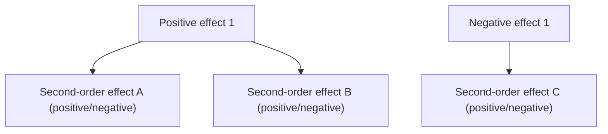
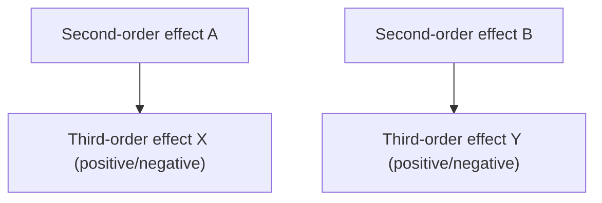

# Second-Order Thinking · Second-Order Thinking

## Core Idea

Most decisions produce unexpected consequences because people only consider first-order effects (direct, anticipated outcomes). Second-order thinking asks **"and then what?"** — tracing the chain of consequences to second-order and third-order effects. The core question: **What happens after the immediate outcome?** If higher-order effects significantly offset first-order gains, the decision needs to be reconsidered.

> First-order thinking says "doing this has benefits"; second-order thinking asks "what trouble will these benefits bring?"

---

## Applicable Scenarios

✅ **Best suited for**
- Policy/rule-making (policies always have unintended side effects)
- Product feature decisions (especially features involving the ecosystem)
- Pricing strategy changes (price changes trigger chain reactions)
- Incentive mechanism design (people respond to incentives, including unintended responses)
- Competitive strategy (how will competitors respond to our actions?)

⚠️ **Use with caution**
- Simple reversible decisions (second-order thinking costs more than the decision itself)
- Routine operations where effects are well understood (no additional reasoning needed)
- Pure execution-level tasks (direction already set, reasoning adds no value)
- Emergency decisions with extreme time pressure (act first, debrief later)

---

## Execution Steps

### Step 1: State the Decision/Action

Clearly write the decision under consideration:

```
Decision: [Specific action description]
Objective: [Desired effect]
Context: [Why this decision is being considered]
```

### Step 2: List First-Order Effects

List the **direct, anticipated consequences** of this decision — this is where most people stop:

```
First-order effects (direct, anticipated):
  + [Positive effect 1]
  + [Positive effect 2]
  - [Negative effect 1]
```

### Step 3: Ask "And Then What?" — Second-Order Effects

For each first-order effect, ask **"and then what? What will this result trigger?"**



**Key technique**: Ask from different stakeholders' perspectives — How will users react? What will competitors do? How will suppliers adjust? How will employee behavior change?

### Step 4: Ask "And Then What?" — Third-Order Effects

For key second-order effects, ask again to reveal deeper impacts:



> Typically, reasoning to the third order is sufficient. Deeper effects have exponentially higher uncertainty, with diminishing reasoning value.

### Step 5: Comprehensive Assessment

```
Effect summary:
  First-order: Net impact [positive/negative] — [explanation]
  Second-order: Net impact [positive/negative] — [explanation]
  Third-order: Net impact [positive/negative] — [explanation]

Comprehensive judgment:
  Do higher-order effects significantly offset first-order gains? Yes / No
  Are there unacceptable negative higher-order effects? Yes / No
```

### Step 6: Decision Rules

```
If: Higher-order effects significantly reinforce first-order gains → Increase investment
If: Higher-order effects slightly weaken first-order gains → Proceed, but add buffer measures
If: Higher-order effects significantly offset first-order gains → Reconsider, find ways to reduce negative higher-order effects
If: Unacceptable negative higher-order effects exist → Abandon or completely redesign
```

---

## Output Template

```
Second-Order Thinking Analysis

Decision: [...]
Objective: [...]

First-order effects:
  + [Positive 1]: [Explanation]
  + [Positive 2]: [Explanation]
  - [Negative 1]: [Explanation]

Second-order effects:
  [1st-order positive 1] → [2nd-order A]: Positive/Negative — [Explanation]
                         → [2nd-order B]: Positive/Negative — [Explanation]
  [1st-order positive 2] → [2nd-order C]: Positive/Negative — [Explanation]
  [1st-order negative 1] → [2nd-order D]: Positive/Negative — [Explanation]

Third-order effects (critical path):
  [2nd-order A] → [3rd-order X]: Positive/Negative — [Explanation]
  [2nd-order B] → [3rd-order Y]: Positive/Negative — [Explanation]

Comprehensive assessment:
  First-order net impact: [Positive/Negative]
  Second-order net impact: [Positive/Negative]
  Third-order net impact: [Positive/Negative]
  Higher-order significantly offsets first-order: Yes / No

Decision recommendation:
  [Proceed / Adjust / Abandon] — [Rationale]
  Buffer measures (if proceeding): [...]
```

---

## Execution Example

**Scenario**: Considering a 30% price reduction for a SaaS product to expand the user base

```
Decision: Product price from 99 RMB/month to 69 RMB/month
Objective: Lower the barrier to expand paying user base

First-order effects:
  + Paying user count growth (projected +50%)
  + Market share increase
  - Per-user revenue drops 30%
  - Short-term total revenue may decrease

Second-order effects:
  User growth → Competitor follows with price cut: Negative — Triggers price war
  User growth → Service costs increase (servers/customer support): Negative — Gross margin further compressed
  Per-user revenue drop → Sales team commission reduced: Negative — Sales motivation decreases
  Price decrease → Brand perception downgrade: Negative — High-end customers churn
  Price decrease → Attracts price-sensitive users: Negative — Low retention, high complaint rate

Third-order effects:
  Price war → Industry-wide profit margin decline: Negative — Unsustainable long-term
  Brand downgrade → Harder to expand into high-end market: Negative — Locked into mid-low end
  High-end customer churn → Lose most valuable customer segment: Negative — Revenue structure deteriorates

Comprehensive assessment:
  First-order net impact: Neutral to positive (user growth but short-term revenue pressure)
  Second-order net impact: Negative (competitive reaction + cost increase + brand damage)
  Third-order net impact: Significantly negative (industry price war + high-end market lock-in)
  Higher-order significantly offsets first-order: Yes

Decision recommendation: Adjust — No full price cut
  Alternative: Launch a 69 RMB/month lite version (limited features), keep the 99 RMB version unchanged
  Buffer measure: Lite version naturally filters price-sensitive users, protecting brand and high-end customers
```

---

## Common Pitfalls

| Pitfall | Description | How to Avoid |
|---------|-------------|-------------|
| Only reasoning negative higher-order effects | Second-order thinking easily becomes pessimistic reasoning, ignoring positive chain reactions | Ask "and then what?" for positive first-order effects too — may discover a positive flywheel |
| Over-reasoning | Asking to fourth-order, fifth-order — uncertainty grows exponentially | Stop at third order; deeper reasoning has diminishing value |
| Ignoring stakeholder reactions | Reasoning only from own perspective, forgetting users/competitors/suppliers | Ask from multiple stakeholder perspectives at each order |
| Treating probability as certainty | "Could happen" ≠ "will happen" — overreacting | Label higher-order effects with probability (high/medium/low); only act on high-probability items |
| Analysis paralysis | Running second-order analysis on every decision, slowing decision speed to a crawl | Only run full second-order analysis for irreversible/high-impact decisions |

---

## Relationship with Other Methodologies

- **Complements Pre-mortem**: Pre-mortem imagines ultimate failure; second-order thinking traces causal chains — one reasons backward from the endpoint, the other forward from the start
- **Complements First Principles**: First-order thinking relies on analogy (what others do); first principles + second-order thinking deduce consequences from fundamentals
- **Complements FMEA**: FMEA systematically identifies failure modes; second-order thinking adds "what new problems will the fix itself cause"
- **Complements Six Thinking Hats**: Black hat (risk) is a natural ally of second-order thinking, but needs yellow hat (value) to maintain balance
- **Complements Decision Matrix**: After second-order thinking identifies hidden risks, use decision matrix to quantitatively compare options
