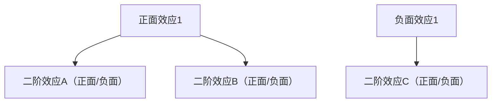
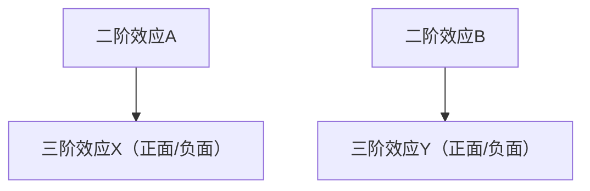

# Second-Order Thinking · 二阶思维

## 核心理念

大多数决策产生意外后果，因为人们只考虑一阶效应（直接的、预期的结果）。二阶思维追问**"然后呢？"**——追踪后果链到二阶、三阶效应。核心问题：**即时结果之后会发生什么？** 如果高阶效应显著抵消一阶收益，就需要重新考虑决策。

> 一阶思维说"这样做有好处"；二阶思维问"这个好处之后会引来什么麻烦"。

---

## 适用场景

✅ **最适合**
- 政策/规则制定（政策总有非预期副作用）
- 产品功能决策（尤其涉及生态系统的功能）
- 定价策略调整（价格变动引发连锁反应）
- 激励机制设计（人们会对激励做出反应，包括非预期反应）
- 竞争策略（对手会如何应对我们的行动？）

⚠️ **慎用**
- 简单可逆决策（二阶思维成本高于决策本身）
- 效应已充分理解的常规操作（无需额外推演）
- 纯执行层面任务（方向已定，推演无额外价值）
- 时间极度紧迫的应急决策（先行动再复盘）

---

## 执行步骤

### Step 1：陈述决策/行动

清晰写出正在考虑的决策：

```
决策：[具体行动描述]
目标：[期望达到的效果]
背景：[为什么考虑这个决策]
```

### Step 2：列出一阶效应

列出该决策的**直接、预期后果**——这是大多数人止步的地方：

```
一阶效应（直接的、预期的）：
  + [正面效应1]
  + [正面效应2]
  - [负面效应1]
```

### Step 3：追问"然后呢？"——二阶效应

对每个一阶效应，追问**"然后呢？这个结果会引发什么？"**



**关键技巧**：从不同利益相关者的视角追问——用户会怎么反应？竞争对手会怎么做？供应商会怎么调整？员工行为会如何变化？

### Step 4：追问"然后呢？"——三阶效应

对关键的二阶效应再次追问，揭示更深层的影响：



> 通常推演到三阶即可。更深层的效应不确定性太高，推演价值递减。

### Step 5：综合评估

```
效应汇总：
  一阶：净影响 [正面/负面] — [说明]
  二阶：净影响 [正面/负面] — [说明]
  三阶：净影响 [正面/负面] — [说明]

综合判断：
  高阶效应是否显著抵消一阶收益？是 / 否
  是否存在不可接受的负面高阶效应？是 / 否
```

### Step 6：决策规则

```
如果：高阶效应显著强化一阶收益 → 加大投入
如果：高阶效应轻微削弱一阶收益 → 继续执行，但增加缓冲措施
如果：高阶效应显著抵消一阶收益 → 重新考虑，寻找降低负面高阶效应的方式
如果：存在不可接受的负面高阶效应 → 放弃或彻底重新设计
```

---

## 输出模板

```
二阶思维分析

决策：[...]
目标：[...]

一阶效应：
  + [正面1]：[说明]
  + [正面2]：[说明]
  - [负面1]：[说明]

二阶效应：
  [一阶正面1] → [二阶A]：正面/负面 — [说明]
             → [二阶B]：正面/负面 — [说明]
  [一阶正面2] → [二阶C]：正面/负面 — [说明]
  [一阶负面1] → [二阶D]：正面/负面 — [说明]

三阶效应（关键路径）：
  [二阶A] → [三阶X]：正面/负面 — [说明]
  [二阶B] → [三阶Y]：正面/负面 — [说明]

综合评估：
  一阶净影响：[正面/负面]
  二阶净影响：[正面/负面]
  三阶净影响：[正面/负面]
  高阶是否显著抵消一阶：是 / 否

决策建议：
  [继续 / 调整 / 放弃] — [理由]
  缓冲措施（如继续）：[...]
```

---

## 执行示例

**场景**：考虑将 SaaS 产品降价 30% 以扩大用户基数

```
决策：产品价格从 99元/月 降至 69元/月
目标：降低门槛，扩大付费用户基数

一阶效应：
  + 付费用户数增长（预计 +50%）
  + 市场份额提升
  - 单用户收入下降 30%
  - 短期总收入可能下降

二阶效应：
  用户数增长 → 竞争对手跟进降价：负面 — 触发价格战
  用户数增长 → 服务成本上升（服务器/客服）：负面 — 毛利进一步压缩
  单用户收入下降 → 销售团队提成减少：负面 — 销售积极性下降
  价格下降 → 品牌感知降级：负面 — 高端客户流失
  价格下降 → 吸引价格敏感用户：负面 — 这类用户留存率低、投诉率高

三阶效应：
  价格战 → 行业整体利润率下降：负面 — 长期不可持续
  品牌降级 → 更难向高端市场拓展：负面 — 锁死在中低端
  高端客户流失 → 失去最有价值的客户群：负面 — 收入结构恶化

综合评估：
  一阶净影响：中性偏正（用户增长但收入短期承压）
  二阶净影响：负面（竞争反应 + 成本上升 + 品牌损伤）
  三阶净影响：显著负面（行业价格战 + 高端市场锁死）
  高阶是否显著抵消一阶：是

决策建议：调整 — 不做全面降价
  替代方案：推出 69元/月的精简版（功能限制），保持 99元版不变
  缓冲措施：精简版自然筛选价格敏感用户，保护品牌和高端客户
```

---

## 常见陷阱

| 陷阱 | 说明 | 避免方式 |
|------|------|---------|
| 只推演负面高阶效应 | 二阶思维容易变成悲观推演，忽略正面连锁反应 | 对正面一阶效应也追问"然后呢"，可能发现正面飞轮 |
| 推演过度 | 追问到四阶五阶，不确定性指数级增长 | 三阶为止，更深层的推演价值递减 |
| 忽视利益相关者反应 | 只从自身视角推演，忘记用户/对手/供应商的反应 | 每阶都从多个利益相关者视角追问 |
| 把可能性当确定性 | "可能发生"不等于"必然发生"，过度反应 | 对高阶效应标注概率（高/中/低），只对高概率项做应对 |
| 分析瘫痪 | 每个决策都做二阶推演，决策速度极慢 | 只对不可逆/高影响决策做完整二阶分析 |

---

## 与其他方法论的关系

- **搭配 Pre-mortem**：Pre-mortem 想象最终失败，二阶思维追踪因果链——前者是终点倒推，后者是起点正推
- **搭配 First Principles**：一阶思维依赖类比（别人怎么做），第一性原理 + 二阶思维从本质出发推演后果
- **搭配 FMEA**：FMEA 系统化识别失效模式，二阶思维补充"修复措施本身会带来什么新问题"
- **搭配 Six Thinking Hats**：黑帽（风险）是二阶思维的天然盟友，但需配合黄帽（价值）保持平衡
- **搭配 Decision Matrix**：二阶思维识别隐藏风险后，用决策矩阵量化比较各选项
