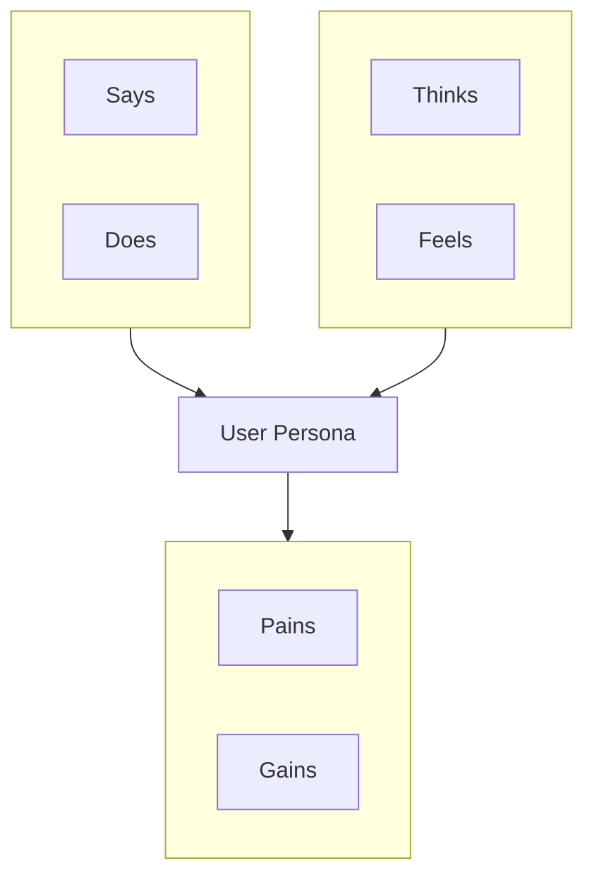

# Empathy Map · 同理心地图

## Core Concept

Systematically organize observations and understanding of a specific user across **four dimensions**, helping teams truly "see from the user's perspective" and avoid designing products based on assumptions.

Founded by Dave Gray, founder of XPLANE, widely used in the Empathize phase of Design Thinking.



**Four Dimensions + Two Foundations:**
- **Says**: What the user explicitly states in interviews / reviews (direct quotes)
- **Does**: Observed user behaviors, actions, habits
- **Thinks**: What the user may not say aloud — inner thoughts, concerns, focus areas
- **Feels**: The user's emotional state, feelings

Foundation summary:
- **Pains**: Things that create friction, fear, or frustration for the user
- **Gains**: Benefits the user wants to obtain, success criteria

---

## Difference from Persona

| Tool | Focus | Output |
|------|--------|------|
| Persona | Who the user is (demographics, background, goals) | User profile card |
| Empathy Map | The user's current experience (what they think, feel) | Experience dimension map |

Empathy Map is an **experience-layer supplement** to Personas; use them together.

---

## Applicable Scenarios

✅ **Best Suited For**
- Organizing outputs from the Design Thinking Empathize phase
- Calibrating team understanding of "do we truly understand the user?"
- Structuring user interview data
- Aligning user understanding before exploring new product directions

⚠️ **Use with Caution**
- As a quantitative tool (Empathy Map is qualitative)
- Filling it without real user data (becomes a projection of team assumptions)

---

## Data Collection Methods

Before filling in the Empathy Map, you need raw data:

**Primary: Direct User Research**
- User interviews (30-60 minutes, open-ended questions)
- Field observation / contextual inquiry
- Diary studies

**Secondary: Indirect Data**
- Customer service tickets and user feedback
- Social media comments, App Store reviews
- User forum posts
- NPS qualitative responses

**Key collection principles**:
- Collect **direct quotes**, not team summaries
- Record **observed behaviors**, not inferences
- Distinguish between what users say (surface) and what researchers infer (deep)

---

## Execution Steps

### Step 1: Define the User Subject

Select a specific user type or Persona — the Empathy Map targets a **single user type**, not all users.

### Step 2: Fill in Says & Does (Direct Evidence Layer)

Extract from user interview notes and observation notes:
- **Says**: User's verbatim quotes, unedited
- **Does**: Observed behaviors, describe actions not intentions

### Step 3: Fill in Thinks & Feels (Inference Layer)

Infer the user's inner world based on Says and Does:
- **Thinks**: What the user didn't say but behaviors imply; unexpressed concerns and focus areas
- **Feels**: Emotional state, described with emotion words (anxiety, anticipation, confusion, pride, etc.)

Note that these are **inferences**, not direct evidence.

### Step 4: Distill Pains & Gains

Synthesize findings from all four quadrants:
- **Pains**: Extract negative content from Thinks/Feels/Says; categorize as obstacles, fears, risks
- **Gains**: User's desired states, success criteria, hoped-for outcomes

### Step 5: Team Alignment and Supplementation

Present the Empathy Map to the team for discussion:
- Which insights surprised the team?
- Which dimensions lack information, requiring further research?
- Have design opportunities been identified?

---

## Output Template

```
User type: [Persona name or user description]
Research source: [N interviews, N observations, review analysis, etc.]

SAYS (What the user said):
  "[Direct quote 1]"
  "[Direct quote 2]"
  "[...]"

DOES (Observed behaviors):
  - [Behavior 1]
  - [Behavior 2]
  - [...]

THINKS (Inner thoughts, inferred):
  - [Thought/concern 1]
  - [Thought/concern 2]
  - [...]
  (Note: The following are inferred, not direct quotes)

FEELS (Emotional state, inferred):
  - [Emotion word 1]: Context/reason
  - [Emotion word 2]: Context/reason
  - [...]

---

Summary:

PAINS (Pain points):
  - [Pain 1: Obstacle/fear/risk]
  - [...]

GAINS (Gains/expectations):
  - [Gain 1: Desired benefit]
  - [...]

---

Key insights:
  Most surprising finding: [...]
  Question requiring further research: [...]
  Design opportunity: [...]
```

---

## Execution Example (Excerpt)

**User type**: Independent software developer, early adopter of AI coding assistants

```
SAYS:
  "I don't know if its suggestions are right or wrong, sometimes I just use them directly"
  "I hate when it explains a bunch of stuff — I just want the code"
  "Sometimes the suggestions are great, sometimes completely wrong, hard to predict"

DOES:
  - Quickly copies and pastes AI suggestions without reading line by line
  - Only uses AI when stuck, not for every line of code
  - When suggestions seem weird, uses Google to verify instead of asking AI further

THINKS (Inferred):
  - "I need a quick way to judge if a suggestion is trustworthy, but I don't have a good method"
  - "I worry my coding skills are declining because of over-reliance on AI"

FEELS (Inferred):
  - Uncertainty: Persistent doubts about AI suggestion reliability
  - Efficiency pressure: Wants to move fast but knows blind trust is unwise

PAINS:
  - Cannot quickly judge AI suggestion reliability
  - Lacks confidence in the "correct way" to use AI

GAINS:
  - Hopes AI can help make rapid progress even in unfamiliar domains
  - Wants AI to be like "an experienced partner," not just "a fast typist"
```

---

## Relationship with Other Methodologies

- **Feeds into Design Thinking**: Empathy Map is the output of the Empathize phase, directly used for HMW statements in the Define phase
- **Supplements Personas**: Personas are background; Empathy Map captures current experience
- **Feeds into JTBD**: Empathy Map's Pains + Gains help identify unmet user Jobs
- **Pairs with Customer Journey Map**: Journey Map describes the experience path; Empathy Map deepens user understanding at specific stages
