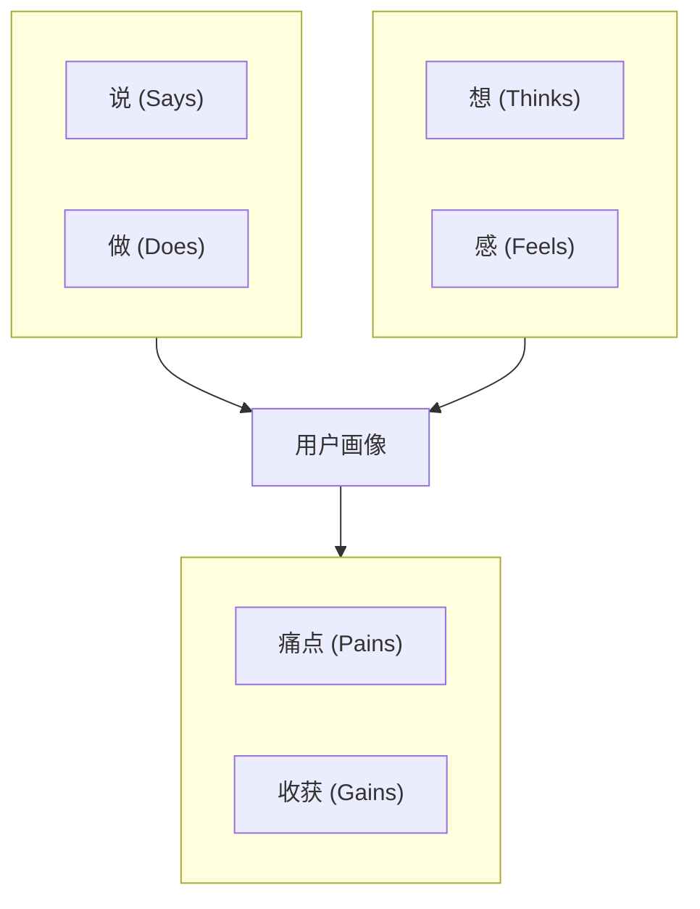

# Empathy Map · 同理心地图

## 核心理念

从**四个维度**系统整理对特定用户的观察和理解，帮助团队真正"站在用户的角度"看问题，避免基于假设设计产品。

由 XPLANE 创始人 Dave Gray 创立，广泛应用于 Design Thinking 的 Empathize 阶段。



**四维度 + 两底层：**
- **Says（说什么）**：用户在访谈/评论中说的话（直接引语）
- **Does（做什么）**：观察到的用户行为、操作、习惯
- **Thinks（想什么）**：用户未必说出口的内心想法、疑虑、关注点
- **Feels（感受什么）**：用户的情绪状态、情感

底层汇总：
- **Pains（痛点）**：让用户感到阻力、恐惧、沮丧的事
- **Gains（收获）**：用户想要获得的好处、成功标准

---

## 与 Persona 的区别

| 工具 | 关注点 | 输出 |
|------|--------|------|
| Persona | 用户是谁（人口统计、背景、目标）| 用户档案卡 |
| Empathy Map | 用户的当下体验（怎么想、怎么感受）| 体验维度地图 |

Empathy Map 是 Persona 的**体验层补充**，二者配合使用。

---

## 适用场景

✅ **最适合**
- Design Thinking Empathize 阶段的成果整理
- 团队对"我们真正理解用户吗"进行校准
- 将用户访谈数据结构化
- 新产品方向探索前的用户理解对齐

⚠️ **慎用**
- 作为量化工具（同理心地图是定性工具）
- 没有真实用户数据时填写（会变成团队假设的投影）

---

## 数据收集方法

在填写同理心地图前，需要原始数据：

**首选：直接用户研究**
- 用户访谈（30-60 分钟，开放式问题）
- 实地观察 / 情境研究
- 日记研究

**辅助：间接数据**
- 客服工单和用户反馈
- 社交媒体评论、App Store 评论
- 用户论坛帖子
- NPS 定性回复

**关键采集原则**：
- 收集**直接引语**，不是团队的总结
- 记录**观察到的行为**，不是推测
- 区分用户说的（表面）和研究者推断的（深层）

---

## 执行步骤

### Step 1：明确用户对象

选择一个具体的用户类型或 Persona，同理心地图针对**单一用户类型**，不是所有用户。

### Step 2：填充 Says & Does（直接证据层）

从用户访谈记录、观察笔记中提取：
- **Says**：用户的原话引语，不改写
- **Does**：观察到的行为，描述动作而非意图

### Step 3：填充 Thinks & Feels（推断层）

基于 Says 和 Does 推断用户的内心世界：
- **Thinks**：用户没有说出口，但行为暗示的想法；未表达的疑虑、关注点
- **Feels**：情绪状态，用情感词描述（不安、期待、困惑、骄傲等）

标注这是**推断**，而非直接证据。

### Step 4：提炼 Pains & Gains

汇总四象限的发现：
- **Pains**：从 Thinks/Feels/Says 中提取负面内容，分类为障碍、恐惧、风险
- **Gains**：用户的期待状态、成功标准、渴望的收获

### Step 5：团队对齐与补充

将同理心地图展示给团队，讨论：
- 哪些洞察让团队感到意外？
- 哪些维度信息不足，需要进一步研究？
- 是否识别出了设计机遇？

---

## 输出模板

```
用户类型：[Persona 名称或用户描述]
研究来源：[访谈 N 人、观察 N 次、评论分析等]

SAYS（用户说的话）：
  "[直接引语 1]"
  "[直接引语 2]"
  "[...]"

DOES（观察到的行为）：
  - [行为 1]
  - [行为 2]
  - [...]

THINKS（内心想法，推断）：
  - [想法/疑虑 1]
  - [想法/疑虑 2]
  - [...]
  （注：以下为推断，非直接引语）

FEELS（情绪状态，推断）：
  - [情绪词 1]：背景/原因
  - [情绪词 2]：背景/原因
  - [...]

---
汇总：

PAINS（痛点）：
  - [痛点 1：障碍/恐惧/风险]
  - [...]

GAINS（收获/期待）：
  - [收获 1：希望得到的好处]
  - [...]

---
关键洞察：
  最令人惊讶的发现：[...]
  最需要进一步研究的问题：[...]
  设计机遇：[...]
```

---

## 执行示例（片段）

**用户类型**：独立软件开发者，使用 AI 代码助手的早期用户

```
SAYS：
  "我不知道它给我的建议是对的还是错的，有时候我直接就用了"
  "最讨厌它给我解释一堆，我只要代码就好"
  "有时候建议很好，有时候完全不对，很难预测"

DOES：
  - 快速复制粘贴 AI 建议，不逐行阅读
  - 只在卡住时才使用 AI，不是每行代码都用
  - 遇到建议奇怪时，用 Google 验证，而非继续追问 AI

THINKS（推断）：
  - "我需要快速判断这个建议是否可信，但我没有好方法"
  - "我担心自己的代码水平因为过度依赖 AI 而退步"

FEELS（推断）：
  - 不确定感：对 AI 建议可靠性持续存在疑虑
  - 效率压力：想快，但知道不应该盲目信任

PAINS：
  - 无法快速判断 AI 建议的可靠性
  - 对使用 AI 的"正确方式"缺乏信心

GAINS：
  - 希望 AI 能让自己在陌生领域也能快速推进
  - 希望 AI 像"有经验的搭档"，而不只是"快速打字员"
```

---

## 与其他方法论的关系

- **输入 Design Thinking**：Empathy Map 是 Empathize 阶段的输出，直接用于 Define 阶段的 HMW 陈述
- **补充 Persona**：Persona 是背景，Empathy Map 是当下体验
- **输入 JTBD**：Empathy Map 的 Pains + Gains 帮助识别用户未被满足的 Job
- **配合 Customer Journey Map**：旅程地图描述体验路径，Empathy Map 深化特定阶段的用户理解
